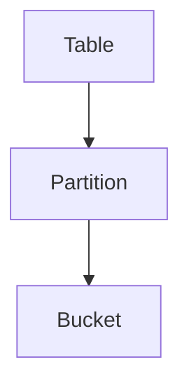

# GitPage 页面规范 v2.1

## 概述

本规范定义 CHANG_AI_TEAM GitPage 项目（`ai_memory_chang_ai_team`）所有内容的统一样式标准与分类组织结构。所有 Agent 发布 GitPage 内容前，必须先行阅读完整的页面规范。

**版本**：v2.1（2026-06-14）
**上次决策**：分类页客户端分页、ASCII 树形图禁止、Mermaid/SVG 图表规范、三级分类层级展示修复

---

## 1. 分类体系

### 1.1 分类结构

GitPage 使用 Jekyll `categories` front matter 组织文章层级。每个 `_posts/*.md` 文件通过 `categories` 数组声明归属：

```yaml
# 二级分类（有子分类）
categories: [一级分类, 二级子分类]

# 三级分类（子分类下还有子类）
categories: [一级分类, 二级子分类, 三级子分类]
# 例：技术调研 → 周报 → Kafka
```

当前分类结构（共 37 篇）：

```
个人观点输出（1篇）
  └── （无子分类，直接归属）
技术调研（36篇）
  ├── Fluss 源码分析（7篇）
  ├── Doris 调研（5篇）
  ├── 论文精读（7篇）
  ├── 周报（16篇）—— 二级子分类，含 4 个三级子类
  │    ├── Kafka（4篇）
  │    ├── AI Harness（4篇）
  │    ├── 面向AI的数据平台（4篇）
  │    └── 技术调研（4篇）—— 三级子分类名与一级分类名重名，属设计允许
  └── 技术调研（1篇）—— 直接归属一级分类，无二级子分类
```

### 1.2 三层分类展示规则

在分类详情页（如 `技术调研`）上，三级分类按 **L2 → L3 树形展示**：

- L2（如"周报"）显示为 `<h2>` 标题 + 总篇数
- L3（如"Kafka"）显示为 `<h3>` 子标题 + 各自篇数
- L3 不单独出现在分类目录页，归属在 L2 名下
- `_layouts/category.html` 自动提取 `post.categories[1]` 作为 L2、`post.categories[2]` 作为 L3

### 1.3 分类规则

| 规则 | 说明 |
|------|------|
| 每篇 post 必须声明至少 1 个 category | `categories: [一级分类]` 或 `categories: [一级分类, 子分类]` |
| 子分类仅用于分组展示 | 不影响 Jekyll Archives 生成的 URL（`/categories/:name/`） |
| 子分类名自动获得独立分类页 | 如 `/categories/fluss-源码分析/` |
| 同一子分类的文章共享该子分类页 | 用户可通过二级导航聚合阅读 |
| 新增 post 时必须检查是否已有对应子分类 | 归档到现有子分类，或按需新建 |

### 1.4 新增文章时的分类决策

```
1. 确定文章属于哪个一级分类（技术调研 / 个人观点输出）
2. 若为技术调研，确定二级子分类
   - 是 Fluss 源码分析？→ `[技术调研, Fluss 源码分析]`
   - 是 Doris 调研？→ `[技术调研, Doris 调研]`
   - 是论文精读？→ `[技术调研, 论文精读]`
   - 是周期性周报？→ `[技术调研, 周报, 周报子类名]`（三级）
3. 若为个人观点输出，无子分类 → `[个人观点输出]`
4. 无法归入现有子分类的直接技术文章 → `[技术调研]`
```

---

## 2. Design Token（CSS 变量）

所有颜色通过 CSS 变量定义，禁止硬编码颜色值。变量定义在 `assets/style.css`。

```css
:root {
  --bg: #ffffff;
  --surface: #f8f9fa;
  --border: #e5e7eb;
  --border-light: #f0f0f0;
  --text: #111827;
  --text-secondary: #4b5563;
  --muted: #6b7280;
  --dim: #9ca3af;
  --accent: #2563eb;
  --accent-hover: #1d4ed8;
  --accent-light: #eff6ff;
  --accent-subtle: #f0f5ff;
  --green: #059669;
  --green-light: #ecfdf5;
  --amber: #d97706;
  --amber-light: #fffbeb;
  --red: #dc2626;
  --red-light: #fef2f2;
  --purple: #7c3aed;
  --purple-light: #f5f3ff;
  --code-block-bg: #1e293b;
  --code-text: #e2e8f0;
  --radius-sm: 6px;
  --radius: 10px;
  --radius-lg: 14px;
  --font-mono: 'SF Mono','Cascadia Code','Fira Code','JetBrains Mono','Menlo','Consolas',monospace;
  --font-sans: -apple-system,BlinkMacSystemFont,'Segoe UI','Noto Sans SC','PingFang SC','Microsoft YaHei',ui-sans-serif,sans-serif;
}
```

---

## 3. 页面骨架

```html
<head>
  <meta charset="UTF-8">
  <meta name="viewport" content="width=device-width, initial-scale=1.0">
  <title>页面标题</title>
  <link rel="stylesheet" href="路径/assets/style.css">
</head>
<body>
  <!-- 全局导航栏（所有页面必须有） -->
  <nav class="global-nav">
    <a href="路径/index.html" class="brand">CHANG_AI_TEAM</a>
    <div class="nav-links">
      <a href="路径/tech_research/index.html" class="nav-link">🔬 技术调研</a>
      <a href="路径/tech_designs/index.html" class="nav-link">📐 技术方案设计</a>
      <a href="路径/blog/index.html" class="nav-link">✍️ 博客</a>
    </div>
  </nav>

  <div class="container">
    <!-- 页面内容 -->
  </div>
</body>
```

注意：
- 禁止在 HTML 中内联 `<style>` 标签，所有样式通过外链 `assets/style.css` 引入
- `路径` 根据页面所在目录层级调整：根目录用 `./`、一级子目录用 `../`、二级子目录用 `../../`
- brand 不要写 emoji（⚡），CSS 通过 `::before` 伪元素自动添加

---

## 4. 页面类型模板

### A 型：首页 (`index.html`)
- Jekyll `layout: home` — 由 Chirpy 主题渲染
- 关键词：Hero header、文章列表、分页、侧边栏

### B 型：模块首页（`tech_research/index.html`、`blog/index.html`）
- `.doc-header` 含标题、元数据、标签
- `.section-title` 分区标题 + 文章计数
- 文章卡片列表（`.article-card` / `.week-card`）

### C 型：内容详情页（`tech_research/fluss/01-xxx.html`）
- `.doc-header` 含标题、日期、标签
- `.article-body` 正文内容区
- `.back-link` 返回上级

### D 型：章节导航页（`tech_research/doris/index.html`）
- `.module-card` 列表（含图标 + 描述 + 统计）
- 作为子模块入口

### E 型：Jekyll 分类页（由 jekyll-archives 自动生成）
- URL：`/categories/:name/`
- 由 `_layouts/category.html` 控制渲染
- 有子分类时按子分类分组展示（`<h2>` 子分类名 + `<ul>` 文章列表）
- 三级分类按 `L2 → L3` 树形展示（`<h2>`L2 + `<h3>`L3）
- 无子分类时按文章卡片列表展示，超过 10 篇启用客户端分页
- 分页大小：每页 10 篇，JS 驱动，URL 不变（SPA 风格），底部显示 Bootstrap 风格分页器

---

## 5. 组件规范

| 组件 | 用途 |
|------|------|
| `.global-nav` | 全局导航栏，sticky 置顶，半透明毛玻璃效果 |
| `.hero` | 首页大标题区，渐变背景 |
| `.container` | 内容容器，max-width 720px 居中 |
| `.doc-header` | 文档页标题区，居中对齐 |
| `.article-body` | 文章正文渲染区 |
| `.module-grid` / `.module-card` | 模块索引卡片 |
| `.weeks-grid` / `.week-card` | 周报列表卡片 |
| `.insight-card` / `.paper-card` | 论文卡片 |
| `.chapter-list` / `.chapter-card` | 章节导航卡片 |
| `.section-title` | 分区标题（含图标 + 计数） |
| `.callout` | 提示框（info/success/warn/danger） |
| `.tag` | 标签（tag-blue/tag-green/tag-purple/tag-pink/tag-red） |
| `.back-link` | 返回链接（箭头 + 文字） |
| `.page-nav` | 上一篇/下一篇导航 |
| `.stats-bar` | 首页统计栏 |
| `.toc` | 文章目录 |
| `.highlight-box` | 高亮信息框（info/warn） |
| `.decision-grid` / `.decision-card` | 决策卡片网格 |
| `.milestone-list` | 里程碑列表 |
| `.article-card` | 博客文章卡片 |
| `.empty-state` | 空状态提示 |
| `footer` | 页脚 |

---

## 6. 代码段与图表规范

### 6.1 代码块

- inline code：浅底 `#f1f5f9` + 红色文字 `#e11d48`，圆角 3px
- pre code block：深底 `#1e293b` + 亮色文字 `#e2e8f0`，圆角 10px，等宽字体

### 6.2 图表渲染规则（⚠️ 强制）

**禁止使用 ASCII 字符画**作为图表（`├──` `└──` `│` 等 Unicode box-drawing 字符组成的树形图 / 结构图 / 流程图）：

| 问题 | 说明 |
|------|------|
| 可读性 | 浅色主题下线条辨识度低，移动端更明显 |
| 布局 | 等宽字体在移动端溢出或折断 |
| 暗色模式 | 颜色不随 theme 变化 |
| 无障碍 | 屏幕阅读器无法解析 |

**替代方案（优先级从高到低）**：

| 优先级 | 方案 | 适用场景 |
|------|------|------|
| 1️⃣ | **Mermaid** (` ```mermaid `) | 流程图、时序图、类图、状态图 |
| 2️⃣ | **SVG** (内嵌 base64) | 不适合 Mermaid 的图（如精确像素布局） |

**Mermaid 使用规则**：
- 主题：使用 `default`（与 Chirpy 浅色主题兼容，深色文字+浅色背景）
- 节点文本：中文括号 `()` 使用英文括号避免解析冲突
- 复杂嵌套用 `flowchart TD`（自上而下）
- 时序交互用 `sequenceDiagram`
- 架构层次用 `graph LR`（从左到右）
- 所有 Mermaid 图依赖 Chirpy 内置 mermaid@11 支持（`_layouts/post.html` 自动引入）

**示例**：

❌ 禁止：ASCII 树形图
```
Table
├── Partition
│   └── Bucket
```

✅ 推荐：Mermaid flowchart


✅ 备选：SVG（生成 base64 后嵌入）
```html
<figure>
  
</figure>
```

---

## 7. 计数器规范

所有页面中的计数器（篇数、期数、模块数等）必须与仓库 `_posts/` 中实际文件数一致。新增或删除文件时必须同步更新计数。

当前基准（2026-06-14）：

| 位置 | 计数值 |
|------|--------|
| 首页 Hero | 37 篇文章、16 期周报、2 篇方案 |
| tech_research/index.html | 技术调研 36 篇 |
| blog/index.html | 博客 1 篇 |
| tech_designs/index.html | 技术方案 2 篇 |
| `_tabs/categories.md` | 个人观点输出(1) + 技术调研(36) |
| 周报各子类 | AI Harness 4 / 面向AI的数据平台 4 / Kafka 4 / 技术调研周报 4 |

---

## 8. 规则

1. ✅ 禁止硬编码颜色值（使用 CSS 变量）
2. ✅ 每个页面必须包含 `.global-nav` 导航栏
3. ✅ 相对路径必须正确匹配页面层级
4. ✅ 禁止使用内联 `<style>` 标签（统一外链 `assets/style.css`）
5. ✅ 所有页面浅色背景（`--bg: #ffffff`）
6. ✅ 所有页面内容居中（max-width 720px）
7. ✅ 代码段必须有深色背景渲染
8. ✅ 禁止使用 ASCII 字符画（必须用 Mermaid 或 SVG）
9. ✅ 新增文章必须申报正确的 categories（含子分类）
10. ✅ 新增文章后必须更新所有受影响的计数器

---

## 9. CSS 更新流程

**修改样式时**：只改 `assets/style.css`，所有外链该文件的页面即时生效。

**相对路径规则**：
- 根目录页面：`href="assets/style.css"`
- 一级子目录：`href="../assets/style.css"`
- 二级子目录：`href="../../assets/style.css"`

---

## 10. 分类模板代码（参考）

### `_tabs/categories.md` — 分类目录页

按一级分类罗列，每个一级分类下展示子分类分组和文章计数。

### `_layouts/category.html` — 分类详情页

核心逻辑：
- 检查 `page.posts` 是否有 `post.categories.size > 1`
- 有子分类：提取 `post.categories[1]` 作为 L2、`post.categories[2]` 作为 L3
- L3 存在时多层次展示（`<h2>`L2 + `<h3>`L3）；L2 叶子节点直接展示
- 无子分类：标准文章卡片列表 + 客户端分页（每页 10 篇）
- 分页器使用 Bootstrap 5 风格，JS 驱动

---

## 11. 项目仓库

| 仓库 | 用途 |
|------|------|
| `git@github.com:BryantChang1992/ai_memory_chang_ai_team.git` | GitPage 站点源码（Jekyll + Chirpy） |
| `git@github.com:BryantChang1992/ai_wikis.git` | Obsidian 内部知识库（规范文档、项目文档、运营资料） |

两仓库需保持规范文档同步：修改规范后，同时推送到双仓库。

---

## 12. 修订历史

| 版本 | 日期 | 变更 |
|------|------|------|
| v2.1 | 2026-06-14 | 新增客户端分页（每页10篇）、三级分类 `L2→L3` 层级展示、ASCII 树形图禁令 + Mermaid/SVG 图表规范（含示例） |
| v2.0 | 2026-06-14 | 分类体系重构：技术调研按子分类分组、项目文档类移除、外链 CSS 统一、新增分类决策流程、新增 E 型页面模板（Jekyll 分类页）、计数器基准更新 |
| v1.2 | 2026-06-14 | 外链 CSS 规范：统一 `assets/style.css`、禁止内联 `<style>` |
| v1.1 | 2026-06-14 | 浅色主题 + 居中布局 + 代码深色渲染 |
| v1.0 | 2026-06-14 | 初始版本 |
