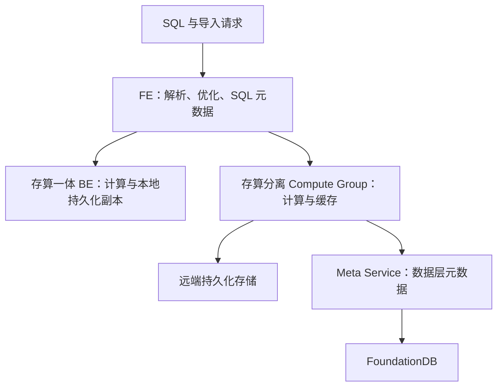
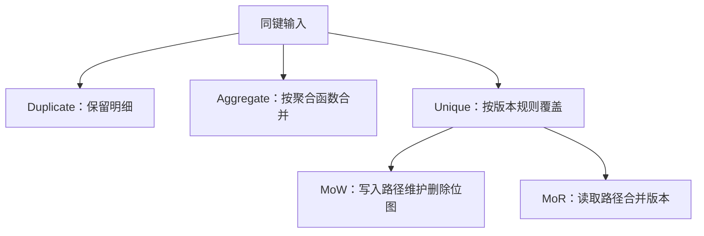

# Doris 概述与模型

本次修订保留原文章路径；以下按已核对的主题重组。详细的版本与证据范围在各节说明。

## Doris 架构演进：共同的查询入口与两种存储部署

本文按架构职责比较经典存算一体和 3.0 引入的存算分离模式。版本功能首次出现的时间，需要逐版本发布说明佐证；旧稿中未找到依据的 Falcon、全面改用 Parquet 等路线图已撤回。

两条分支是可选部署模式，不是一个查询顺次经过的流水线。FE 仍负责规划和 SQL 层元数据；Meta Service 负责数据层元数据，不能理解为替换所有 FE/BDB JE 职责。

### 架构变化解决了什么

| 维度 | 存算一体 | 存算分离 |
|---|---|---|
| 扩容 | 本地数据与计算一同规划 | 计算组可独立调整，持久数据共享 |
| 数据访问 | 本地副本读取 | 缓存命中或远端读取 |
| 运维重点 | 副本分布、磁盘、compaction | 远端存储、元数据服务、缓存预热及隔离 |
| 延迟风险 | 数据倾斜、合并竞争 | 冷缓存、网络、远端存储与元数据依赖 |

本地 File Cache 降低远端读取成本，但不保证扩容或故障后延迟完全不变。“无状态计算”描述持久化职责，不表示节点没有缓存状态，也不意味着扩容瞬时完成。

### 与查询和存储演进的关系

Nereids 影响计划选择，向量化执行影响算子效率，Unique MoW 影响主键更新和读取合并，存算分离影响资源配置。这些是不同维度，不能把某次向量化基准的倍数直接套在架构升级的全部负载上。

学习路径：[[Doris-数据模型]] → [[Doris-Segment-v2-存储格式]] → [[Doris-Compaction-策略]] → [[Doris-MPP-向量化查询引擎]] → [[Doris-元数据与一致性复制]]。

### 核验来源

- [Doris 系统架构](https://doris.apache.org/docs/dev/features-architecture/system-architecture/)
- [存算分离部署与 FoundationDB](https://doris.apache.org/docs/4.x/install/deploy-on-kubernetes/separating-storage-compute/install-doris-cluster/)

## Doris 数据模型：三种模型与 Unique 的两种实现

模型先决定“同键数据的业务含义”，再影响写入、读取和合并成本。Duplicate、Aggregate、Unique 是三种表模型；MoW 与 MoR 是 Unique 模型的实现方式，不应再计为第四种模型。

| 模型 | 同键两行的含义 | 必须承担的工作 | 适合的问题 |
|---|---|---|---|
| Duplicate | 保留两条明细，排序键不等于唯一约束 | 查询按需要聚合 | 日志、事件明细 |
| Aggregate | 按声明的聚合函数合并值 | 导入、compaction、查询阶段可能继续合并 | 固定维度指标 |
| Unique | 同一主键保留逻辑上的有效版本 | 判定版本、覆盖与删除 | CDC、主键更新 |

### 用三条记录检验模型

设输入为 `(A, 10), (A, 20), (B, 5)`。Duplicate 保留三行；Aggregate 的 value 列声明 SUM 时，A 的聚合结果为 30；Unique 的结果取决于版本顺序、sequence 配置等，不能把任意到达较晚的网络包都理解为业务上最新的数据。

### MoW 的逻辑删除不等于立即回收空间

MoW 将新行写入新 rowset，同时维护旧行的删除位图。查询跳过不可见的旧行；旧数据的物理字节仍可能保留到 compaction 等回收过程。它减少了查询时合并主键版本的工作，但不承诺所有查询都最快，也不是“磁盘只存最新版本”。部分列更新还可能需要查找、补齐未更新列。

MoR 把更多版本合并工作留在读取路径。二者的取舍应结合更新比例、主键宽度、批次大小、查询选择性与 compaction 压力实测。不能用一个没有硬件和负载条件的吞吐排序代替选型。

Aggregate 也不保证查询无需聚合：多个 rowset 中的同键聚合状态仍需合并，查询维度更粗时还要再次聚合。预聚合会失去一部分明细可恢复性，因此应先验证需要保留的查询能力。

关联：[[Doris-Segment-v2-存储格式]]、[[Doris-Compaction-策略]]、[[LSM-Tree-RUM猜想]]。

### 核验来源

- [Doris 4.x 更新与删除](https://doris.apache.org/docs/4.x/key-features/data-update-delete/)
- [Doris 预聚合与 Rollup](https://doris.apache.org/docs/dev/key-features/preaggregation-and-rollup/)
