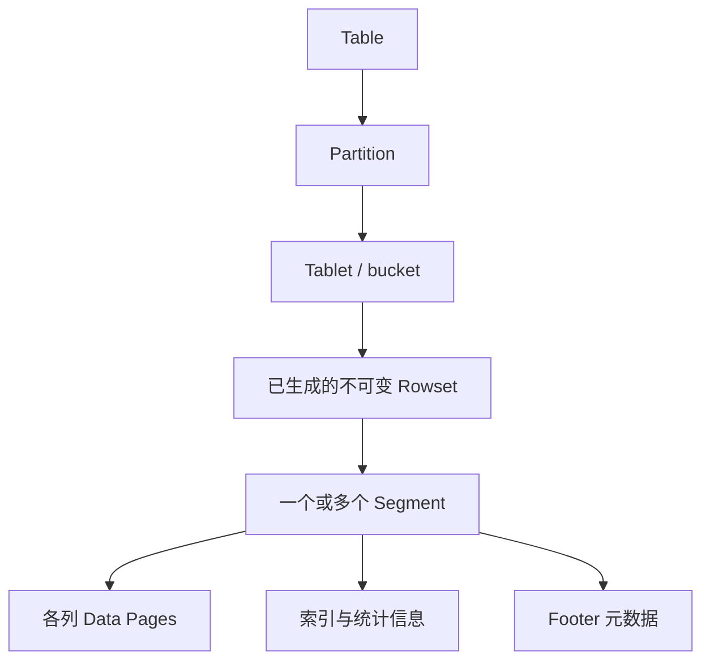
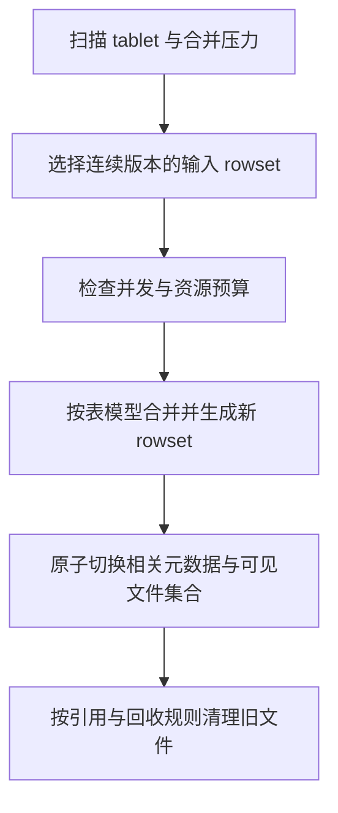

# Doris 存储引擎

本次修订保留原文章路径；以下按已核对的主题重组。详细的版本与证据范围在各节说明。

## Doris Segment v2：文件布局与表级语义

Segment 是列式数据文件；Rowset 由一个或多个 segment 组成；tablet 的可见版本由 rowset 与相关元数据组织。写入先在内存处理，生成不可变文件，而不是不断原地修改“Rowset 0”。

### 读取为什么能跳过数据

排序键、短键索引、列统计和可选索引共同帮助定位候选范围。Bloom filter 的“不存在”可排除数据，命中仍可能是误判；ZoneMap 根据范围统计剪枝，不能保证任意谓词都有效。具体 Page 大小、编码和索引文件布局取决于类型、版本与配置，旧稿固定 1MB、所有列物理连续等说法不再作为统一保证。

### Unique MoW 的删除位图

删除位图记录旧行的可见性，查询跳过这些行。它不是在 segment 数据区原地改值；compaction 生成新 rowset 时可清理不再需要的旧版本。回收不应只归因于一个未经版本核实的 Quick Compaction 名称。

### 与 Parquet 的合理比较

两者都是列式文件组织。Parquet 的 row group 与 page 是不同层级，不能把“约 1MB Page”写成“1MB Row Group”。主键唯一性、事务提交和 MoW 可见性来自 Doris 引擎及元数据协议，不能把前缀排序索引本身当成文件格式的主键约束。开放格式是否适用，还要考虑更新、索引、生态和引擎接口。

关联：[[Doris-数据模型]]、[[Doris-Compaction-策略]]、[[Doris-元数据与一致性复制]]。

### 核验来源

- [Doris 更新与删除](https://doris.apache.org/docs/4.x/key-features/data-update-delete/)
- [Compaction 原理](https://doris.apache.org/docs/4.x/admin-manual/trouble-shooting/compaction-principles/)

## Doris Compaction：选哪些文件与怎样合并

不能把 Cumulative、Base、Vertical 和一次导入内的 Segment Compaction 当成四个互斥的同级策略：前两者偏向 rowset 选择与合并范围，Vertical 是执行算法，Segment Compaction 位于导入内的 segment 合并过程。

| 机制 | 主要解决的问题 | 代价或限制 |
|---|---|---|
| Cumulative | 小增量 rowset 积累 | 与导入和读取竞争资源 |
| Base / Full | 更大范围的历史 rowset 整理 | 大任务的 I/O 与运行时间 |
| Vertical | 分列组处理，降低宽表合并工作集 | 需要维护行来源顺序；收益依赖宽度与 I/O |
| Segment Compaction | 单次大批量导入产生过多 segment | 需结合导入路径与版本配置 |

新输出必须保持原来版本范围和表模型的逻辑结果。更多线程并非必然更快：当磁盘或内存已饱和，会放大前台尾延迟。观察 rowset 数、compaction score、待处理字节、写入失败和查询 P99，再结合批量大小及时间序列策略调整。

官方宽表案例中的内存和速度收益只适用于其条件，不应改写为全部表的性能保证。LSM 的写放大框架有助于分析，但 Doris 的 rowset/version 与标准 RocksDB 层级并不一一对应。

关联：[[Doris-Segment-v2-存储格式]]、[[LSM-Tree-合并优化]]。

### 核验来源

- [Compaction 原理](https://doris.apache.org/docs/4.x/admin-manual/trouble-shooting/compaction-principles/)
- [Vertical 与 Segment Compaction](https://doris.apache.org/docs/dev/admin-manual/trouble-shooting/compaction/)
