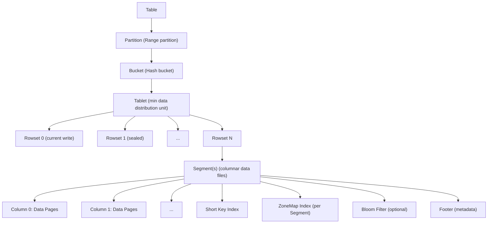
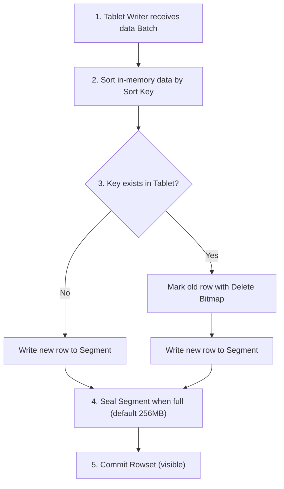

Doris 存储引擎采用自研 **Segment v2** 格式，基于列式存储思想，结合 LSM-tree 写入和高效 Compaction 策略。

### 2.2 存储层级结构

![[知识库/attachments/blog/media/diagrams/02-storage-engine.svg]]

### 2.3 Segment v2 存储格式

Doris 的 Segment 是自研列式存储格式，核心特点：

**数据组织**：
- 以 **Page** 为最小 I/O 单元（默认 1MB）
- 每个 Column 的数据按 Page 组织，同一 Column 的 Page 物理连续
- Column Page 内部采用 **RLE (Run-Length Encoding)** + **Bit-Packing** 压缩

**元数据布局**：
- **Footer**：存储 Segment 层级元数据（版本号、Column 数量、索引偏移量）
- **Short Key Index**：稀疏索引，每 N 行记录一个 Key，用于快速定位
- **ZoneMap Index**：每 Segment 每列的 Min/Max/NullCount，用于读取剪枝

**与 Parquet 的对比**：

| 维度 | Doris Segment v2 | Apache Parquet |
|------|-----------------|----------------|
| 设计哲学 | OLAP 写入优化，低延迟 | 数据湖通用，压缩优先 |
| Page 大小 | 1MB (可配置) | ~1MB (Row Group) |
| 索引粒度 | Segment + Page 级 | Row Group + Page 级 |
| 编码方式 | RLE + BitPacking + LZ4/ZSTD | Dictionary + RLE + Delta |
| 主键支持 | 原生 Prefix Sort Key | 无 |
| 更新支持 | MoW DELETE_BITMAP | 不可变 |

### 2.4 Compaction 策略

Doris Compaction 负责将多个小 Rowset 合并为大 Rowset，减少碎片、加速查询。

**Compaction 触发机制**：

| 类型 | 触发条件 | 作用 |
|------|----------|------|
| **Cumulative Compaction** | Cumulate Point 之前的 Rowset 数量 > 阈值 | 合并大量小 Rowset |
| **Base Compaction** | Base Rowset 版本过期 | 合并所有 Rowset 为一个 |
| **Quick Compaction** | MoW 表 Segment 数 > 阈值 | 局部合并 Delete Bitmap 过多的小 Segment |
| **Vertical Compaction** | 宽表 (大 Column 数) | 按列组合并，减少内存开销 |

**Compaction 流程**：
1. BE 的 Compaction 线程池定期扫描 Tablet 状态
2. 选取待合并 Rowset 列表
3. 读取源 Rowset 所有 Segment，按 Sort Key 归并排序
4. 对于 MoW 表：同时合并 DELETE_BITMAP，物理删除标记行
5. 写入新 Rowset 到磁盘
6. 原子替换旧 Rowset 元数据

### 2.5 Merge-on-Write 存储实现

MoW 是 Doris 2.1+ 的核心创新，在写入时处理主键冲突：

**写入 MoW Tablet 流程**：

**DELETE_BITMAP**：
- 行级删除标记，位图存储在 Segment 同层
- 查询时先加载 DELETE_BITMAP，跳过被标记行
- Quick Compaction 时物理清除被标记行，释放空间

### 2.6 索引实现

Doris 索引分为内存索引和文件索引两类：

**内存索引**：
- **Tablet 级 Key Index**：全量 Sort Key → Rowset+Segment+RowID 映射，MoW 写入去重的核心
- 采用 Flat Map 实现（高基数 Table 谨慎）

**文件索引**：
- **ZoneMap**：每 Segment 每列的 Min/Max/NullCount →
- **Bloom Filter**：可选择列建 Bloom Filter，判不存在
- **Inverted Index**：2.0+ 支持，底层 CLucene，支持全文检索、模糊匹配
- **N-Gram Bloom Filter**：2.0+ 支持，模糊 LIKE 查询加速
