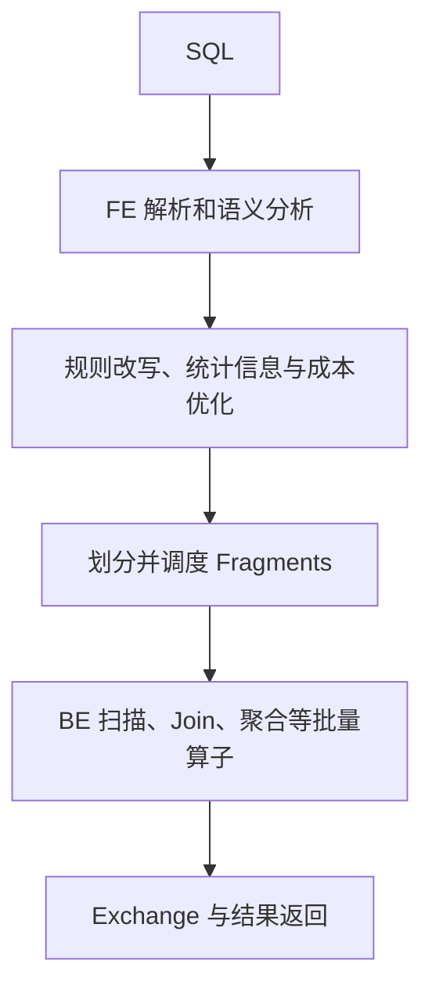
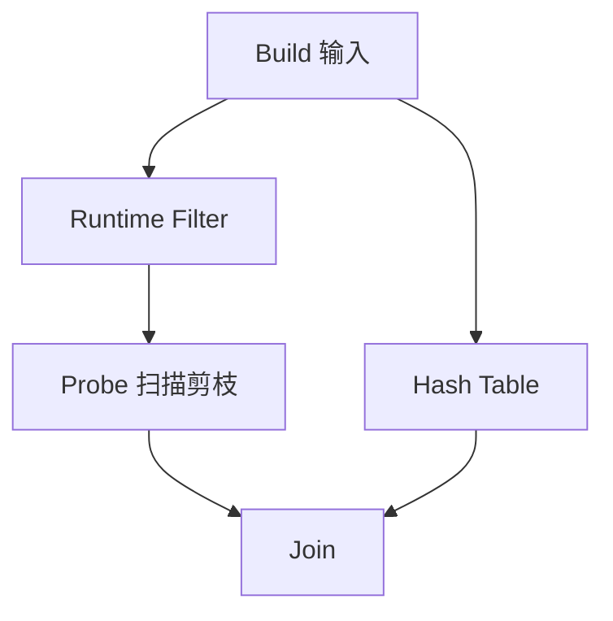

# Doris 查询流程：规划、分布与执行

一个 Fragment 可以有多个并行实例，实例分布与查询计划相关。向量化以列式批次减少解释与函数调用成本，批次大小和 SIMD 使用取决于配置、类型及算子，不能固定写成所有执行都为 4096 行。

## 数据分布和 Join

| 方式 | 作用 | 需要的条件 |
|---|---|---|
| Broadcast | 将一侧数据送到所需执行节点 | 大小估计、内存、Join 语义与成本 |
| Hash Shuffle | 按连接/聚合键重新分布 | 网络代价与数据倾斜可接受 |
| Bucket Shuffle | 利用已有 bucket 分布减少一侧重分布 | 键与分布条件匹配；不等于完全没有 shuffle |
| Colocate | 利用兼容放置执行本地 Join | 表组、分桶和放置满足要求 |

Runtime Filter 来自 Join 的 build 输入，可下推到适用的 probe 侧扫描。左右表不是固定角色；过滤率取决于数据选择性，旧稿没有数据集依据的 50%–99% 不作为保证。

## 优化器与联邦查询

Nereids 结合规则、统计信息和成本模型选择计划。统计信息过期、相关性估计错误及倾斜都会影响结果；使用 EXPLAIN 与 profile 看真实计划，而非根据版本名预设必然更快。外部 Catalog 扩展数据源访问，但不能把某一数据源支持的读写、时间旅行或 schema 能力推广到其他 Catalog。

本次未对每个历史版本逐条核实首次引入时间，因此撤回旧“v4 Falcon”等未经证实的路线图。阅读 [[Doris-Nereids-CBO-优化器]] 与 [[Doris-MPP-向量化查询引擎]] 时应同样以具体版本为准。

## 核验来源

- [Doris 系统架构](https://doris.apache.org/docs/dev/features-architecture/system-architecture/)
