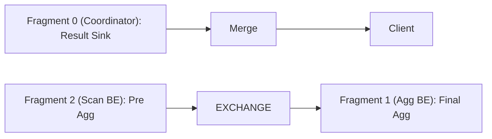
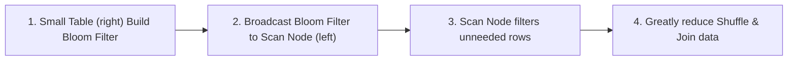

Doris 查询引擎是其高性能的核心，基于自研 C++ 向量化执行引擎，支持标准 SQL 和 MPP 分布式执行。

### 3.2 查询架构总览

```mermaid
flowchart TD
    Client["Client (MySQL Protocol / HTTP / Arrow Flight)"]
    Client --> FE["FE (Frontend) - Java"]

    subgraph FE_["FE (Frontend)"]
        FE --> Parser["SQL Parser (ANSI SQL compat)"]
        FE --> Analyzer["Analyzer (semantic check, Catalog metadata)"]
        FE --> Opt["Optimizer"]
        Opt --> RBO["RBO (Rule-Based, v1.x-2.x)"]
        Opt --> Nereids["Nereids (CBO, v2.1+ exp., v3.0 stable)"]
        Nereids --> Stats["Statistics collection"]
        Nereids --> Cost["Cost Model (CBO best plan)"]
        Nereids --> Rewrite["Plan Rewrite (prune/pushdown/fold)"]
        FE --> Coord["Coordinator"]
        Coord --> Frag["Plan Fragment gen (MPP distributed plan)"]
        Coord --> Par["Parallelism calc"]
        Coord --> Sched["Schedule to BEs"]
        FE --> RM["Result Merger (merge results -> Client)"]
    end

    FE --> BE["BE (Backend) - C++"]

    subgraph BE_["BE (Backend)"]
        BE --> PFE["Plan Fragment Executor"]
        PFE --> Scan["Scan Node -> Segment Reader"]
        Scan --> ZM["ZoneMap pruning"]
        Scan --> Blm["Bloom Filter"]
        Scan --> PIO["Page-level IO"]
        PFE --> Join["Join Node"]
        Join --> HJ["Hash Join (Build/Probe)"]
        Join --> BCJ["Broadcast Join (small table)"]
        Join --> SJ["Shuffle Join (large table)"]
        PFE --> Agg["Agg Node (pre-agg)"]
        PFE --> SL["Sort / Limit / Exchange"]
        BE --> VE["Vectorized Engine"]
        VE --> CB["Columnar Batch (4096 rows/batch)"]
        VE --> SIMD["SIMD accel (SSE/AVX2)"]
        VE --> MP["Memory pool (anti-frag)"]
        BE --> RF["Runtime Filter"]
        RF --> BFG["Bloom Filter gen (Join Build side)"]
        RF --> BCF["Broadcast to Scan Node (early filter)"]
    end
```

![[知识库/attachments/blog/media/diagrams/04-query-execution.svg]]



### 3.3 分布式执行模型

Doris MPP 执行分为三个阶段：

**Phase 1：Plan Fragment 分发**

FE 将 SQL Plan 拆分为多个 Fragment，每个 Fragment 由 BE 上的一个 Instance 执行：



**Phase 2：Data Shuffle**

BE 间通过 BRPC 进行数据交换，交换策略：

| 策略 | 触发条件 | 说明 |
|------|----------|------|
| **Broadcast** | 右表数据量 < broadcast_row_limit | 全量广播到所有 Scan Node |
| **Hash Shuffle (Partition)** | Join Key 或 Agg Key | 按 Key Hash 重分布 |
| **Bucket Shuffle** | Join Key 与分桶键一致 | 直接按 Bucket 映射，避免 Shuffle |
| **Colocate Join** | 两张表 Colocation Group 相同 | 零 Shuffle，本地 Join |

**Phase 3：Vectorized Execution**

BE 内部以 4096 行为一个 Columnar Batch 流水线处理：
- Scan → Filter → Project → Join → Agg → Sort → Sink
- 全程列式操作，利用 SIMD 加速

### 3.4 Optimizer 演进

| 阶段 | 优化器 | 特点 |
|------|--------|------|
| v0.x~v1.x | 无优化器 | 手工编写的 SQL Rewrite 规则 |
| v1.x~v2.x | RBO (Rule-Based) | 固定规则重写，无成本模型 |
| v2.1+ | Nereids (CBO, 实验) | 基于成本的优化器，统计信息驱动 |
| v3.0+ | Nereids (CBO, 稳定) | 默认优化器，支持 Join Reorder、CTE 重用 |
| v4.0 (计划) | Nereids + Falcon | 新执行引擎，Runtime Filter 增强 |

**Nereids CBO 核心能力**：
- **Join Reorder**：基于表统计信息 (RowCount/NDV) 动态调整 Join 顺序
- **CTE 物化**：公共表表达式物化重用，避免重复计算
- **Runtime Filter**：Join Build 侧生成 Bloom Filter，提前下推过滤 Scan
- **Derived Column Rewrite**：派生列改写，消除不必要的列计算

### 3.5 Runtime Filter

Doris Runtime Filter 是查询加速的核心技术：



**典型收益**：大表 Join 小表，Runtime Filter 可过滤 50%~99% 的无效数据。

### 3.6 Lakehouse 联邦查询

Doris 3.0 支持原生联邦查询多种数据源：

| Catalog 类型 | 支持引擎 | 能力 |
|-------------|----------|------|
| **Hive** | Hive Metastore | 读 Hive 表，支持多文件格式 |
| **Iceberg** | Iceberg REST / HMS | 读 Iceberg v2 表，支持 Time Travel |
| **Paimon** | Filesystem / HMS | 读 Paimon 表，支持 CDC |
| **Hudi** | HMS | 读 Hudi MOR/COW 表 |
| **JDBC** | MySQL/PG/Oracle | 联邦查询 RDBMS |
| **ES** | Elasticsearch | 联邦查询 ES |

```sql
-- 创建 Iceberg Catalog
CREATE CATALOG iceberg_catalog PROPERTIES (
    "type" = "iceberg",
    "iceberg.catalog.type" = "rest",
    "uri" = "http://iceberg-rest:8181/"
);

-- 联邦 Join 查询
SELECT d.user_id, d.order_count, i.item_name
FROM doris_db.user_order_daily d
JOIN iceberg_catalog.item_db.items i ON d.item_id = i.item_id;
```
