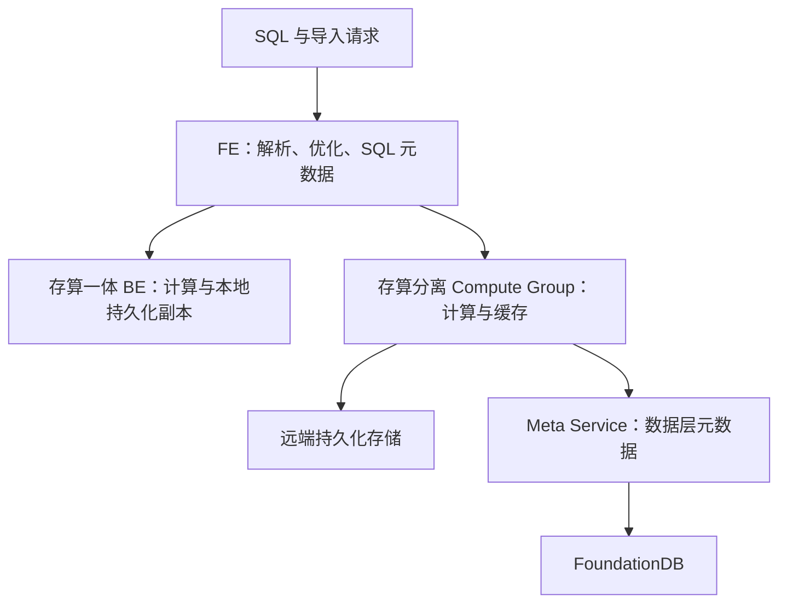

# Doris 架构演进：共同的查询入口与两种存储部署

本文按架构职责比较经典存算一体和 3.0 引入的存算分离模式。版本功能首次出现的时间，需要逐版本发布说明佐证；旧稿中未找到依据的 Falcon、全面改用 Parquet 等路线图已撤回。

两条分支是可选部署模式，不是一个查询顺次经过的流水线。FE 仍负责规划和 SQL 层元数据；Meta Service 负责数据层元数据，不能理解为替换所有 FE/BDB JE 职责。

## 架构变化解决了什么

| 维度 | 存算一体 | 存算分离 |
|---|---|---|
| 扩容 | 本地数据与计算一同规划 | 计算组可独立调整，持久数据共享 |
| 数据访问 | 本地副本读取 | 缓存命中或远端读取 |
| 运维重点 | 副本分布、磁盘、compaction | 远端存储、元数据服务、缓存预热及隔离 |
| 延迟风险 | 数据倾斜、合并竞争 | 冷缓存、网络、远端存储与元数据依赖 |

本地 File Cache 降低远端读取成本，但不保证扩容或故障后延迟完全不变。“无状态计算”描述持久化职责，不表示节点没有缓存状态，也不意味着扩容瞬时完成。

## 与查询和存储演进的关系

Nereids 影响计划选择，向量化执行影响算子效率，Unique MoW 影响主键更新和读取合并，存算分离影响资源配置。这些是不同维度，不能把某次向量化基准的倍数直接套在架构升级的全部负载上。

学习路径：[[Doris-数据模型]] → [[Doris-Segment-v2-存储格式]] → [[Doris-Compaction-策略]] → [[Doris-MPP-向量化查询引擎]] → [[Doris-元数据与一致性复制]]。

## 核验来源

- [Doris 系统架构](https://doris.apache.org/docs/dev/features-architecture/system-architecture/)
- [存算分离部署与 FoundationDB](https://doris.apache.org/docs/4.x/install/deploy-on-kubernetes/separating-storage-compute/install-doris-cluster/)
