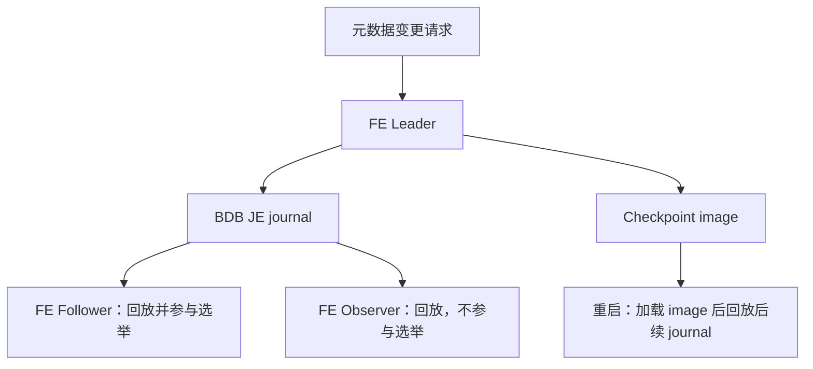
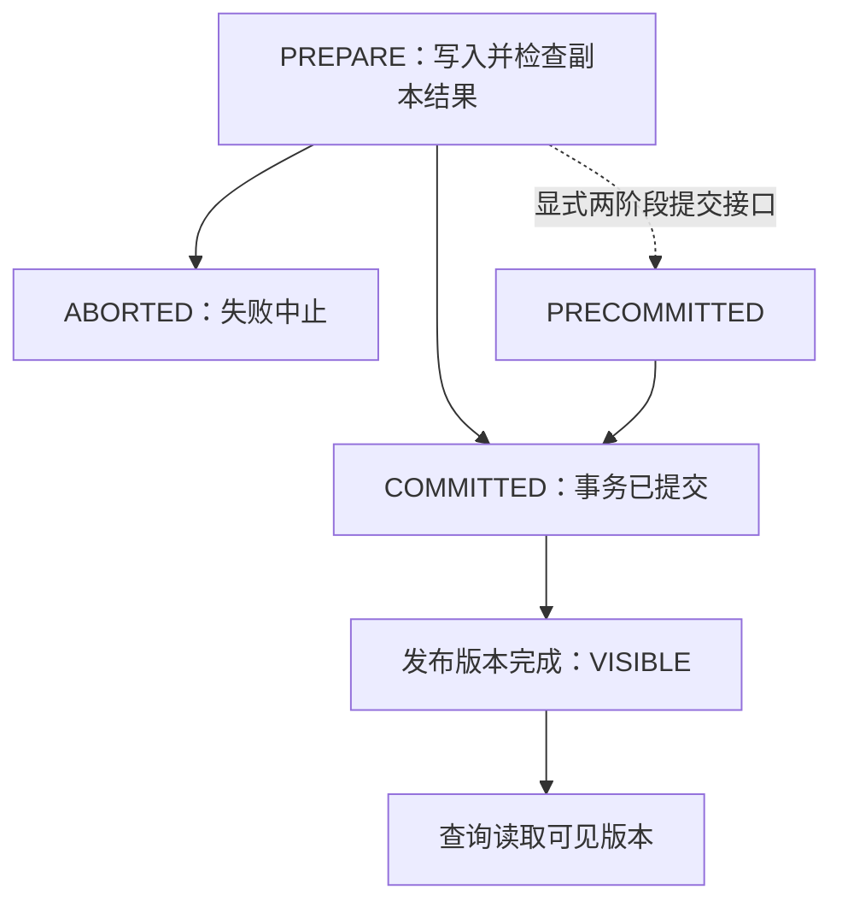

# Doris 元数据、复制与导入可见性

## 先分清三类状态

FE 的 SQL 元数据、BE 上的数据副本、存算分离模式的存储元数据，不能画成一条统一的 Raft 日志。

| 状态 | 经典存算一体模式 | 存算分离模式中的变化 |
|---|---|---|
| 库表 schema、权限、集群信息 | FE 管理 | FE 仍保留 SQL 层职责 |
| FE 元数据持久化和复制 | image + BDB JE journal；单 Leader 接受变更 | 不能据 Meta Service 的存在推断 FE 元数据全部消失 |
| tablet / rowset 等数据层元数据 | BE 与 FE 按职责管理 | Meta Service 承担数据层元数据及相关事务职责，依赖 FoundationDB |
| 数据文件 | BE 本地副本 | 远端存储持久化，计算节点本地缓存 |

FE 元数据设计文档说明各 FE 在内存中保存完整元数据，Follower 回放 Leader 复制的 journal。Observer 接收同步但不参加选举。这里的 BDB JE 复制机制不应直接标成 Raft；也不应画成只缓存热点表、LRU 淘汰其余 schema。

## 写入成功、提交、查询可见是不同阶段

经典多副本导入默认要求 tablet 的多数副本成功；相关配置可以改变要求。因此，“任一副本成功就默认完成，剩余靠异步 Clone”不成立。副本修复是故障处理机制，不等于正常写入确认协议。

图是导入事务状态的概念图；并非每种导入 API 都把 PRECOMMITTED 暴露给用户。COMMITTED 后仍需发布版本才能进入 VISIBLE。收到超时不代表事务一定失败，应使用 label/事务状态查询处理重试，避免业务重复提交。

## 故障分析应检查什么

FE 故障检查元数据选举、journal 同步和恢复；BE 故障检查副本数量、版本完整性及调度修复；存算分离再检查 Meta Service、FoundationDB、对象存储和缓存预热。恢复时间取决于故障类型、数据规模和配置，不能统一写成“10–30 秒”或“秒级”。

单个旧副本暂时落后，不意味着系统只提供任意陈旧数据的最终一致性读取。分析一致性要具体到事务可见版本、可读副本选择及读写接口，而不是只看后台是否有异步修复。

关联：[[Doris-架构演进]]、[[事务模型深度调研]]、[[Raft-共识算法协议核心]]。Raft 卡片用于比较协议，不代表 Doris FE 实现了 Raft。

## 核验来源

- [FE 元数据设计](https://doris.apache.org/community/design/metadata-design/)
- [两种部署模式](https://doris.apache.org/docs/dev/features-architecture/system-architecture/)
- [导入事务状态](https://doris.apache.org/docs/dev/key-features/load-transaction/)
- [导入高可用](https://doris.apache.org/docs/dev/data-operate/import/load-best-practices/load-high-availability/)
