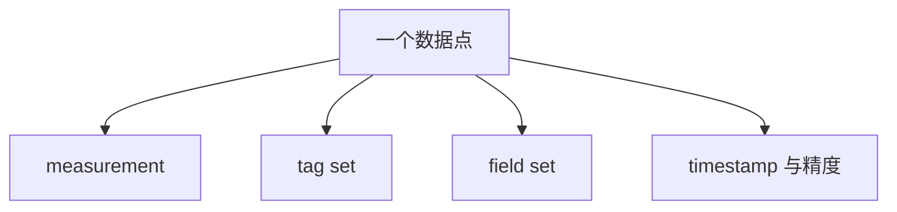

# InfluxDB 数据模型与产品差异

Line Protocol 描述 measurement、可选 tags、fields 和可选 timestamp。时间戳精度由写入约定或 API 参数解释，不能把一个整数不加说明地都当作纳秒。

```text
cpu,host=server-a,region=west usage_user=64.5,usage_sys=12.3 1718200000000000000
```

此示例按纳秒解释时间戳。measurement 是 cpu；tags 为 host、region；两个 fields 保存度量值。转义、字段类型和重复点合并语义仍需按版本校验。



## Series 的统计口径

逻辑上常按 measurement 与 tag-set 识别 series；TSM 存储键进一步包含 field key。报告基数时需注明统计工具和口径。维度取值数乘积是组合上界，只有实际全部出现且满足相应条件时才等于 distinct 数；fields 的内部序列数量应另列。

## 容器概念不能跨版本硬套

v1 的 database / retention policy 与 v2 的 bucket 不是两个同层次必经目录；InfluxDB 3 又有自己的 database / table 与保留配置。Clustered 的按天分区、Catalog 与多 Ingester 也不能自动套到 Core。

TSM 的 tag 索引特征需要和 3.x 列式读取分开描述：不能对全部版本统一打出“Tag 有索引、Field 没索引”的选型表，或宣称 3.x 任意基数免费。先列出真实过滤、分组、范围扫描需求，再设计表与字段。

继续阅读：[[InfluxDB-指标设计与基数管理]]、[[InfluxDB-写入与查询路径]]、[[InfluxDB-Catalog元数据]]。


## 核验来源

- [TSM 数据与索引](https://docs.influxdata.com/influxdb/v2/reference/internals/storage-engine/)
- [Clustered 产品架构](https://docs.influxdata.com/influxdb3/clustered/reference/internals/storage-engine/)
