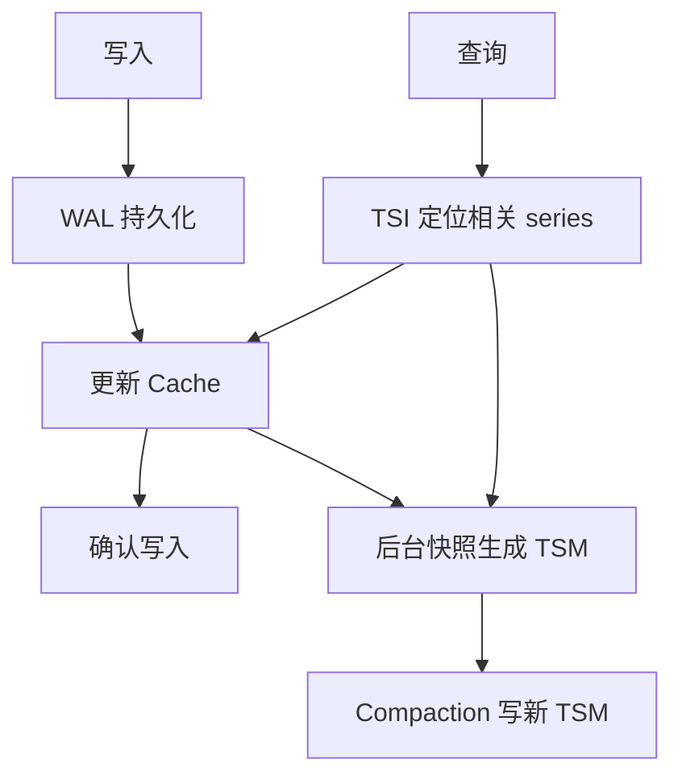
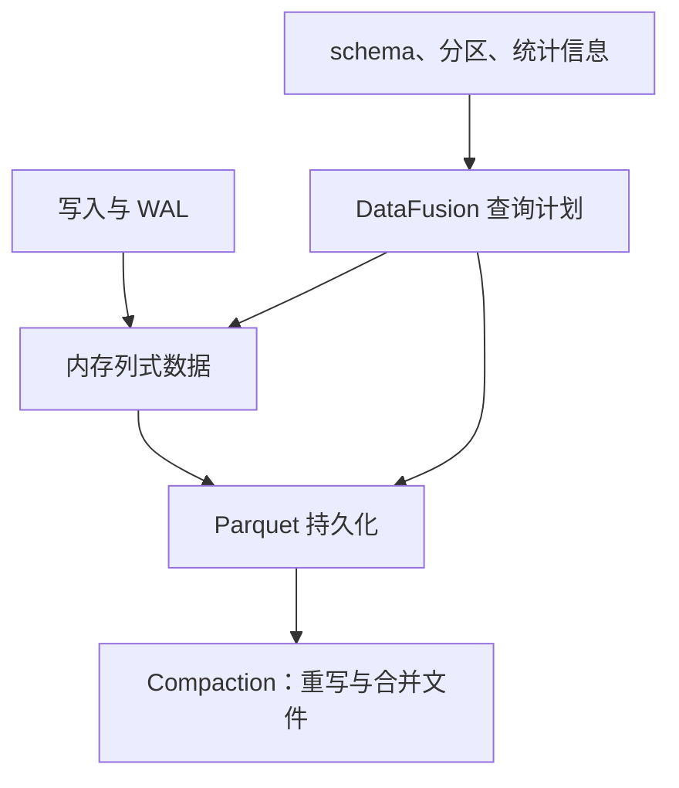

# InfluxDB 引擎调研

本次修订保留原文章路径；以下按已核对的主题重组。详细的版本与证据范围在各节说明。

## InfluxDB TSM 存储引擎

TSM 是 v1/v2 时序存储路线中的不可变列式文件组织，与 WAL、Cache 和 TSI 索引共同工作。不能把 TSM 与所有 InfluxDB 产品的部署架构等同。

TSM 把相关 field 的值按时间组织为块，利用数据类型及分布选择编码压缩；不能把 WAL 使用的压缩方式推广为所有 TSM 列统一采用的编码，更不能给出无数据集条件的固定压缩倍数。

Cache 支持读取最近数据，查询合并 Cache 与 TSM。重启使用未被安全淘汰的 WAL 恢复内存，而非无条件重放数据库全部历史。Compaction 通过新文件重组数据，旧文件按引用及删除规则回收；删除标记不等于直接原地覆盖文件中的值。

### TSI 与过滤器不是同一种索引

TSI 支持从 measurement、tag 等条件定位 series；Bloom filter 回答的是一个候选文件中某键是否可能存在。两者不能作为一一对应组件交换。高基数会增加索引、内存和查询成本，但“百万即必然 OOM”不成立，应结合机器、版本、分布和查询测量。

持久化和后台合并思想与 [[LSM-Tree]] 相近，具体文件层级和调度不可照搬 RocksDB 的任意层数模型。比较新引擎见 [[InfluxDB-3-列存引擎]]，数据设计见 [[InfluxDB-指标设计与基数管理]]。

### 核验来源

- [InfluxDB OSS v2 存储引擎](https://docs.influxdata.com/influxdb/v2/reference/internals/storage-engine/)

## InfluxDB 3 的列式引擎：格式、执行与部署

Arrow 面向内存列式表示，DataFusion 执行查询计划，Parquet 面向持久化列式数据。三者分别回答“如何表示数据、如何计算、如何落盘”，不能合并成“没有索引、没有合并、无限基数零成本”。

图描述数据职责，不代表独立进程数。Core 与 Clustered 的 WAL 及组件拓扑见 [[InfluxDB-写入与查询路径]]。

### 与 TSM 的比较应避免什么

| 维度 | 可用的比较 | 错误的绝对结论 |
|---|---|---|
| 格式 | TSM 是时序专用格式；Parquet 是开放列式格式 | TSM 文件可变、Parquet 不可变 |
| 剪枝 | 分区和列统计帮助减少读取 | 不需要任何索引或元数据 |
| 基数 | 避开原 TSI 设计的部分扩展限制 | 任意基数都不增加内存与查询成本 |
| 写放大 | 取决于刷盘、文件大小、合并与重写 | Parquet 只写一次，没有 compaction |
| 扩容 | 取决于具体产品部署形态 | 所有 3.x 版本原生同样水平扩展 |

压缩倍数受排序、列类型、分布、编码与压缩算法共同影响；没有同一数据集、相同统计口径，就不能宣称固定降低十倍成本。开放文件格式方便工具互操作，但还需遵守 Catalog、权限和一致性约束，直接扫描所有对象文件可能包含已被逻辑替换的数据。

关联：[[InfluxDB-TSM存储引擎]]、[[InfluxDB-指标设计与基数管理]]、[[InfluxDB-Catalog元数据]]。

### 核验来源

- [Clustered 引擎及 compactor](https://docs.influxdata.com/influxdb3/clustered/reference/internals/storage-engine/)
- [Core 存储引擎](https://docs.influxdata.com/influxdb3/core/reference/internals/storage-engine/)
