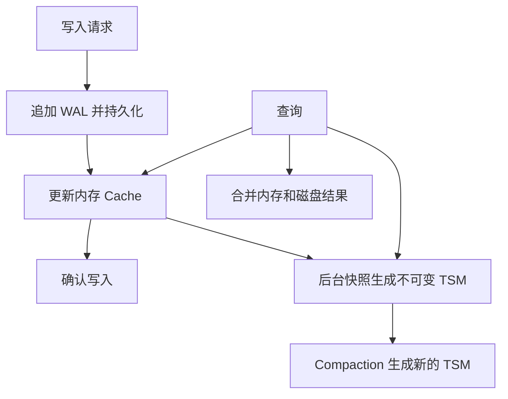
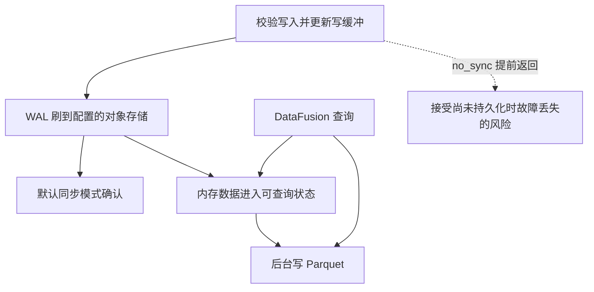
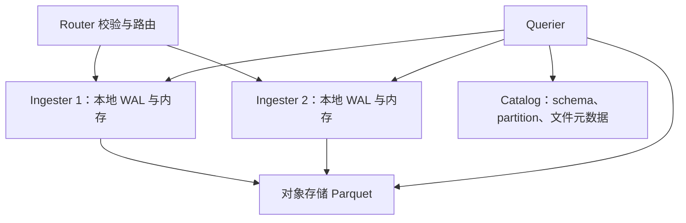

# InfluxDB 写入与查询：先区分产品形态

TSM 是 v1/v2 的引擎路线；InfluxDB 3 Core 与 Clustered 虽共享列式技术方向，其进程拓扑和 WAL 持久化路径不能混画。以下比较的是官方文档描述的默认路径，部署时还需核对版本和配置。

## v1/v2：WAL、Cache、TSM

查询合并 Cache 和 TSM；WAL 用于恢复 Cache，不是普通查询扫描的数据源。TSM compaction 写新文件，因此不能说 TSM 文件可变、只有 Parquet 才不可变。

## InfluxDB 3 Core：对象存储 WAL 与内存可查询数据

`no_sync=true` 改变确认边界；不能套用默认同步模式的数据耐久性结论。文件尚未变成 Parquet，不代表数据不可查询。

## InfluxDB Clustered：Router、Ingester、Querier

Clustered 默认把写入复制到多个 Ingester，WAL 在各 Ingester 本地持久化。Querier 需要最近写入数据时会访问 Ingester，并按 Catalog 信息读取已持久化文件。它不是“所有组件只通过对象存储通信”。

## 调优前先定位瓶颈

把写入确认延迟、内存可见延迟、Parquet 持久化延迟、compaction 积压分别观测。对查询区分最近数据和历史扫描，记录时间范围、过滤选择性、并发及冷热缓存；仅比较文件格式无法解释端到端延迟。

关联：[[InfluxDB-TSM存储引擎]]、[[InfluxDB-3-列存引擎]]、[[InfluxDB-多副本与高可用]]。

## 核验来源

- [OSS v2 存储引擎](https://docs.influxdata.com/influxdb/v2/reference/internals/storage-engine/)
- [3 Core 数据耐久性](https://docs.influxdata.com/influxdb3/core/reference/internals/durability/)
- [Clustered 存储架构](https://docs.influxdata.com/influxdb3/clustered/reference/internals/storage-engine/)
- [Clustered 数据耐久性](https://docs.influxdata.com/influxdb3/clustered/reference/internals/durability/)
