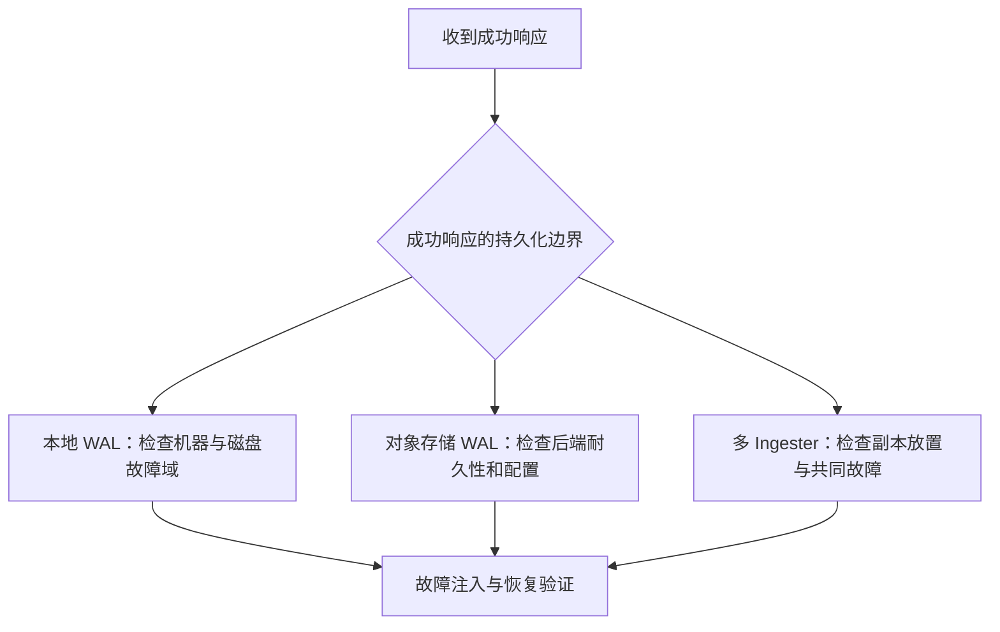
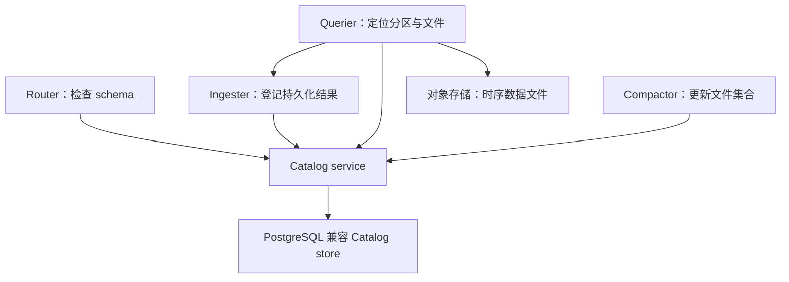

# InfluxDB 耐久性与高可用：确认边界和故障边界

## 三条不同的持久化路径

| 产品形态 | 确认写入依赖什么 | 查询最近数据 | 不应推断的保证 |
|---|---|---|---|
| v1/v2 TSM | 本地 WAL 持久化与 Cache 更新 | Cache 与 TSM 合并 | 单机 WAL 不等于跨节点容灾 |
| 3 Core 默认同步模式 | WAL 刷到配置的对象存储 | 内存缓冲与 Parquet | 不意味着自带多个 Ingester 副本 |
| Clustered | 多 Ingester 本地 WAL，默认复制配置见文档 | Querier 访问 Ingester 与 Parquet | 副本数不直接等于任意多故障容忍 |

Core 开启 `no_sync` 时可能在 WAL 持久化前应答，必须单独评估丢失窗口。Clustered 的近期数据尚未写成 Parquet 时仍可查询，WAL 在持久化数据安全落地前承担恢复职责。

## 不可变文件仍需要元数据与备份

TSM 与 Parquet 都通过生成新文件进行合并，不可变不等于不会误删或无需备份。对象存储的故障域与冗余策略取决于所选后端；Catalog 的备份和文件回收策略也有独立边界。旧稿所写“所有 InfluxDB 3 自动三 AZ、固定 100 天、RPO 一律为 0”没有跨产品依据。

测试至少覆盖：写入确认后进程终止、节点磁盘丢失、对象存储暂时不可用、Catalog 恢复，以及 compaction 期间故障。分别记录可用性、数据完整性和恢复耗时；不能只凭一次写入成功判断容灾达标。

关联：[[InfluxDB-Catalog元数据]]、[[InfluxDB-写入与查询路径]]。

## 核验来源

- [Core 确认与 WAL](https://docs.influxdata.com/influxdb3/core/reference/internals/durability/)
- [Clustered 副本与 WAL](https://docs.influxdata.com/influxdb3/clustered/reference/internals/durability/)
- [TSM 引擎](https://docs.influxdata.com/influxdb/v2/reference/internals/storage-engine/)

## Catalog 补充

这里的独立 Catalog 服务图专指 InfluxDB Clustered，不应推广为全部 InfluxDB 3 Core / Enterprise 部署的固定要求。

Clustered 把 Catalog 分成缓存及访问管理服务和 PostgreSQL 兼容的 Catalog store。它描述 schema、分区及对象存储中文件的位置；实际时序列值仍位于 Ingester 的近期数据和持久化 Parquet 中。

## 为什么不能只备份数据文件

文件存在和文件属于哪张表、哪个分区，是两个问题。恢复方案需要 Catalog 与对象数据的对应关系，必须按所用产品的备份恢复流程验证。上图也显示 Querier 与 Ingester 直接通信，因此 Catalog 不是“组件唯一的通信渠道”。

Catalog 数据库的复制、备份周期、保留期和故障域配置依赖部署。旧稿把“固定 100 天备份、三可用区、自动 PostgreSQL 主从”写成产品普遍保证，没有足够依据，已移除。也不能把 v1/v2 的 BoltDB、旧集群元数据服务、etcd 与新产品 Catalog 简单合并为一条实现史。

## 应验证的恢复不变量

1. Catalog 引用的有效文件仍可读。
2. Compaction 切换后的旧文件不会被新的读取计划当作额外有效数据重复统计。
3. 备份恢复与写入恢复路径共同覆盖最近确认的数据。

这些是审查设计的工程问题，不是本文声称已对所有产品做过的故障注入结果。

关联：[[InfluxDB-多副本与高可用]]、[[InfluxDB-写入与查询路径]]。

## 核验来源

- [Clustered：Catalog store 与 service](https://docs.influxdata.com/influxdb3/clustered/reference/internals/storage-engine/)
