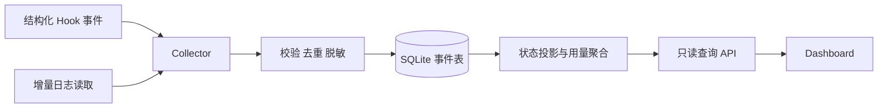
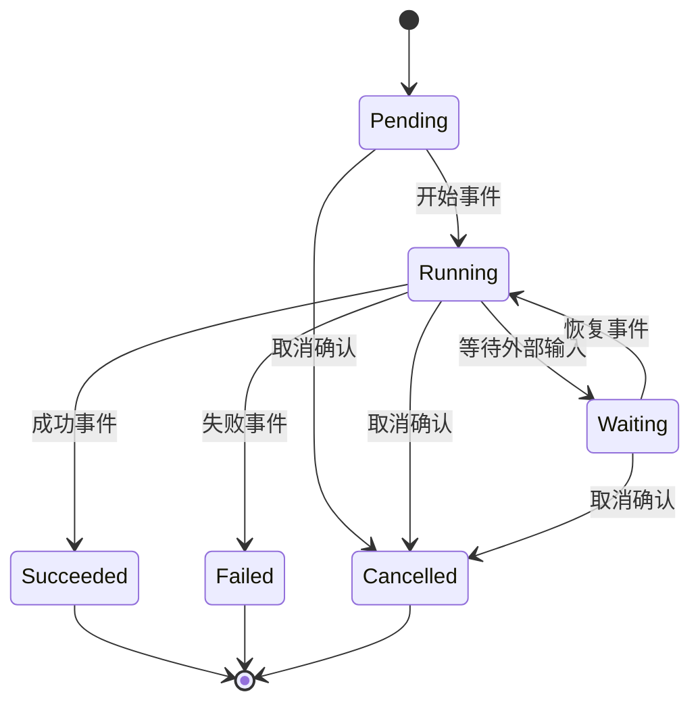

# Agent 可观测性平台：事件、状态与成本的数据设计

> 技术设计草案。本文保留可复用的采集、存储、查询与恢复设计。性能、恢复时间及告警准确率均需通过实现和测量确认。

## 1. 设计问题

多会话 Agent 系统需要回答：某个任务处于什么状态、由哪些执行会话参与、出现了哪些失败，以及模型使用量如何归属。任务状态、进程状态和账单状态来自不同数据源，不能把“没有新日志”直接解释为执行失败，也不能把模型报告的 token 数直接当成最终账单。

## 2. 数据流与职责

Collector 只接受已知 schema，记录来源、事件发生时间和接收时间；日志读取保存可恢复的游标，处理轮转与截断。来源事件 ID 应稳定，重复投递通过唯一约束去重。没有稳定 ID 时，应说明组合键 / 内容哈希的碰撞及漏计风险，不能承诺 exactly-once。

查询 API 和静态前端分离。API 至少提供按任务、会话、时间范围分页查询及聚合结果。即使单用户，也应绑定受控网络接口、验证请求权限并限制返回内容；查询端不能获得启动任务或修改执行状态的权限。

## 3. 关系模型

| 表 | 关键字段 | 约束与用途 |
|---|---|---|
| tasks | task_id、title、created_at | 逻辑工作单元，不等同于单个进程 |
| sessions | session_id、task_id、parent_session_id、provider | 支持一个任务的多次尝试与父子关系 |
| events | event_id、session_id、kind、occurred_at、ingested_at、payload_version | 追加事件事实；来源 ID 唯一去重 |
| task_projection | task_id、state、last_event_id、updated_at | 可重建的查询投影，不作为唯一事实源 |
| usage | usage_id、session_id、model、input_tokens、output_tokens、cache_tokens、source | 按供应商口径保留原始计量维度 |
| price_versions | provider、model、effective_at、unit、price | 将估算金额与价格版本绑定 |

token 分类可能重叠，例如缓存 token 是否包含在 input_tokens 内取决于接口语义。聚合前先规范供应商口径；父会话报告已包含子会话消耗时，不能再把子项重复相加。缺失值应显示“未知”，不能默认零。重试、失败请求、工具费用与订阅额度也不能由文本 token 数完整推导。

金额应标注“估算”、币种、价格生效日期及计费单位；后续账单对账以来源系统为准。这样历史价格更新不会悄悄改写旧报表。

## 4. 状态机与乱序事件

状态机表示一个执行尝试。重试创建新的 attempt / session，保留旧尝试的终态。仅收到取消请求时不能宣称远端操作已撤销；应在确认前显示取消处理中或结果未知。超时是一条观测或策略事件，执行端是否停止需要另行确认。

对于乱序事件，优先使用来源序列号与明确的版本规则；墙钟时间并不天然可比较。投影更新记录 last_event_id，回放时遵守同样规则；非法状态转换进入诊断队列，不应静默覆盖成功或失败事实。

## 5. SQLite 持久化与恢复

SQLite 适用于单机、写入量受控的原型。事务边界应同时覆盖事件插入和必要的游标推进，避免崩溃后跳过事件。是否启用 WAL、同步策略和忙等待参数，应结合并发读写与故障测试决定；不要把某一组参数当成所有部署的性能保证。

**不要把正在写入的数据库文件直接提交到 Git 当作可靠备份。** 应使用 SQLite backup API 或受支持的一致性快照方式，保存快照时间、schema 版本、校验值与必要的增量事件。Git 可管理代码、schema 和脱敏文本配置；包含日志与用量的备份存放在受控位置，按保留策略清理。

恢复流程：校验快照 → 恢复数据库 → 执行兼容迁移 → 按游标补采事件 → 重建投影 → 抽样对账。恢复时间和可容忍数据损失取决于数据量、备份间隔与源日志可重放性；“小于 30 秒”只能作为测试目标。

## 6. Dashboard 与告警

首页显示任务总览、等待 / 异常任务、按模型归属的用量，以及最近一次成功采集时间。详情页沿 task → session → event 展开，明确事件时间与接收时间；使用量视图标示估算、缺失和重复归属排除规则。

告警先落库，再由独立发送器发送；使用告警指纹、冷却时间和恢复事件，避免轮询重复轰炸。采集延迟、来源中断、超时任务和预算阈值是不同告警类型。可观测系统自身故障不能被解释成所有 Agent 同时失败。

## 7. 可验证的交付条件

- 同一事件重复投递、日志轮转与崩溃重启后，不发生明显重复计量或游标跳跃。
- 乱序、缺失和取消结果未知的事件，在界面上保留不确定状态。
- 对固定事件集重放后，状态投影和使用量聚合可重复。
- 使用一致性快照完成一次恢复演练，并记录实际耗时和数据窗口。
- 前端无写权限；敏感日志字段在入库前或查询返回前按明确规则过滤。

关联：[[知识库/wiki/Agent-Harness-Context-Memory上下文管理]]。本草案描述工程选择，不声称任何特定 Agent 框架已提供全部接口。
