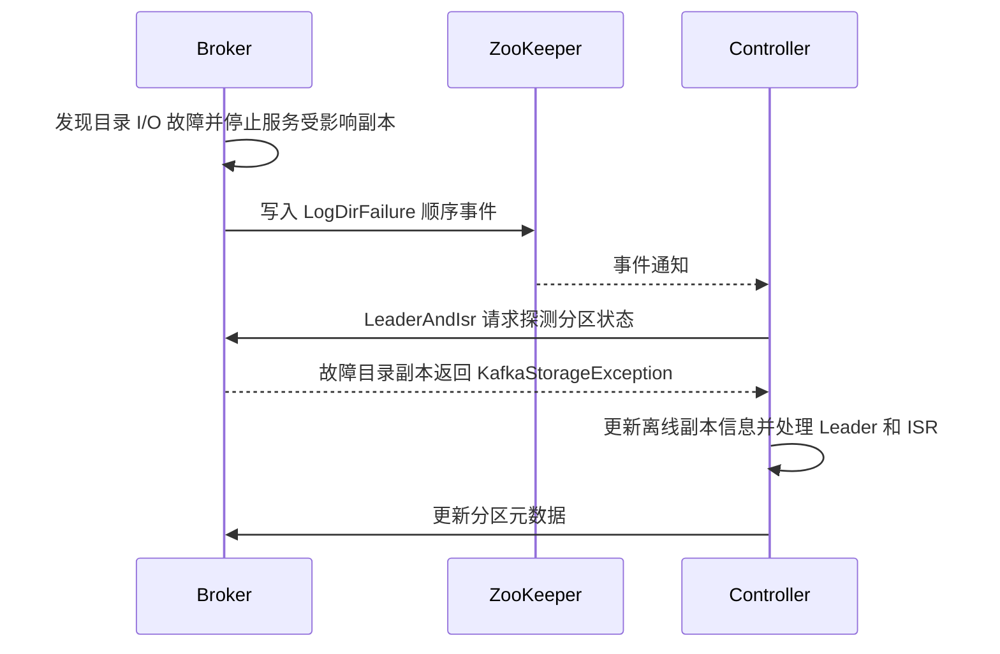
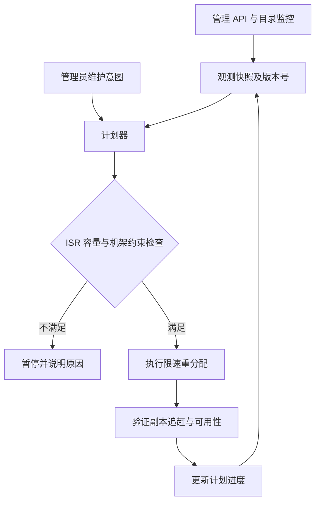

# ZooKeeper 模式 Kafka JBOD 故障处理：现有能力与扩展设计

> 修订说明：旧稿把 ZooKeeper Controller 描述成只能发现整台 broker 掉线，这是错误的。KIP-112 已提供部分磁盘故障通知及受影响副本的处理。本文先澄清现有能力，再保留需要自行实现、测试的运维扩展；它不是可直接执行的产品操作手册。

## 1. 现有机制：部分磁盘故障已经可以被发现

KIP-112 的目标就是让 JBOD broker 在部分磁盘损坏后继续服务健康目录。磁盘 I/O 故障进入目录失败处理链，broker 停止服务该目录上的副本，并通过 ZooKeeper 的 `/log_dir_event_notification` 顺序子节点通知 Controller。该通道用于目录故障事件，不能描述成仅用于 ZK→KRaft 迁移。

Controller 并非等待整台 broker 死亡才开始处理。若存活 ISR 和选举条件满足，它可以为受影响分区选举其他 Leader；不能保证每种故障下都有可选 Leader。健康目录可以继续工作，所有日志目录失败时 broker 才需要退出。**故障感知、Leader 切换、副本数据补齐和永久重新均衡是不同动作**，前两者的存在不等于系统已完成自动迁移与修复。

KIP 文档描述设计语义；具体异常分支、重试行为、管理接口和发行版补丁必须与部署的 Kafka tag 对照。不能把 4.x 接口直接套在 2.7.x 的 ZK 集群上。

## 2. KIP-1066 的边界：Cordon 阻止新放置

Kafka 4.3.0 发布说明列出 KIP-1066。它提供 broker / log directory 的 cordon 能力，其中 `cordoned.log.dirs` 控制目录不再接收新的分区放置；已有副本仍可继续服务。**Cordon 不等于自动 drain，不会仅因标记完成就搬空目录或修好磁盘。** KRaft 下的目录身份、元数据与心跳协议也不能归因于单独一个 KIP。

| 能力 | ZooKeeper 模式的已有基础 | 需要区分的运维扩展 |
|---|---|---|
| 部分磁盘故障通知 | KIP-112 目录事件及分区错误响应 | 告警聚合、故障抑制、工单 |
| 可用性恢复 | 依据分区状态处理 Leader / ISR | 受控补副本与容量恢复 |
| 计划维护 | 依部署版本选择管理 API / 重分配工具 | 统一 cordon 意图、drain 编排 |
| 故障后回归 | 依版本和故障类型恢复目录 / broker | 校验、观察期、逐步放开容量 |

## 3. 扩展设计：维护意图与运行健康分开

保留一个独立运维控制器，但不修改 Kafka 内置故障事件的 JSON 协议。控制器读取部署版本支持的管理 API、目录 / 分区状态与监控，生成迁移计划；写操作通过该版本支持的重分配路径执行。

健康状态（可读写 / I/O 故障）和维护意图（允许放置 / 禁止新放置）是两个维度。磁盘恢复不应自动抹掉管理员的维护意图。若旧版分配器没有 cordon 支持，外部控制器最多约束自己发起的计划，不能声称拦截了所有新增副本。

自定义状态如需存入 ZooKeeper，应使用应用独立命名空间，而非伪装成 Kafka 官方 `/brokers/dirs` 协议。至少记录 schema version、broker 实例身份、计划 ID、观测版本、期望状态、执行结果与失败原因。采用条件更新或等效并发控制，避免旧控制器在会话失效后覆盖新计划；重启应对账实际集群状态，而不是盲目重放命令。

## 4. 迁移与恢复流程

1. **评估**：确认受影响分区、ISR、可用容量与机架分布；区分不可读磁盘和仍可读取的计划维护目录。坏盘数据不可假定可以直接搬出。
2. **隔离新增放置**：仅使用部署版本确实支持的能力；没有内置支持时明确外部约束的覆盖范围。
3. **制定计划**：选择健康来源与目标，设定并发、网络 / 磁盘带宽和磁盘余量预算。不能在 ISR 已不足时继续主动减少健康副本。
4. **执行并观测**：每批次验证副本追赶、ISR、客户端错误、延迟和容量。目标失败、流量异常或余量触底时暂停后续批次。
5. **维修和回归**：更换 / 检查设备后按对应版本恢复流程处理，核验目录身份及副本状态；观察稳定后再解除维护意图。解除 cordon 与数据自动回填不是同一件事。

恢复动作不能保证无损回滚：已执行的副本重分配可能需要新的反向计划，且必须重新检查容量和 ISR。任何固定的“30 秒恢复”“自动无损回迁”都应作为待测目标，而非已实现保证。

## 5. 验证清单与失败场景

| 场景 | 应验证的结果 |
|---|---|
| 单目录 I/O 故障，其他目录健康 | 故障副本被识别；健康目录继续服务；选举符合 ISR 条件 |
| 全目录故障 | broker 退出 / 不可用语义与部署实现一致 |
| Controller 切换与事件重复 | 重建实际分区状态，计划幂等，不重复放大迁移 |
| 目标磁盘余量不足 | 拒绝或暂停计划，不因补副本引发第二次容量故障 |
| 维护期间新建 topic | 测出自定义 cordon 的覆盖盲区，不能假设全局拦截 |
| 控制器重启或 ZK 会话过期 | 旧实例被隔离，重新对账，不复用过时观测 |

本稿撤下未实现的 `--cordon` CLI、虚构的内置配置默认值和与旧协议不兼容的事件示例。实现前应固定部署版本、API 能力矩阵与集成测试环境。

## 参考

- [KIP-112：Handle disk failure for JBOD](https://cwiki.apache.org/confluence/spaces/KAFKA/pages/67638402/KIP-112+Handle+disk+failure+for+JBOD)
- [KIP-1066：Mechanism to cordon brokers and log directories](https://cwiki.apache.org/confluence/spaces/KAFKA/pages/311627566/KIP-1066+Mechanism+to+cordon+brokers+and+log+directories)
- [Kafka 4.3.0 发布说明](https://kafka.apache.org/blog/2026/05/22/apache-kafka-4.3.0-release-announcement/)
