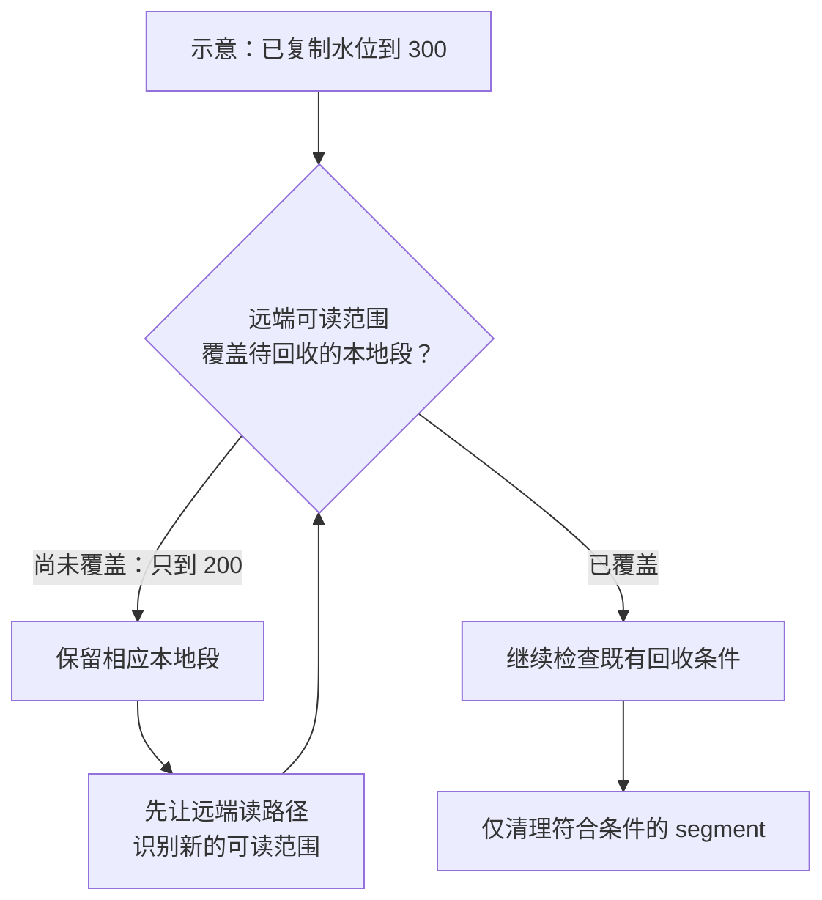

**2026 年 9 月 4 日 09:00—9 月 11 日 09:00（北京时间）**

文件读取中断、主题刚创建、日志副本迁移或推理流量突增时，任务“成功”仍可能伴随数据缺块、远端对象暂不可读或缓存上下文错误。本期从这些边界检查数据链路的正确性。

本期三个重点：**跨引擎类型保真、存储状态生效顺序，以及容量、缓存与重试的协同。** vLLM、SGLang 属于本周版本发布；其余实现只确认本周合并，尚未核实正式发行版归属。七月论文仅作设计背景。

## 数据湖处理：能读到一列，还要确认读回的是同一个值

湖仓互操作需要同时核对类型转换、字段映射、删除语义与元数据解释；文件能打开，并不足以证明值被正确还原。

Iceberg 修复 Flink 读取数组、Map 内时间戳时的精度丢失：旧路径先降为毫秒，再计算余量，可能把 `.123456` 截成 `.123`；补丁保留精度后再拆分毫秒与剩余纳秒。[Iceberg #18001](https://github.com/apache/iceberg/pull/18001)

例如，两条仅差几十微秒的事件可能被压成同一时间值，行数检查仍会通过。因此跨引擎测试应覆盖嵌套类型与边界值。这是机制推演，并非本期发现的线上事故。

Trino 为 Iceberg reader 增加 Parquet 页级跳读，依据列索引与谓词跳过不匹配的数据页。**收益要求文件已有相应索引**；当时 Trino 的 Iceberg writer 仍不生成这些索引，开启读取能力不会自动优化所有既有文件。[Trino #30971](https://github.com/trinodb/trino/pull/30971)

Paimon REST Catalog 增加展示用 schema 历史查询；Hudi 补齐 Flink 对 Lance 顶层 FLOAT/DOUBLE VECTOR 的读写，保留固定维度向量身份。两者分别解决元数据可观察性与类型保真，不代表远程 schema 修改体系或向量检索服务。[Paimon #9673](https://github.com/apache/paimon/pull/9673) · [Hudi 写入](https://github.com/apache/hudi/pull/19831) · [Hudi 读取](https://github.com/apache/hudi/pull/19842)

Delta Kernel 为中途失败的写入增加 abort 路径，避免清理时 close 继续 flush 并写 footer，导致部分输出被当成完整文件；保障仍依赖临时文件机制或底层输出流的 abort 能力。[Delta #7221](https://github.com/delta-io/delta/pull/7221)

验收可分三层：值和类型往返保真，读取优化所需的文件元数据存在，失败输出不会被错误发布。页索引示例、VECTOR 边界与失败路径见[[技术文章/博客同步/tech-research-week-11-lakehouse|数据湖处理分稿]]。

## 流存储：数据已经复制，为什么仍然可能读不到？

分层日志回收需要区分两个进度：数据已复制到哪里，以及元数据允许读者访问到哪里。后者未跟上时，释放本地 segment 可能使数据暂不可读。

Fluss 对同一份已提交 manifest，先更新远端可读起止 offset，再推进复制水位并触发本地清理。非空 manifest 的清理上界取远端可读末尾与已复制水位的较小值。[Fluss #4254](https://github.com/apache/fluss/pull/4254)

以下为说明性推演：复制水位到 300，读路径只知道 200 之前可远端读取，此时回收本地段，200—300 就可能暂时没有可用读路径。字节仍在，但定位状态未就绪。空 manifest 有专门的过期回收逻辑，不适用同一规则。

**图 1｜从“已复制”到“可安全回收”，中间还有读路径检查**

*窄屏可横向滑动图示。*

*图中数字沿用上文推演，展示非空 manifest 的核心约束。复制完成不会绕过可读性和其他回收条件；空 manifest 的特殊路径见流存储分稿。*

Kafka 自动建主题后，较早批次可能因元数据未就绪而失败，较晚批次却先被接受，令早批次重试时序号落后并持续失败。修复要求：从未写过记录且没有该 producer 状态的分区，首批序号必须为 0，以维护幂等协议初始条件。[Kafka #23234](https://github.com/apache/kafka/pull/23234)

Kafka 针对未来时间戳改用文件修改时间判断本地保留期限，仍要求上传完成后才删除。AutoMQ 增加日志元数据 Avro 编码与条件压缩，并修复主题删除重放时遗漏本轮待处理配置的问题。[Kafka #22873](https://github.com/apache/kafka/pull/22873) · [AutoMQ #3576](https://github.com/AutoMQ/automq/pull/3576) · [#3575](https://github.com/AutoMQ/automq/pull/3575)

建议交叉测试 manifest 生效与读取、分区创建与生产、配置重放与主题删除重建。[[技术文章/博客同步/tech-research-week-11-streaming|流存储分稿]]保留失败时序、回收关系图与共享存储 KIP 的设计对照。

## 分布式存储：恢复任务完成，不等于内容已被核对

恢复可能改变服务器和分片边界，因此内容校验不能依赖物理布局；把全量数据送往外部客户端计算，又会增加传输成本。

FoundationDB 的 RangeDigest 在数据所在服务器计算键值叶子哈希，再用可交换、可结合的加法聚合。只要每个相同键值对恰好计入一次，改变分片和聚合顺序不影响结果。计算仍需全量读取，优化的是计算位置与汇总方式。[FoundationDB #13866](https://github.com/apple/foundationdb/pull/13866)

**停写保护同一份逻辑状态，停止迁移保护每个键恰好计入一次。** 否则可能混合不同提交时刻，或在迁移中重复、遗漏键。因此当前能力适合静止数据集恢复核验，不能当作在线一致快照审计；摘要也不是绝无碰撞的证明。

JuiceFS 操作先读到路径 `a → inode1`，并发事务可能随后将其改为 `a → inode2`；若仍只按名称删除，就会误伤新对象。修复把身份条件带入修改语句，并通过受影响行数触发重试。[JuiceFS #7476](https://github.com/juicedata/juicefs/pull/7476)

JuiceFS 还隔离超时后迟到的读取结果，避免后台回调在外层尚未完成返回时覆盖错误状态。Ceph 将 RGW 去重池能力检查从启动移到实际处理阶段，避免空集群尚未建池就初始化失败。[JuiceFS #7500](https://github.com/juicedata/juicefs/pull/7500) · [Ceph #71568](https://github.com/ceph/ceph/pull/71568)

验收需记录核对的状态、修改时匹配的身份，以及超时后的结果发布资格。聚合公式、目录项时序与 WriteGuards 所有权机制见[[技术文章/博客同步/tech-research-week-11-distributed-storage|分布式存储分稿]]。

## AI Infra：容量、缓存命中与重试，必须放到同一条链路里

长短 prompt 的 prefill 工作量不同，持续接单可能积累首 token 延迟，超时重试又会增加负载。容量限制应同时考虑请求数、token 数与重试预算。

vLLM **v0.29.0 于 9 月 9 日发布**，提供请求数与 prompt token 数两类准入上限，超限返回 503。前者统计等待与运行中的请求，后者统计仍处于 prefill 的请求；两个阈值默认关闭，升级后需主动配置。[vLLM 发布说明](https://github.com/vllm-project/vllm/releases/tag/v0.29.0) · [准入实现](https://github.com/vllm-project/vllm/pull/49445)

计数使用完整 prompt 长度，不扣除已完成的 chunked prefill 或前缀缓存命中。例如两个各 12,000 token、仍处于 prefill 的请求合计为 24,000，即使共享前缀已缓存也未必获得准入折扣。这是说明性计算，不是吞吐评测。保守估计减少进度同步成本，也可能提前拒绝，评估时应同时观察拒绝率、有效完成吞吐、TTFT 与重试。

**SGLang v0.5.19 于 9 月 5 日发布**，默认使用统一 radix tree，包含 L3 存储热挂载与流水线并行缓存一致性修复。挂载前已有节点可能缺少存储哈希，需按父子顺序补齐；否则键只描述后缀，可能错误复用其他上下文的 KV。[SGLang 发布说明](https://github.com/sgl-project/sglang/releases/tag/v0.5.19) · [哈希补齐](https://github.com/sgl-project/sglang/pull/35269)

缓存命中仍可能等待慢层加载或并行 rank 同步，因此要核对身份、就绪状态和加载代价。OSDI '26 Strata 为布局、I/O 与调度协同提供设计背景，不代表本周 PR 已实现其全部方案。

Ray 文件数据源重试器按“从头重放，再跳过已交付项”恢复，底层却复用前移的文件句柄，导致后续真实数据被再次跳过。修复每次重试重新打开文件，代价是重复读取与解析；Parquet 不走此路径。[Ray Data #66011](https://github.com/ray-project/ray/pull/66011)

Ray Serve 统一由 controller 聚合扩缩容指标。关联列式编码组件虽已合并，但尚未接入运行链路，其完整链路基准不能算作本周交付加速。[指标聚合](https://github.com/ray-project/ray/pull/65714) · [编码边界](https://github.com/ray-project/ray/pull/64281) · [[技术文章/博客同步/tech-research-week-11-ai-infra|AI Infra 分稿]]

## 提案跟踪：设计被接受以后，还要继续看交付边界

本期首次建立状态基线，下表只展开有本周实现事件的 KIP。原文的 Accepted 本身不是本周新增变化。

| 提案 | 本周变化 | 对使用者的意义 |
|---|---|---|
| KIP-909 | Streams/Connect 强制同步 bootstrap DNS | 异步失败需要重建已失效客户端，框架尚未适配此恢复契约。[#23364](https://github.com/apache/kafka/pull/23364) |
| KIP-939 | `4.4` 分支撤回部分 2PC 公共 API | 原文仍为 Accepted；不能把提案接受、内部实现和公共能力交付视为同一步。[#23356](https://github.com/apache/kafka/pull/23356) |

KIP-1163/1164/1183、FIP-3/6/9 的长期观察与设计层次对照见[[技术文章/博客同步/tech-research-week-11-streaming|流存储分稿]]。后续将分别核对实现范围与实际发行，不把目录目标当作交付证据。

## 用论文把本周案例放回更长的设计问题

背景论文均发表于七月：本期读取 [WriteGuards](https://www.usenix.org/system/files/osdi26-mao-ziming-writeguards.pdf) 的动机与核心正确性机制，以及 [Strata](https://www.usenix.org/system/files/osdi26-xie-zhiqiang.pdf) 的问题分析与设计章节，未复现评测。

WriteGuards 解释所有权切换后，存储端如何拒绝旧节点在途写入；本地拒绝迟到结果与远端阻止旧操作生效是两种保证。Strata 讨论多层上下文缓存的 I/O 与调度，说明容量增加仍需加载机制配合。两篇论文提供设计对照，结论不能直接移植到本周其他系统。

后续可深入两个选题：**分层日志如何证明本地副本可安全删除？共享上下文的加载、准入与重试预算如何共同设计？** 分别沿 manifest / 可读水位 / 恢复路径，以及突发流量 / 冷暖缓存组合实验验证。本期其他会议论文的窗口筛查仍不完整，详见 [来源清单](https://github.com/BryantChang1992/ai_memory_chang_ai_team/blob/main/docs/drafts/weekly/2026-09-11/sources.json) 与 [核验范围说明](https://github.com/BryantChang1992/ai_memory_chang_ai_team/blob/main/docs/drafts/weekly/2026-09-11/review.md)。
