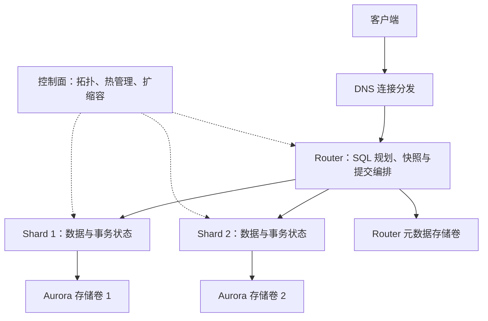
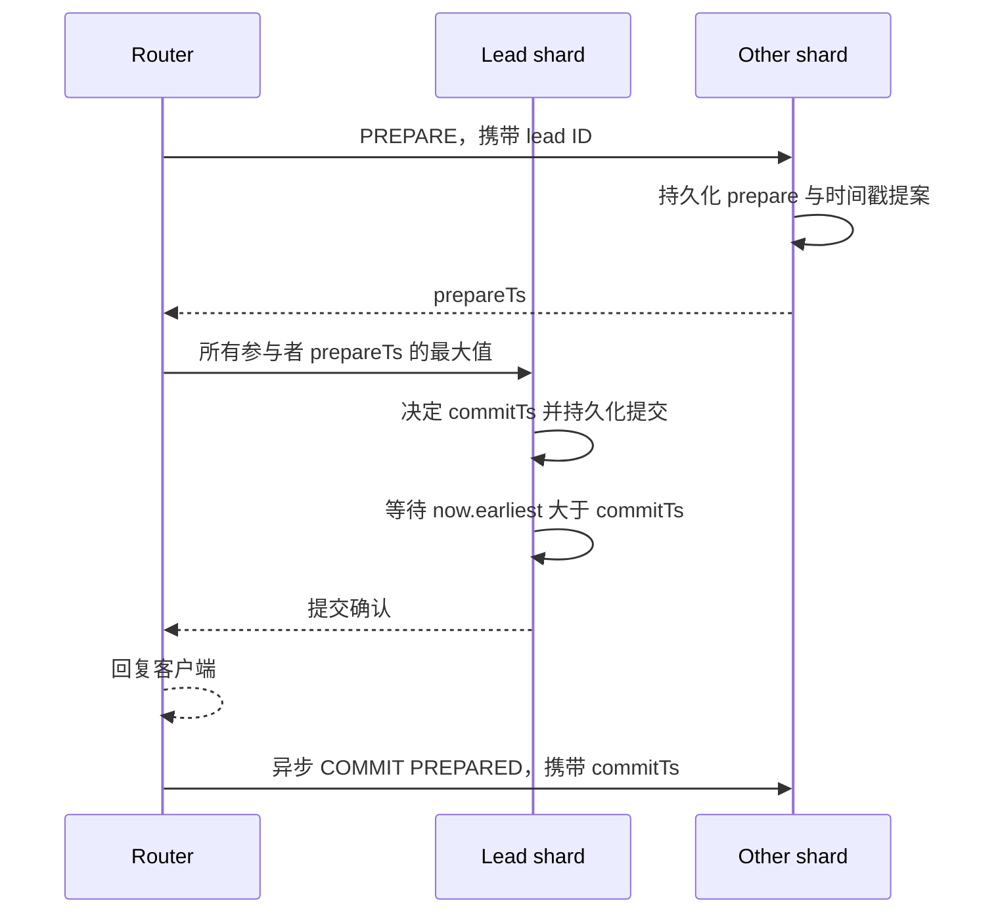

# Aurora Limitless 精读：时间戳事务与二维扩缩容

> 核验版本：本目录 13 页 PDF，Dmitry Arkhangelskiy 等，SIGMOD Companion 2026，DOI 10.1145/3788853.3803089。以下页码是 PDF 页序（正文印刷页 175–187）。现有审核状态保留；本次补的是出处核对。

## 要解决的问题与前提

单写 Aurora 的共享存储不能自动消除单写计算节点的上限。Limitless 把数据分片和查询编排分开，希望分片友好的 OLTP 能随计算节点增加而扩展。其前提包括：客户选择合适分片键；同一区域内跨 AZ 的 Aurora 持久存储；Time Sync 返回包含真实时间的误差区间。它提供 PostgreSQL RC 和 RR（SI），没有实现 Serializable。论文说的是高度 PostgreSQL 兼容；不能推导成全部功能无差别、无需改应用或跨区域读写。

## 章节导航

| 位置 | 阅读问题 |
|---|---|
| §2–3，PDF 2–4，图 1–2 | 三种表怎样映射到 router 与 shard？元数据放在哪里？ |
| §4，PDF 4–5 | clone、redo、切换、清理如何组成 shard split？ |
| §5.1–5.6，PDF 5–7，图 3 | 快照可见性、2PC、HLC、commit wait 分别保证什么？ |
| §5.7–5.9、§6，PDF 8–9 | DDL、备份与 RC 的额外约束 |
| §7，PDF 9–10 | 哪些谓词、连接和函数能下推？ |
| §8，PDF 10–11，表 2、图 4–7 | 固定预算横向扩展与增加预算的效果如何区分？ |
| §10，PDF 12 | 分片键迁移成本、schema 演进和 Serializable 的限制 |

## 架构：控制、编排与持久状态

Router 不存用户表的数据分区，但维护 schema/topology 等持久元数据；不能简化成完全无状态。Shard 有自己的 Aurora 存储卷，并可配置 standby。Router 无专用 standby 是把提交决定持久化在 lead shard 的动机之一，并不意味着 router 不参与协调。

Sharded 表按客户选定的键哈希分片；共置表让相关事务落在同一 shard。Reference 表在各 shard 复制，适合小型连接维表；Standard 表驻留单 shard。分片键和共置关系决定单 shard 优化是否有效，而不是任意 SQL 自动线性扩展。

## 时间戳协议及不变量

§5.1 的关键性质是：对不同事务 T、T'，T 看到 T' 的修改，当且仅当 `T'.commitTs ≤ T.startTs`。RR 首个查询确定快照，RC 每个语句获取新快照。版本可见性为 `xmin.commitTs ≤ startTs < xmax.commitTs`，无后继版本时省略右侧条件。

SI 写冲突仍靠行锁和版本检查：获取排他锁后若发现快照以后的已提交版本，事务回滚。因此使用物理时间戳不等于放弃并发控制，也不等于可串行化。

这里有三种不能混淆的等待：

1. **时钟落后**：读请求 `startTs=100` 到达本地时间区间 `[20,40]` 的 shard。把 `C` 推到至少 `101`，未来 prepare/commit 使用 `max(C, now.latest)`，阻止后来提交再落入旧快照；因此不必只为时钟落后阻塞读。这是 §5.5 的例子。
2. **已 prepare 但结果未知**：向 lead 查询。若已提交，取真实 commitTs；若还未决定，lead 推高 C，使其未来提交时间晚于当前读快照。
3. **COMMITTING**：若提交时间已定且 `commitTs ≤ startTs`，但持久化尚未完成，读必须等提交或中止；HLC 不能消除这一等待。

commit wait 保证一个写事务已响应之后启动的事务看到它的效果（§5.6）。这是尊重实时顺序的 SI，仍允许 SI 的 write skew。论文依赖 Time Sync 的有界时钟误差，不能说它“避免了硬件时钟依赖”。Router 故障后的事务结局依 lead 的持久状态解决；未持久提交不能当作已成功。

## 扩缩容走通示例

假设源 shard 的某些 table slices 要交给新 shard（§4.2，PDF 4–5）：先利用 Aurora 的 copy-on-write clone 建卷，再回放源 redo 追赶。切换期间获取相关锁、冻结受影响表的修改，完成追赶并更新 slice→shard 映射，两边 detach 不再负责的分区，最后后台清理。

典型配置为每表 512 slices，不是每表永远固定 512 个。Clone 减少全量复制负担，但切换会短暂阻塞 DDL/更新，冲突中的事务可能被终止；不能称作“零负载、零中断迁移”。垂直 ACU 分配与水平 split 相互补充，分片不均会让固定总预算仍未充分使用。

## 实验如何解读

§8：us-east-1，Serverless V2 节点最大 256 ACU；定制 HammerDB/TPC-C 派生负载，12,000 warehouses、1,000 客户端、1,000 万次迭代；每配置测试 1 小时，另排除 20 分钟预热，约 10% 事务跨 shard。表 2 给配置，图 4–5 和正文给 NOPM 与 NEWORD 平均延迟。

| 配置 | Router / Shard | 总 Max ACU | NOPM | NEWORD 平均延迟 |
|---|---|---:|---:|---:|
| r1 | 2 / 4 | 1536 | 1,268,350 | 29.70 ms |
| r2 | 4 / 8 | 1536 | 2,012,763 | 21.06 ms |
| r3 | 8 / 16 | 1536 | 2,042,201 | 16.42 ms |
| r4 | 4 / 8 | 3072 | 2,107,539 | 13.13 ms |
| r5 | 8 / 16 | 3072 | 2,891,718 | 9.72 ms |

r1→r2 固定预算增加节点：吞吐 +58.7%；r3→r5 固定节点增加预算：吞吐 +41.6%。r2→r3 的收益很小，说明节点数不是充分条件。**原文 §8.2 的 r4→r5 文字误复用了 r3→r5 的起点及 41.6%；按上表重算是约 +37.2%**。这是读者依据已报告数值计算的勘误，不能悄悄当作原文实测百分比。

NOPM 是每分钟新订单数，不能直接当作每秒事务数；平均延迟也不能当作 P99。该实验不是与其他数据库的公平跨产品竞赛，不支持“竞品中独一无二”或一般意义的线性扩展结论。

## 工程启示与边界

**推论**：应先测单 shard 命中率、热点分片和 router 的协调开销，再决定买更多 ACU 还是 split；切换应覆盖长事务终止与客户端重试测试。复制持久性、事务原子性、快照可见性、实时顺序是四个不同问题，评审时需分别核验。

相关：[[Aurora-Limitless-分布式架构]]、[[Aurora-Limitless-时间戳事务]]、[[Aurora-Limitless-自适应扩缩容]]、[[事务模型深度调研]]。
