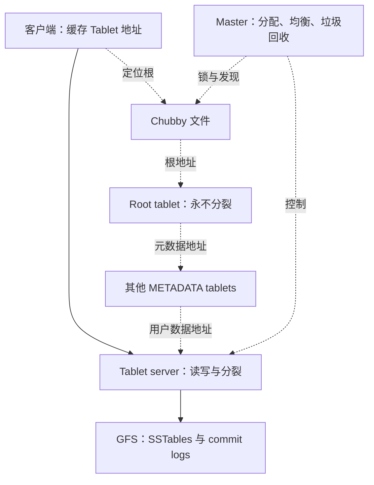
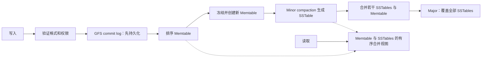

# Bigtable 精读：有序稀疏表、Tablet 定位与故障恢复

> Fay Chang 等，OSDI 2006；核验本目录 14 页 PDF。定位使用 PDF 页序。本文说明的是 2006 年论文系统，不是当前 Cloud Bigtable 产品承诺。

## 问题和接口边界（§1–3，页 1–3）

目标是在数千台机器、PB 级结构化数据上提供持久存储、随机读写和范围扫描，同时允许应用控制数据布局。接口不是完整关系数据库：没有一般 SQL、跨任意行事务或自动 join。

抽象为 `(row:string, column:string, time:int64) → string`。行按字典序排序，单行读写具有原子性；列名由列族与 qualifier 组成，列族需要显式创建，qualifier 可动态增加。版本按时间戳降序，列族可指定版本保留策略。时间戳是数据版本标识，不能直接推导成跨行 SI。值是不可解释的字节串；论文没有声称持久 cell 编码省略所有 key/column/timestamp。

示例：反转域名的 row key 将同一网站页面放在相邻行；`contents:` 保存页面版本，`anchor:example.com` 保存来源锚文本。相邻行促进范围扫描与压缩；是否把多个列族放在同一物理组由 locality group 决定，不能把行排序与列族分组当成一件事。

## 架构与定位（§4–5.2，页 3–5，图 4）

Master 不在用户数据路径上；客户端直接找 tablet server。Tablet 一般 100–200 MB，server 通常管理 10–1000 个。Root 是 METADATA 的第一个 tablet，特殊之处是永不分裂。

§5.1 的容量估算：每 METADATA 行约 1 KB，按 128 MB 的 metadata tablet，三层结构可寻址 `2^34` 个 tablet；若每数据 tablet 128 MB，合计 `2^61` 字节。旧稿将 `2^34` 个 tablet 写成字节，误成 16 TB，已纠正。空缓存定位需 3 次网络往返，陈旧缓存可能达 6 次（假设 METADATA 迁移不频繁）。

### 为什么旧 server 不能继续写

§5.2：server 在 Chubby 的专属文件持独占锁；失锁即停止服务。Master 多次联系不上 server 后，尝试获取其锁，成功后删除文件，再把 tablets 标记为未分配。文件已删的旧 server 无法重新持锁，应退出。这是防旧 owner 继续服务的关键次序；不能简化为“心跳没了就立刻迁移”。Master 的 Chubby session 过期时也会退出。

Master 重启先获得唯一锁，发现存活 server、询问已分配 tablets，再扫描 METADATA 找未分配部分。既有分配不因 master 重启自动失效，但需重新分配的故障 tablet 仍会受控制面恢复影响，因此不能承诺 master 故障时“任何数据均持续可用”。Chubby 是关键依赖，由复制服务实现，不能称为单台单点。

## 存储机制与删除不变量（§5.3–5.4、§6，页 6–8，图 5）

SSTable 是有序不可变映射，block 大小可配置，论文示例为 64 KB，索引加载进内存。Memtable 是排序缓冲，行使用 copy-on-write 降低并发读写竞争；原文没有把它指定为 COLA。

- Minor：冻结 Memtable 并写为 SSTable，释放内存、缩短恢复要回放的日志。
- Merging：合并若干 SSTables 与 Memtable，以限制文件数量。
- Major：把全部 SSTables 重写为一个 SSTable，结果不再含删除标记和被删值。其他合并仍可能需要 tombstone 遮蔽未参与合并的旧文件。

例：新文件有 `delete(k)`，老文件仍有 `k=v`。若只合并新文件便丢 tombstone，旧值会重新出现。因此不能把任意 merging 当成彻底物理删除；论文也未规定 major 必须每周一次。这里的 merging 不等价于现代 RocksDB 的 partitioned leveling。

### 日志与恢复

每 server 共用 commit log，增强 group commit 并降低文件数量；故障后先按 `(table,row,sequence)` 排序日志，使接管者只读自己 tablet 的连续范围。日志按 64 MB 段并行排序。双日志线程可以切换慢日志路径，序号用于恢复去重（§6，页 7–8）。

有计划迁移先做一次 minor compaction，再停服并做第二次 minor 清空新增尾部，减少接管回放。论文报告迁移通常少于 1 秒的短暂停服（§7），不是一切故障在 100–200 ms 内恢复。新 tablet 可共享父 tablet 的不可变 SSTables，无需分裂时全量复制。

## 性能优化的因果关系（§6，页 6–8）

| 技术 | 节省什么 | 前提/代价 |
|---|---|---|
| Locality group | 只读相关列族对应 SSTable | 分组需匹配列共访模式，非每列族自动单独一文件 |
| 两遍 block 压缩 | 降存储与传输量 | 同 host 页连续有利；10:1 是 Webtable 样本，不是所有数据 |
| Scan cache / Block cache | 重复 KV / 相邻 block 访问 | 不同访问模式收益不同 |
| Bloom filter | 排除不存在的 row/column 对 | 原文为按 locality group 启用，没有统一 1% 配置承诺 |
| SSTable 不可变 | 简化并发、分裂、垃圾回收 | 更新与删除需新版本和 compaction |

## 评估证据（§7，页 8–10，图 6）

N 个 tablet server 与 N 个客户端，server 配 1 GB 内存；底层共享 1786 台 GFS 机器。机器为双路双核 2 GHz Opteron、千兆网络，同机房 RTT 小于 1 ms；同池有其他作业干扰。每 server 约 1 GB 数据，每 value 1000 字节且不可压缩；内存随机读例外，只用 100 MB/server。

下表是**每 server 每秒 values 数**，不是整个集群总量，也不是延迟：

| 操作 | 1 server | 500 servers 时每 server |
|---|---:|---:|
| 随机读 | 1212 | 241 |
| 内存随机读 | 10811 | 6250 |
| 随机写 | 8850 | 2000 |
| 顺序读 | 4425 | 2469 |
| 顺序写 | 8547 | 1905 |
| 扫描 | 15385 | 7843 |

随机读每次为一个 1000-byte value 拉取 64 KB block，CPU/网络成为瓶颈；scan 用单个 RPC 取多值摊薄开销。500 节点内存读总吞吐约为单节点 289 倍，随机读约 99 倍，均非线性 500 倍。基线是同系统不同规模和访问模式，不是其他数据库。

§8（页 10–11）给 388 个非测试集群、约 24,500 servers；繁忙的 14 个集群合计约 120 万请求/秒。Analytics 原始点击表约 200 TB、压缩为原体积 14%，汇总表约 20 TB、29%。旧稿的单集群 1.3 PB、每天新增 500 servers 和延迟分位表未在此原文定位，已移除。

## 工程启示与局限

**推论**：路由缓存减少中心请求，但必须设计地址失效重查；不可变文件使迁移轻，但不消除 owner fencing；调大 block 能帮助 scan，却增加随机点读放大。设计 row key 时需同时考虑顺序局部性和热点。

论文没有解决一般跨行事务、SQL 优化器或跨区域强一致性。后来的 HBase、Cassandra、LevelDB 与 Bigtable 有历史关联，但具体产品的当前引擎和一致性要用各自来源核实，不能从 2006 年论文自动补全。

相关：[[Bigtable-分布式结构化存储系统]]、[[LSM-Tree]]、[[LSM-Tree-合并优化]]。
