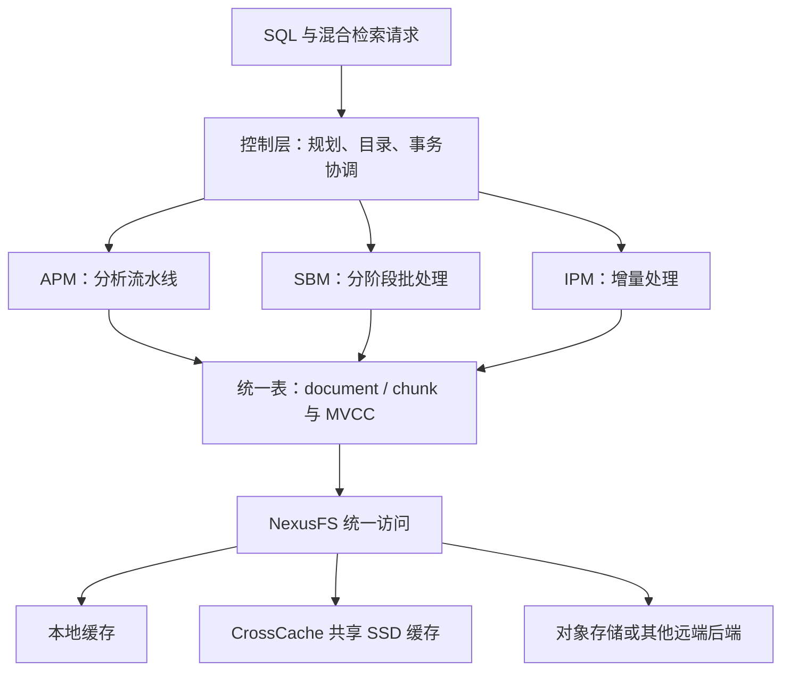
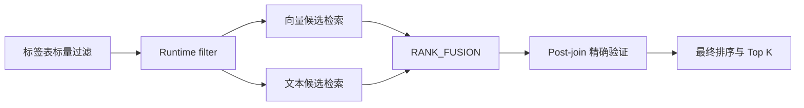

# ByteHouse 精读：统一表、执行模式与多模态检索

> 核验版本：本目录 14 页 PDF，Yuxing Han 等，SIGMOD Companion 2026，*ByteHouse: ByteDance's Cloud-Native Data Warehouse for Real-Time Multimodal Data Analytics*。下列定位为 PDF 页序；生产规模是论文报告，不是当前产品能力审计。

## 问题与设计约束

同一业务需要大范围列扫描、增量结果刷新和向量/文本/标量混合检索。把它们拆为完全独立引擎会重复维护元数据与索引，并增加数据新鲜度不一致风险。ByteHouse 选择统一表抽象，再用不同存储访问路径和执行模式适配工作负载。代价是版本管理、后台合并和优化器必须协同，不是给列存加一个向量字段就完成统一。

§2（页 2–3，图 2）分控制、计算与存储层：控制层管理查询规划、目录、事务和后台任务；计算层提供 APM/SBM/IPM；存储层包括统一表、CrossCache 与 NexusFS。§2明确宣称Global Transaction Manager支持serializable事务和一致快照读；正文未完整展开并发控制证明，因此应作为论文报告的系统能力记录，而不能只凭“全局时间戳”这一个实现要素推导保证。

## 统一表与写入路径（§3.1，页 3–4）

逻辑 document 可拆成多个语义 chunk，以 `(document_id, chunk_id)` 唯一标识记录；schema 同时容纳结构化属性、嵌套字段和向量。物理上 stable segments 为不可变列存，delta segments 记录近期更新与特征刷新，MVCC 决定同一快照看到的版本，后台 merge 将 delta 组织进 stable。

**不变量**：同一查询的标量过滤和向量候选不能拼接两个不同版本的数据；后台重写存储布局不能改变该快照的逻辑结果。这是从论文一致快照设计得出的评审要求，而非新的隔离级别证明。

Compaction 控制器（式 1）令

`α = min(1, max(0, k × (NΔ/N* − 1)))`。

其中 NΔ 为活动 delta 数，N* 为平衡数量，k 为灵敏度。α 影响触发频率、合并批次及调度优先级。教学例：N*=100、k=.5 时，NΔ=100/200/400 对应 α=0/.5/1。公式只描述单调限幅控制，不能仅凭其形状证明带迟滞、I/O 反馈的实际系统永不振荡。

## Sniffer、缓存与文件系统各解决什么（§3.2–3.4，页 4–6，图 3）

Sniffer 将数据、索引与文件元数据共置，通过 RecordGroup、ColumnPartition、索引/统计与 footer 支持裁剪和按需访问。它减少分离文件的查找与额外访问，不表示整个系统不再需要 catalog，也不保证任意点查一次 I/O 取齐全部索引和数据。

CrossCache 在独立 SSD 节点按 chunk 放置缓存，一致性哈希定位、预取与异步刷写降低远端访问成本。NexusFS 给计算端统一命名和读写访问，协调本地缓存、CrossCache、TOS/HDFS 等后端；缓存命中、缓存未命中与持久副本角色不能混为一谈。

## 三种执行模式（§4，页 6–8）

| 模式 | 选择原因 | 仍需付出的成本 |
|---|---|---|
| APM | 低延迟流水线与并行分析 | shuffle、join 和聚合仍受数据倾斜影响 |
| SBM | 長 ETL 的阶段化执行与失败重试 | 中间结果持久化带来额外 I/O |
| IPM | 只处理变更传播而非每次全量重算 | 必须维护 lineage、版本和中间状态 |

它们共享优化器与运行时，不代表任意查询可零代价切换模式。IPM 的效果必须带上变更比例、join 形态和维护状态量解释。

## 混合检索走通示例（§5–6，页 8–10，图 4–5）

查询需求：“找带 doc_image 标签、同时符合关键词与语义的前 K 个 chunks”。优化器先估计标签表选择率，在合适情况下构建 join-key runtime filter，注入文档或向量扫描；文本与向量各自产生候选排名，RANK_FUSION 合并，随后保留必要的 post-join 精确验证。Bloom runtime filter 有假阳性，不能用它代替最终关系谓词。

融合有两条路径：分数 Min–Max 归一化后加权；或 RRF：`sum_i 1/(k + rank_i(d))`，k 常设 60。教学例：两列表名次 (1,10) 的候选得 `1/61+1/70≈.03068`，名次 (3,3) 得 `2/63≈.03175`，后者更靠前。RRF 使用相对排名，不要求 cosine 与文本分数原本同尺度。

索引选择也有边界：在线低延迟用 HNSW+SQ；近实时可用 IVFFlat/IVFSQ/IVFPQ；成本敏感可用 SSD 上 DiskANN，更宽松归档可用 DiskIVFSQ。论文没有承诺“HNSW<10ms、IVF<100ms、DiskANN对象存储<1s”的统一 SLA。HBO/ML 用执行历史改善选择率和 join side 等决策，仍需防止分布变化和计划回退，不能认为 ML 永远优于 CBO。

## 实验按问题分开读（§7，页 10–12）

| 实验与定位 | 设置、基线 | 作者报告与解释边界 |
|---|---|---|
| 标准分析，图 6 | AMD EPYC 9Y24，64 cores/128 threads，247 GB；TPC-DS SF1000，及 ClickBench 43 查询，每查询运行 5 次取最快 | ClickBench 较 ClickHouse 总延迟 -25.4%，约 32 个查询更快；不能解释成 P99、全部查询或平均用户体验改善 |
| IPM，图 7 | TPC-H SF100，Q12/Q14/Q19，lineitem 2.5% 更新；增量 vs 全量重算 | CPU 时间下降 28.4%–69.2%，不是端到端 wall-clock 统一倍数 |
| CrossCache，图 8 | 180 计算节点，47 cache nodes，每 cache node 2.25 TB SSD；最大扫描量的历史 1000 查询 | 相较本地缓存 50% 命中率，P50/P90/P99 约 -25%/-18%/-22%；理想 100% 本地命中仍略快，论文确有此实验 |
| AI 优化，图 9 | 100 节点生产集群，每节点192 cores/1.48 TiB；PPS 与 JSS | PPS 启用后读量最多 -87%；1000 个生产 join 样本，JSS 延迟 -15%–45%；需留意前后对照的负载混杂 |
| 向量检索，图 10a | VDBBench；Cohere/C4；99% recall；带1%标量过滤；Milvus、pgvector | 作者报告相较 Milvus 提高50%–60%（Cohere）及超过50%（C4）；不应称所有多模态工作负载吞吐提高50% |
| 混合召回，图 10b | MS MARCO 8.84M中抽2M passages，BGE-M3；hybrid/vector/text | Recall@100 比 vector约高30%、比text约高50%，是召回效果而非吞吐 |

旧稿把缓存命中率实验说成缺失，并给当前竞品统一打“无向量支持”，均超出本文证据，已撤除。本文实验不包含 Snowflake 统一性能比较。

## 局限与可迁移的工程判断

此工业论文同时介绍多层系统，许多收益是组合效果，不能把25.4%完全归于某个索引或模型。模型稳定性、缓存成本和总资源成本仍需自有工作负载验证。缺少统一重跑各系统的完整配置时，不把图中优势当作普遍排序。

**推论**：选型应把 freshness、recall、过滤选择率、缓存命中、更新比例和故障重试一起纳入测试；否则同名“向量QPS”或“实时分析”会隐藏不同约束。

相关：[[ByteHouse-架构与设计]]、[[ByteHouse-统一表引擎]]、[[ByteHouse-多模态查询优化]]。
