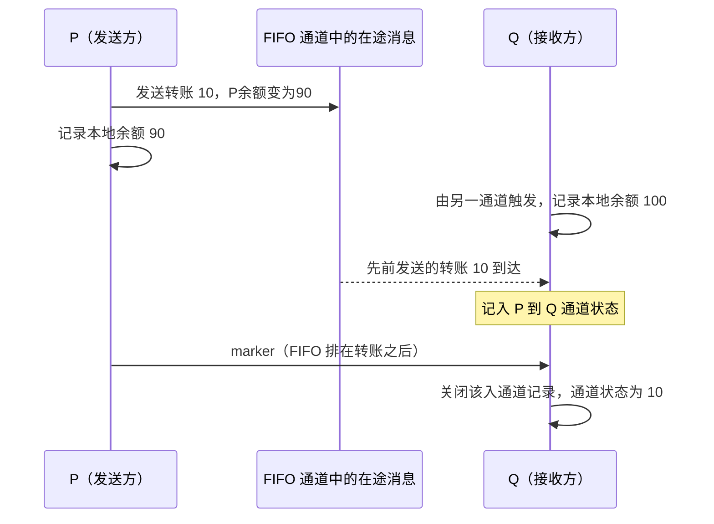

# Chandy–Lamport 分布式快照：精读分析

> 核对版本：Chandy & Lamport, *Distributed Snapshots: Determining Global States of Distributed Systems*, TOCS 3(1), 1985, pp. 63–75。下文同时给出印刷页码与 PDF 页码；本文是分析，不是逐句翻译。

## 问题、模型与边界

目标是在各进程继续执行、没有全局时钟的条件下，记录一份由**进程本地状态和有向通道中的消息序列**组成的全局状态。只保存进程变量不够：发送端已经扣款、接收端尚未入账的转账消息也属于系统状态。

§2（印刷 pp. 65–68 / PDF pp. 3–6）使用进程状态机、可靠 FIFO 通道和原子事件模型。通道有无限缓冲，传输延迟任意但有限；协议不解决快照执行期间的进程崩溃、丢消息、非 FIFO 传输。强连通图是单发起者触达所有进程的充分条件，**不是唯一可用拓扑**：§3.3 要求每个进程自身启动，或能从某个发起进程经有向路径到达，同时 marker 最终被接收。

## 算法与关键不变量

§3.1 从消息计数推出通道记录应等于「发送端记录前已发送的消息」减去「接收端记录前已收到的消息」。§3.2 给出发送与接收规则（印刷 p. 70 / PDF p. 8）。

1. 进程记录自己的本地状态。
2. 在向每条出通道发送任何**后续应用消息之前**，先向该通道发送 marker；不能把这一步仅理解为“稍后广播”。
3. 尚未记录本地状态的进程首次收到 marker 时，立即记录本地状态，并把该 marker 所在入通道的记录置为空，随后按第 2 步传播 marker。
4. 对其他入通道，记录本地状态之后、该通道 marker 到达之前收到的应用消息。收到 marker 后关闭该通道的记录；应用计算继续执行。

首次 marker 所在通道为空，原因是 FIFO：marker 之前的应用消息已在接收方的本地记录之前收到，之后的消息属于发送方记录之后。**这并不表示 marker 是通道的第一条消息，也不表示该通道历史上没有消息。**

不变量是：快照不能包含一个 receive 却不包含对应 send；send 在切割内而 receive 在切割外的消息，必须恰好出现在通道状态中。Marker 是边界标识，不能直接等同于逻辑时钟计数器。

## 可复核的转账示例

下面是解释算法的自构示例，不是论文实验：P 和 Q 初始各有 100 元，P 发出转账 10 元后先记录状态，因此记录 P=90；Q 由另一个路径先触发快照，记录 Q=100，尚未收到转账。消息随后到 Q，晚于 Q 本地记录、早于 P→Q marker，因此被记入通道，最终全局状态为 90+100+10=200。

图中的“FIFO 通道”是为区分发送与接收事件而加入的示意对象，不是新增服务节点。转账在 P 本地记录前已发出，随后才被 Q 收到。若只有 P 发起且 Q 的首个 marker 就来自 P，Q 会先收到转账再记录余额 110，此时通道为空，同样守恒。

## 正确性：可能状态不等于实际经过的状态

§4、Figure 8 与 Theorem 1（印刷 pp. 71–74 / PDF pp. 9–12）明确指出，记录的 S* **可能从未出现在原始执行序列中**。证明通过交换不违反因果顺序的独立事件，构造另一合法执行，令 S* 位于快照启动状态 S_start 与结束状态 S_end 之间：

- S_start 可以到达 S*；
- S* 可以到达 S_end；
- 保留每个进程内部事件顺序和消息发送先于接收的约束。

因此它是一致、可达的全局状态，并非某个未知墙钟时刻的真实照片。原笔记将这两者等同，现已纠正。

## 稳定属性：正负结果的含义不同

§5（印刷 pp. 74–75 / PDF pp. 12–13）中的稳定属性 y 满足：一旦为真，在后继状态仍为真。例子包括计算已经终止、在不含外部解除动作的模型中死锁、令牌环中的所有令牌消失。不能把任意“资源泄漏”或任意等待环都无条件当成稳定属性。

由可达性可得：

- y(S*) 为真 ⇒ y(S_end) 为真；
- y(S*) 为假 ⇒ y(S_start) 为假；
- **y(S*) 为假不能推出算法结束时仍为假**，属性可能在快照期间变真。

## 证据类型、开销和局限

这是一篇算法与证明论文，没有吞吐基线、机器配置或性能实验。Figures 1–8 是状态与执行示例，不是实验曲线。不能补造“快照降低多少延迟”的数字。

从规则可推导：单次快照在每条有向通道发送一个 marker，控制消息数与通道数同阶；通道记录的空间取决于本地记录到 marker 到达间的在途消息数。此复杂度是本文依据算法的推导，不是论文测得的数据。§3.3 将最终汇集各节点快照视为另一层工作，不应误称收齐本地 marker 就已把完整快照持久化到中心。

## 与流处理检查点的关系

这是后续工程联系，不是 1985 年论文对 Flink 的结论：barrier 与 marker 都用于划分逻辑边界，但具体系统如何暂停输入、持久化状态、重放通道及对接 source/sink，需要自己的协议。Aligned checkpoint 通过对齐避免把全部在途数据当作通道快照；unaligned checkpoint 会保存通道数据。不能笼统写成“原算法阻塞输入，而 Flink 只是异步版本”。原算法本来就允许应用计算继续。

延伸阅读：[[Chandy-Lamport-分布式快照算法]]、[[流处理容错模型]]、[[流处理状态管理]]。
