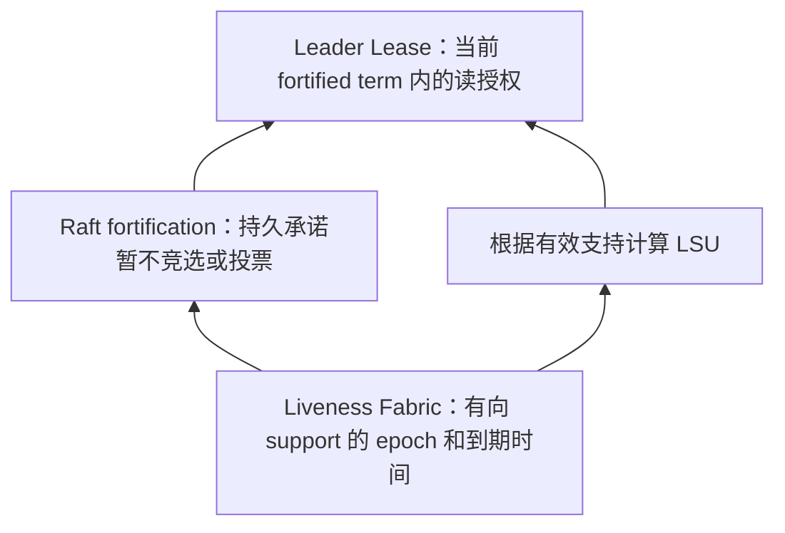

# CockroachDB Leader Leases：精读分析

> 原文：Kettaneh 等，*Scalable Leader Leases For Multi Consensus Groups in CockroachDB*，SIGMOD Companion 2026，13 页，DOI 10.1145/3788853.3803081。下列页码为本库 PDF 页序。

## 问题与贡献

CockroachDB 把数据划分成大量 Range，每个 Range 由 Raft 复制。每个组独立续租会使背景维护成本随组数增加；集中 liveness Range 虽省资源，却可能与某个数据组的实际可通信性脱节。本文用共享的 Liveness Fabric、显式的 Raft Leader Fortification 和与 fortified term 绑定的 Leader Lease，把常态续约从每组下沉到共享节点/存储对。

不要据此宣称所有分布式数据库都使用 Raft；论文对 Paxos 等协议的背景介绍并不改变 CockroachDB 自身采用 Raft 的事实。也不能说所有 Raft 成本变成与组数无关：写复制、状态以及尚未静默的 leader tick 仍是每组工作。

## 三层机制及证据位置

### 1. Liveness Fabric（§3.4，pp.6–8）

A 请求 B 支持自己至 HLC 时间戳 t，B 持久化 support_for 后回应。A 的 support_from 是非持久状态，B 的 support_for 要跨重启兑现。support epoch 描述**某条有向支持关系的不间断区间**；A 失去 B 的支持，不代表它也失去 C 的支持。max_epoch 的增长不能被解释成所有边一同重置。

§4.1（p.8）给出两种性质：Durability 保证 B 仍支持 A，或者 B 的时钟已超过承诺到期值；Disjointness 约束旧 epoch 支持区间与更高 epoch 支持区间不能在相关时间戳意义下重叠。旧稿写成“同一 epoch 两段支持不重叠”错误，续约本来就是延长同一 epoch。

max_requested、max_withdrawn 被持久化；重启时使时钟超过它们，再建立新支持。HLC 消息传播和单调时钟对因果约束重要。本文不要求严格时钟同步，但这不等于无需任何时钟条件；也不应把所有时钟相关陈述改写成真实时间上的绝对截止。

### 2. Leader Fortification（§3.3，pp.4–6）

Leader 发 MsgFortifyLeader，follower 确认 term 正确、未承诺另一 leader 且 Fabric 支持成立后，返回 LeadEpoch。Leader 获得包含自身的 quorum 响应，并只对与已记录 LeadEpoch 匹配的有效支持计算：

`LSU = max over valid quorums Q ( min over replicas r in Q τ_r )`。

如果支持过期或 epoch 已变，旧 fortification 不能复活，必须重新强化。Follower 持久化 Lead 与 LeadEpoch（§3.3.6），防止重启后忘记承诺立即投票。对已强化 follower 可停止常态 Raft 心跳；未强化 follower 仍接收周期性 MsgFortifyLeader，承担类似心跳的作用。因此不是永远删除所有 per-group 探测。

配置变化会改变 quorum。§3.3.5、Figure 3 要求变更前满足 LSU=MaxLSU，再次确保当前配置的支持；只使用新配置计算较小 LSU，可能忘掉此前已经授出的更长租约。显式 de-fortification 和带授权元数据的 leadership transfer 还负责避免旧承诺阻塞新选举。

### 3. Lease 安全（§3.2、§4.2–4.3，pp.4、9）

非合作获取必须先当选新 Raft leader。合作转移中，旧 holder 放弃剩余租约，新 holder 暂持 expiration lease；领导权转移后才转为 Leader Lease。因此常态合并两角色，不等于所有转移瞬间它们绝不分离。

核心安全目标是不同 lease 在时间戳区间上不相交，Theorem 4.7 由 support 与 fortified leadership 的性质组合得出。快速读还需要读到完整已提交状态；单独拿一个 LSU 数值不能代替数据库读路径的其余条件。

## 自构故障例：为什么集中探活会失配

数据 Range 在节点 4、5、6，系统 liveness Range 在 1、2、3。节点 4 仍可联系 1–3，却不能联系 5、6。集中探活允许 4 续租，但它无法保有数据组的多数通信，其他数据副本又不能覆盖其有效租约。该不可用性持续到这种分区解除，不是“永远无法恢复”的无条件结论。

共享 Fabric 跟踪与数据组成员相关的有向支持；4 与 5、6 的支持无法续期，fortification 最终失效，新 leader 才能安全取得租约。此过程仍要等支持到期及后续选举，绝非零延迟切换。

## 实验设置、结果和可外推范围

原文 §5 使用 CockroachDB v25.4.0 预发布版；所有对照统一 3 秒 lease、1 秒续约。一般结果为 20 次平均与标准差，故障实验另为 300 次、报告分位数。

| 测试 | 设置与指标 | 结果与定位 |
|---|---|---|
| 故障恢复 | GCP 6×n2-standard-8；系统 Range 放1–3、用户 Range放4–6；进程崩溃、全分区、部分分区、磁盘暂停；每类300次 | Figure5、§5.1 pp9–10：崩溃/全分区中 expiration/centralized P50 3.0–3.9s、P99 3.7–4.5s；Leader P50 4.0–4.7s、P99 6.5s |
| 部分分区 | 保留系统 Range 连接而断开用户 Range 的同伴 | Expiration P50 3.65s/P99 4.3s；Leader P50 4.3s/P99 5.8s；centralized 在该分区持续期间不能恢复 |
| 背景 CPU | 3×n2-standard-8；无前台负载；10K–100K Ranges；每节点平均CPU | Figure6、§5.2 pp10–11：expiration 在80K时超过90%；Leader整个测试区间低于15%；centralized约5%或更低。论文总述为“最高减少85%”，不是至少85% |
| TPC-C | 5×n2-standard-16，wait=false，变化 warehouses | Figure7、§5.3 p11：expiration从25K warehouses约100K tpmC，到100K warehouses下降近20%；其余两种相对平稳。不是声称所有TPCC负载都提升20% |
| Fabric扩展 | 每节点12 stores，5–150节点，即60–1800 stores；CPU cores | Figure8、§5.4 p11：600/1200/1800 stores分别约0.073/0.15/0.225 cores；1800对应8vCPU实例约2.8%。这描述测试中观测的CPU开销，不能称整个150节点集群总共只消耗0.225核 |

磁盘 stall 需单独解释：旧协议在特定停顿场景不能及时切换，但实现有持续超过20秒后自杀恢复的机制。Leader Leases 在发 Fabric 心跳前执行同步磁盘写，让磁盘停顿同时终止支持与领导权；不能把实验表格中的暂时不可用改成旧协议永远无法恢复。

## 代价与局限

相同3秒配置下，Leader Leases 的 lease 到期和领导者选举串行，实验约慢1–2秒；生产默认参数可不同，不能把相同参数对照当生产SLA。Fabric涉及共享组的节点/存储对，最坏有向mesh通信与节点数平方相关，**每节点随集群规模线性**并不等于集群总通信线性。支持层、Raft持久字段、配置变更和合作转移均增加协议实现负担。

论文还指出空闲 follower 可静默，但 leader 仍 tick，进一步降低其开销是 future work。对“所有 per-group 开销已消除”的说法应保留这个边界。

深入卡片：[[CockroachDB-Leader-Lease-整体设计]]、[[CockroachDB-Liveness-Fabric-故障检测层]]、[[CockroachDB-Leader-Fortification]]。
