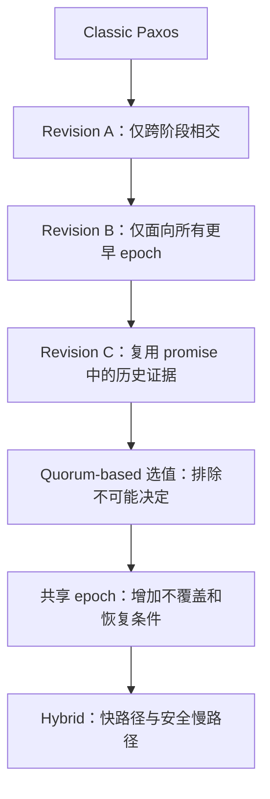

# Distributed Consensus Revised：逐层放宽 Paxos 的精读

> Heidi Howard，剑桥大学博士论文，提交于 2018 年；本次核对 2019 年 4 月技术报告 UCAM-CL-TR-935（151 页）。[官方原文](https://www.cl.cam.ac.uk/techreports/UCAM-CL-TR-935.pdf)。下文页码为该报告页码，与 PDF 页序一致。*A Generalised Solution to Distributed Consensus*（arXiv:1902.06776，Howard 与 Mortier）是另一篇相关论文，不能作为本博士论文的 arXiv 编号。

## 问题与证据类型

Classic Paxos 是分布式共识的一种解，其多数 quorum、取最高 epoch 的值和 epoch 唯一性，并不全是问题本身必须满足的条件。论文从经典算法的安全证明出发，逐项确认哪些约束真正被证明使用，再给出更弱的充分条件及算法。

§1.6 排除拜占庭行为；主要对象是单值共识，再讨论对 Multi-Paxos 的启示。证明关注非平凡性、安全性及给定通信/活性条件下的进展。它不是一个数据库产品，也不提供与 Raft 的端到端吞吐实验。正文序列图和 Table 7.1 属于执行例与 quorum 计数，不是机器基准。

## Ch.4：两次放宽 quorum 相交

§4.1、式(4.4)、Algorithm 13（pp.75–78）：Revision A / Flexible Paxos 只要求任意 phase-1 quorum 与任意 phase-2 quorum 相交；各阶段内部的 quorum 不必自相交。在沿用本章其他经典规则、尤其每 epoch 单值的前提下，这是安全的。

四 acceptor 例（Figure 4.1）：Q1 可以是 `{a1,a2}`、`{a3,a4}`，Q2 可以是 `{a1,a3}`、`{a2,a4}`。同行的两个 quorum 不相交，但每个 Q1 都与每个 Q2 相交。按数量定义 quorum 时，`q1+q2>N` 足以保证跨阶段相交；缩小稳定路径 Q2，通常会增大新领导者准备阶段 Q1 的要求，不能免费增加所有故障场景的可用性。

§4.2、式(4.6)（p.81）：epoch e 的 Q1 只需要与**所有更早 epoch f<e** 的 Q2 相交，不是只检查紧邻 e 的前一轮，也不需要与本轮或未来轮 Q2 相交。最小 epoch 没有更早轮次，因此可以跳过 phase 1；并不意味着任意新 leader 都能跳过恢复。

## Ch.5：promise 内容可以复用更早的安全工作

§5.1–5.2、式(5.1)、Algorithm 15（pp.91–93）：收到 `promise(e,f,v)` 表示 acceptor 对当前 e 作了承诺，并报告以前接受的 `(f,v)`。在本章仍满足每 epoch 单值等规则时，proposer 可复用 f 的合法选值所隐含的历史约束，只需继续覆盖 `f<g<e` 的轮次。

因此“收到某个 promise 就结束 phase 1”是错的。若当前 e=9、已知 f=5，还必须排除或继承 6、7、8 中的可能决定。这里也不是简单的集合相交在数学上自动具有传递性，而是合法提案形成了可传递的安全证据。

## Ch.6：按 quorum 排除可能决定

§6.1、Algorithms 16–18（pp.97–100）保持 epoch 无关 quorum，保存每个 acceptor 的回答 R，计算可能已经决定的值集合 Vdec。

- 某 quorum 中**一个**成员返回 nil，已足以排除它以前形成决定；不必等所有成员都为 nil。
- 某 quorum 的成员报告 `(f,w)`，而任意已回复成员（不要求在同一 quorum 中）报告更高的 `(g,x)` 且 x≠w，可以排除包含前者的相关 quorum。正确性依赖 Lemma 20，不是任意两个不同值都互相否定。
- 所有可能决定都已排除，Vdec 为空，才可选择自己的候选值；Vdec 为单值则必须继承。剩余可能 quorum 不需全部存在，只要还有一个可能决定 v，就不能随便提出新值。

自构小例：沿用上面的 Q2，a1 报告 `(1,A)`、a3 报告 nil、a4 报告 nil。Q2={a1,a3} 被 a3 排除，Q2={a2,a4} 被 a4 排除，因此可提出 B；经典“最高 accepted epoch”选值会继续选 A。此例展示增加回答可证明 A 并未成为决定，而不是任意抛弃旧值。

§6.2（Algorithms 19–20，pp.106–107）推广到 epoch 相关 quorum；未知、已排除、只能决定某值三种状态必须区分。未知不是“未决定”，不能将没收到回复当成 nil。

## Ch.7：共享 epoch 的代价

| 方案 | 位置 | 收益与限制 |
|---|---|---|
| Allocator | §7.1，pp.114–115 | 动态分配最小 epoch；额外请求轮次，allocator 可用性成为依赖 |
| Value mapping | §7.2，pp.115–118 | 将 epoch 绑定值，例如奇偶数表示二元决定；知道值后才知道 epoch，选值改变可能重试，不是任意哈希自动消除冲突 |
| Recovery | §7.3，pp.118–134 | 同 epoch 可以出现不同提案，但 acceptor 不能在同 epoch 改写已接受值；同轮 Q2 必须相交，恢复需排除多个可能值 |
| Hybrid / Multi-path | §7.4，pp.134–139 | 最小 epoch 使用快速机制，较高 epoch 使用预分配/投票的慢路径；快路径失败不允许直接忘掉已接受数据 |

§7.3 的式(7.2)要求恢复 Q1 与前一较低 epoch 中**任意两个 Q2 的交集**相交，这是保证最坏情形可恢复的充分条件。不能把只有 majority 的普通恢复，误称总可一轮完成。

Table 7.1（p.130）：N=5、Q2 大小 k=3 时，phase 1 可能要等 3–5 个回答；k=4 时是 2–3；k=5 时只需 1 个。快路径写 quorum 越小，冲突恢复最坏情况可能越难。该表是协议分析，不是吞吐测量。

## 结论与工程推论分开

论文证明经典 Paxos 条件可以系统放宽；并未证明所有 quorum 越小越好，也未证明这些泛化在任意工作负载胜过 Raft。工程迁移需要重新验证恢复、重配置和日志层协议。§1.5.2 列举 Flexible Paxos 的 PlusCal 与机械验证后续工作，所以旧稿“完全没有形式化验证”的泛化断言也不准确。

CockroachDB 的 Leader Leases 明确建立在 **Raft** 上，不能称为 Multi-Paxos centric。将此论文用于它的 quorum/租约设计只是研究设想，需要额外证明，不能直接替换已有多数派规则。

知识卡片：[[Paxos-Quorum-Intersection-Revised]]、[[Paxos-Value-Selection-Revised]]、[[Paxos-Epochs-Revised]]、[[共识算法族系-从Paxos到广义解]]。
