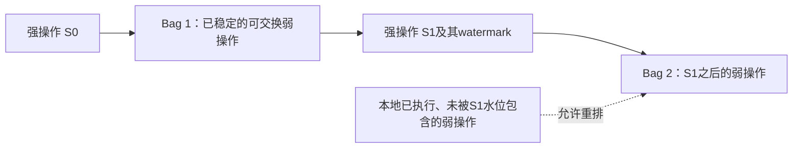
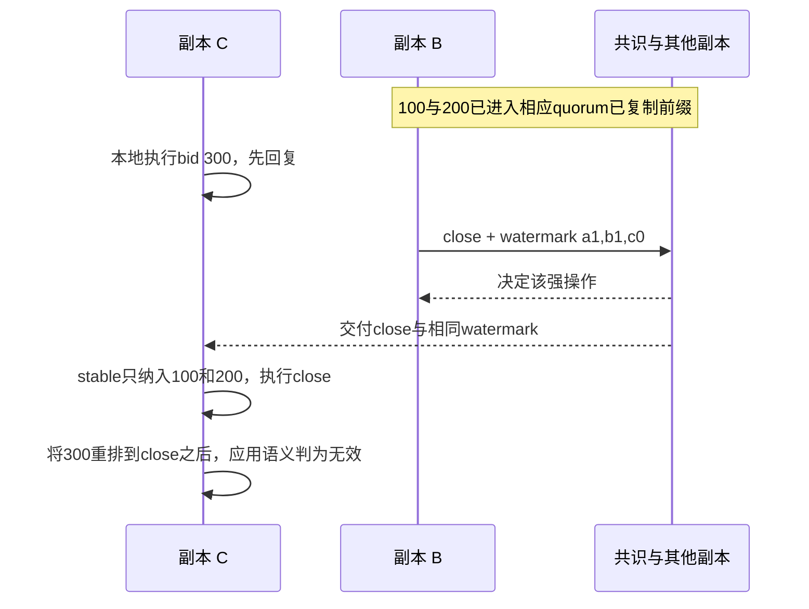

# Event Horizon：非对称依赖与半线性化精读

> Arns、Ng、Psarakis、Katsifodimos、Carbone，*Event Horizon: Asymmetric Dependencies for Fast Geo-Distributed Operations*，CIDR 2026，10页（含参考文献）。[官方原文](https://www.vldb.org/cidrdb/papers/2026/p20-arns.pdf)。本文按原文机制与实验修订；正文译文见 [[知识库/sources/papers/Event-Horizon/全文翻译]]。

## 研究问题和不可省略的业务取舍

地理复制中的每次跨区协调成本高，但不是所有操作都要求相同实时顺序。论文用拍卖举例：不同bid可以并发、可交换；close必须在所有副本读取同一组前置bid，保证赢家不变。若一个bid与close并发，业务允许它后来被重排到close之后并失效，就存在减少协调的空间。

这个允许撤销的选择是语义前提，不是实现细节。若业务要求“本地已回复的bid永不撤销，且必须赶在全球close之前”，本文的快速弱路径不能直接满足。也不能把CALM/CRDT概括为不维护任何不变量；它们能维护哪些不变量取决于数据类型与业务约束。

## §2.1 四种依赖，而不是三种

箭头在这里表示谁的读取依赖谁的写入，不是简单时间线箭头。原文某些符号在纯文本提取中外形相似，以下以名称区分（PDF p.3）。

| 依赖 | 对称性 | 条件 | 拍卖例 |
|---|---|---|---|
| Strictly ordered | 对称 | 相关操作按实时线性化顺序全序 | close与close |
| Commutative | 对称 | 可交换，无须额外全序；实现仍保留所需因果顺序 | bid与bid |
| Ordered | 有向 | 若v1在一副本读取某v2，所有副本都应保持同一读集合 | close读取其前置bid集合 |
| Eventually ordered | 有向 | 允许重排v1，最终在所有副本读取同一v2集合 | bid相对并发close最终排序，可能失效 |

因此不能把“bid→close的反向依赖”写作不存在，它是与“close→bid”**不同强度**的依赖。PoR的全名是**Partial Order-Restrictions**，不是Proof of Replication。

## §3 半线性化的保证

全局结构由强操作的全序，以及强操作之间装着可交换弱操作的bag组成。Bag内部不是又做一遍任意全序，而是保留需要的因果顺序；弱操作可在稳定前被重排，强操作不会被重排。

原文条件要求每个副本尊重依赖定义的偏序，且执行强操作前已应用偏序中排在它之前的全部操作。强操作线性化；弱/强之间允许从暂时顺序一致的视图经重排走向稳定关系，不等于所有快速回复都已经全球线性化。

图据Figure3（p.4）重绘；箭头表示bag与强操作之间的顺序，未给bag内部添造全序。

## §4 DeMon：watermark 与双状态，而非只读本地 bag

DeMon是地理复制内存存储系统。强操作由OmniPaxos共识复制；弱操作使用可靠因果广播。其实现没有原稿所写的“Weak Guard / Strong Guard”，而是**stable state与unstable state**。

### 弱路径（§4.1，Figure4，p.5）

1. 接入副本先在unstable state本地执行弱操作，立即回复客户端。
2. 随后异步因果广播，远端按因果顺序交付并执行。
3. 副本周期性交换各来源已接收的弱操作ID，使每个副本知道哪些操作已达到多数quorum复制。

低延迟来自**回复不等待WAN复制**，不是“先完成一次因果广播单跳就返回”；本地回复也不同于跨区稳定持久化确认。

### 强路径与重排（§4.1–4.2，pp.5–6）

1. 接入副本给强操作附一个向量时钟，概括它已知各来源**被quorum看到**的最新弱操作，这个低水位决定前置弱操作集合。
2. 强操作与watermark一起作为共识日志条目决定。
3. 每副本合并当前与此前watermark；若缺少水位内的弱操作，仍需等待它们到达，再把它们应用到stable state。
4. 在stable state执行强操作；产生delta更新unstable state，再重放被delta覆盖的近期弱操作。水位外的并发弱操作因此可能落在强操作之后。

避免了要求所有近期弱操作在强请求提出前都新做一轮同步复制，但**没有删除跨强弱路径的同步边界**。只有“本地看到”不够，且缺失水位数据时仍可能等待。

### 原文的100/200/300出价例

A与B分别执行100、200出价，并已传播；C的300刚在本地执行，尚未到其他副本。B发起close，附watermark `[a1,b1,c0]`，因此赢家稳定为200（§4.1 p.5）。

如果300在某副本先于close到达，需重排；若晚于close到达，直接在已关闭状态上执行而无效。两条路径最终一致。不应将其讲成close必须等待全球所有并发bid，也不应向客户承诺快速bid返回就是最终中标资格。

## §5 评估：设置决定数字含义

五区域为US-East、Finland、Brazil、US-West、Singapore；每区一台GCE n2-standard-4（4vCPU、16GB）。测得跨区平均RTT范围73.7–387.6ms，单主基线主区在US-East；客户端任务与副本同机，排除了client到服务端网络延迟。

五个参考协议与DeMon都在同一个Rust代码库实现：Gemini（不保证容错写）、Gemini+（RedBlue容错版本）、UniStore风格PoR、OmniPaxos和No Guarantees。No Guarantees只是无协调性能下界，不能维护非可交换工作负载不变量；Gemini有一致性模型，不能称它“没有一致性保证”。

| 测试 | 工作负载 / 指标 | 原文结果 | 边界 |
|---|---|---|---|
| RUBiS延迟，Figure5 pp.6–7 | 更新操作为主，Bid占60%，新增CloseAuction；报告CDF及按操作延迟 | DeMon超过75%工作负载亚毫秒；强操作中位约245ms；CloseAuction的Gemini+/UniStore为371/391ms | 同机客户端、本地快速回复语义；不是任意请求端到端亚毫秒 |
| RUBiS吞吐，Figure6左 p.7 | 增加每区客户端数 | DeMon峰值略高于其他容错协议；Gemini更高，但容错写语义不同 | 单主共识可过载，不能表述为无中心瓶颈 |
| 非负计数器，Figure6右 p.7 | add弱、subtract强；改变强操作比例，测平均延迟 | DeMon延迟随强比例增长；OmniPaxos约245ms固定；其他混合基线在50%之前或附近已超过OmniPaxos | 原稿“50%以上所有混合模型趋同”不符合图文描述 |

摘要“最常见操作延迟降低四个数量级”是作者在该实验中的整体表述；原文这里没有提供“Bid相对次优Gemini+精确四个数量级”的完整逐值计算，本文不再把它写成那种定量配对结论。“微秒对毫秒”本身也不足以推出一万倍。

## 局限、可推广内容与推论

§6（pp.7–8）强调应用须接受弱操作的重排/撤销，并在UI区分快速状态与稳定状态；不接受这项业务取舍时，也就没有该例的协调规避空间。识别不变量和操作依赖仍需开发者参与。BFT在§6是研究方向，§7的自然语言/DSL/验证提升属于展望，不能写成已经完成安全代码生成或BFT验证。

原稿对Kafka offset commit、Flink barrier和2PC作了过度类比：普通offset提交并非天然可交换，消费者代际、回退、事务输出都会改变条件；DeMon强路径是共识而不是将2PC简单缩小到强操作；checkpoint的一致切割也不直接等于SL。可研究“哪些依赖真正需要协调”，但必须单独建立故障模型、不变量与用户可见语义，不能直接提出取消现有协调的改造结论。

知识链：[[Event-Horizon-非对称依赖]]、[[事务模型深度调研]]、[[Chandy-Lamport-分布式快照算法]]。源码出处按原文为[JonathanArns/demon](https://github.com/JonathanArns/demon)，不再误写为Ververica官方项目。
