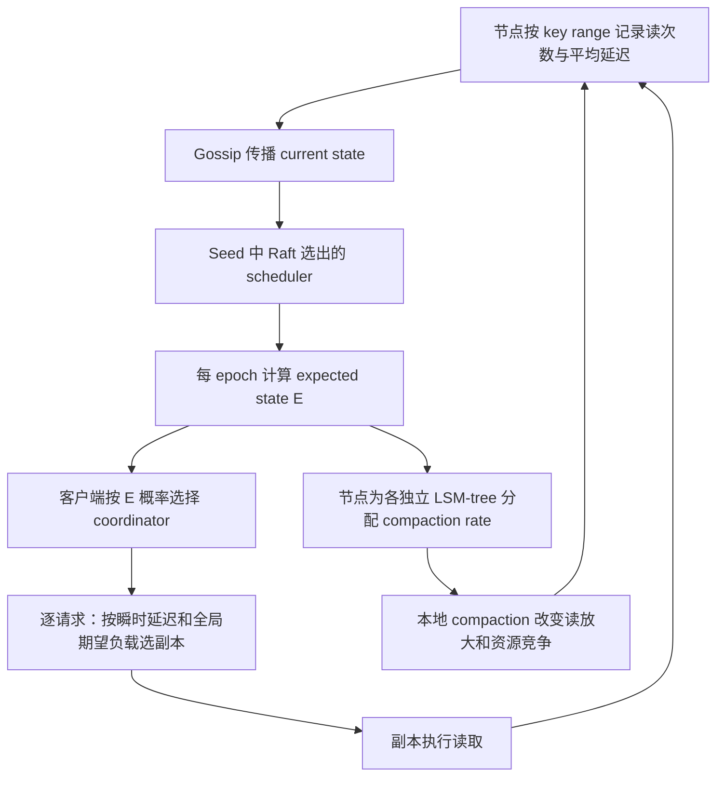

# HATS 精读：分布式 LSM 的读请求与 Compaction 协同调度

> **来源纠正**：本目录 `LSM-Scheduling-FAST2026.pdf` 实际是 *Holistic and Automated Task Scheduling for Distributed LSM-tree-based Storage*，Yuanming Ren、Siyuan Sheng、Zhang Cao、Yongkun Li、Patrick P. C. Lee，FAST 2026（第 24 届）。旧稿误写成 Silo，并编入 WAF、Anti-hog/Pro-hog、CrossZone、RocksDB/阿里云评估；这些内容不对应本 PDF，现已撤除。为保持链接稳定保留目录及旧卡文件名，显示标题使用 HATS。

核验页码采用 PDF 页序：第 1 页为会议封面，第 2 页开始正文（印刷页 203）。本地文件 18 页，包括参考文献与 artifact 附录。

## 问题与假设（§2–3，PDF 3–5）

即使均匀分配请求，节点延迟也会因 compaction 的 CPU/I/O 干扰而波动。停止 compaction 可以缓解眼前竞争，却让更多 SSTables 留在读路径，恶化长期延迟。HATS 同时调整读流量分布和本地 compaction 配额。

基础系统是 Cassandra 5.0，依赖数据副本提供可选择的服务节点，并把不同 key range 的副本拆到独立 LSM-tree（replica decoupling）。论文没有迁移 SSTable compaction job 到远端 worker，写入仍按 Cassandra 的复制与一致性设置处理。

## 三个闭环环节（§4，PDF 5–8，图 5）

### 粗粒度：移动读负载，不移动数据

§4.2、算法 1（PDF 6–7）：M 个节点、复制因子 R，`C[i,j]` 表示 key range i 的第 j 个副本上一 epoch 的请求数；`T_i` 为节点 i 平均存储层读延迟，epoch 长 L。以 `L/T_i` 估计可服务请求数，减去该节点实际读数，得到余量 Δ。

在同一复制组内，从 Δ<0 的节点向 Δ≥0 的节点转移请求数，转移量为过载量、空闲量、该 range 当前请求量三者最小值。结果 E 保持每个 key range 的总请求数不变。客户端按 `E[i,j]/sum_j E[i,j]` 选择 coordinator，而不是把所有流量瞬时压向同一个最快节点。

**手算示例（教学数值）**：某 range 的副本 A 有 800 次期望请求，节点超载 200；B 余量 120。该步转移 `min(200,120,800)=120`，A 此 range 降至 680，B 增加 120；组内总量守恒，A 尚余 80 过载需继续处理。示例展示算法约束，不是论文测量。

### 细粒度：逐请求适应短时抖动

§4.3（PDF 7）：coordinator 维护包含网络与存储耗时的瞬时延迟 `t[i,j]`（EWMA 权重 0.5）；计算 score=`L/t[i,j] - Q[node]`，Q 是 E 推导出的节点总期望读数。选择 score 最大副本，综合“此时有多快”与“已承担多少负载”。每 epoch 先用 round-robin 初始化副本测量。正确性仍受 Cassandra 配置的一致性约束，调度器不降低所需响应数。

### Compaction：把预算给读得多的副本

§4.4–5（PDF 8）：replica decoupling 允许逐 key range 限速。总允许 compaction rate 在实验设为 64 MiB/s，按 E 中读负载比例分给本地各 LSM-tree。读得多的副本优先压实，随后更可能被读调度选中。论文对靠近新刷写数据的最低层 compaction 不限速，防止其积压放大新数据读取成本；对其余层施加预算。

防饥饿机制在 §5：过低的分配不能令写多读少的副本永久失去进展，低于论文阈值的情况回到 Cassandra 默认 FCFS 任务执行。不要把“按读负载分配”实现成零配额无限期饿死。默认 epoch=60 s，与 Cassandra 的调度间隔对齐。

## 状态传播与失效边界

§4.2.1：current state 带节点版本，expected state 带 Raft term 与 epoch。接收者保留较新版本，避免乱序 Gossip 把调度倒退。Raft 选 seed leader，Gossip 传负载与决策；Raft 不承担用户数据复制。节点失败仍由 Cassandra 的故障检测、hinted handoff、read repair 等机制处理。

**推论**：这里的不变量包括副本候选资格、请求总量守恒、调度版本单调、后台任务有进展。性能估计可以陈旧，但陈旧估计不应改变数据读写语义。算法假设用近期平均延迟能预测容量，非形式化尾延迟 SLO 保证。

## 实验设计与结果（§6，PDF 8–14）

- 22 台本地机器，通常 10 个同构 server 加 2 客户端；扩展实验最多 20 个异构 server。server 为四核 i5-3570 3.4 GHz、16 GiB DRAM、128 GiB SATA SSD；10 Gbps 网络、Ubuntu 22.04。
- Cassandra 5.0 与客户端 driver 3.0.0，约 6000 行修改；100M 条预装记录，key 24 B/value 1000 B，预装后等待 flush/compaction 完成。100 客户线程；默认 R=3、读响应数 1、写响应数 3。
- YCSB A–F 默认 Zipf θ=.99（D 为 latest）；每轮 50M 操作，E 为 5M；5 轮均值与 95% t 置信区间。Facebook 负载是根据公开生产特征构造的模型，不是本文在 Facebook 集群实测。
- 基线 mLSM、C3、DEPART 均重做在 Cassandra 5.0；mLSM/C3 使用 replica decoupling 保持公平，不能把结果标成“默认 RocksDB”。

| 证据 | 能支持的结论 |
|---|---|
| 图 6，PDF 9，粗粒度/细粒度消融 | 三部分组合优于单独的负载分配，需同时考虑数据分布与存储干扰 |
| 图 7 与摘要，PDF 2、9–10 | 作者对 read-dominant YCSB 报告较 C3/DEPART 的 P99 降低 58.6%/59.9%，吞吐为 2.41×/2.90× |
| 图 8，PDF 10 | Facebook 模型负载较 C3/DEPART 的 P99 Get 降低 78.9%/68.3%，吞吐为 2.42×/2.27× |
| 表 1、图 9，PDF 11 | 节点间与最慢节点时间上的延迟波动均有测量，不能仅用 CPU 均衡替代 |
| 表 2，PDF 11–12 | 分解分布层与存储层耗时，检查优化落点 |
| 图 11–15，PDF 12–13 | 覆盖规模、一致性设置、倾斜、value 大小与饱和度的敏感性 |

## 局限与工程使用

§6.6 提醒写密集 YCSB-A 下 P50 可略高于 mLSM，即降低尾部不保证所有分位都更快。评估规模上限 20 servers，不支持直接外推到数千节点或跨地域。更高读一致性需要更多副本响应，会缩小副本选择余地。60 s epoch、64 MiB/s 和 EWMA 权重是当前实现参数，应按部署验证，而非普适常数。

**推论**：迁移思路应是“把读取导向压实良好且有余量的副本，并把压实预算倾向读热范围”，而不是“发现高 WAF 就远程搬运 SST”。对强一致系统，需要先确保 follower read 的合法快照和进度，再讨论这些调度信号。

相关：[[Silo-分布式LSM-Compaction调度|HATS：分布式读与 Compaction 协同调度]]、[[Silo-Compaction-迁移协议|HATS：副本选择与 Compaction 配额]]、[[LSM-Tree-合并优化]]。
