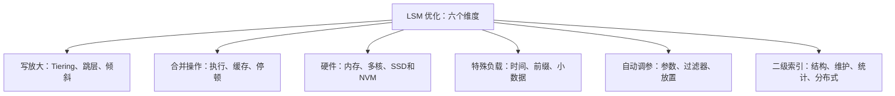

---
sources:
- '[[知识库/sources/papers/LSM-Survey/LSM-Survey-VLDBJ2019.pdf]]'
title: 'LSM-based Storage Techniques: A Survey — 精读分析'
type: analysis
created: '2026-06-12'
source_check_scope: 本地PDF §2.3、§3.1、§3.6、§5，表1–3；只核验综述转述，不冒充各被引论文精读。
related:
- '[[LSM-Tree]]'
- '[[LSM-Tree-自动调参]]'
updated: '2026-10-05'
source_checked: '2026-10-05'
diagram_format: mermaid
---

# LSM-based Storage Techniques: A Survey — 精读分析

> **论文**：LSM-based Storage Techniques: A Survey  
> **作者**：Chen Luo, Michael J. Carey (UC Irvine)  
> **期刊**：VLDB Journal, 2019 (pre-print arXiv:1812.07527)  
> **全文**：https://arxiv.org/abs/1812.07527

---

## 一、论文概述

这是一篇 LSM-tree 领域的**综合性综述论文**，发表于 VLDB Journal 2019。由 UC Irvine 的 Chen Luo 和 Michael J. Carey 撰写。论文系统梳理了 2018 年前后 所收录的 LSM-tree 研究方向，涵盖约 85 篇参考文献，提出了一个完整的分类体系（Taxonomy），并深入分析了各类改进的技术细节与 trade-off。

**核心价值**：这份综述系统梳理其检索时期的 LSM 研究，尤其适合想快速建立 LSM-tree 全局认知的读者。

---

## 二、LSM-tree 基础回顾（Section 2）

### 2.1 发展历史

| 时间 | 里程碑 | 说明 |
|------|--------|------|
| 1976 | Differential Files | 最早的 out-of-place 更新结构 |
| 1980s | Postgres 日志存储 | 追加写入 + vacuum cleaner 后台清理 |
| 1992 | LFS (Log-Structured File System) | 文件系统层利用顺序写带宽 |
| 1996 | **LSM-tree 原始论文** | O'Neil 提出，含 rolling merge 和 size ratio 理论 |
| 1997 | Stepped-merge (tiering 雏形) | Jagadish 等提出 T 组件合并策略 |

**关键洞察**：LSM-tree 通过将 merge 过程集成到结构本身，解决了早期 log-structured 存储"查询差、空间利用率低、无法调参"三大问题。

### 2.2 现代 LSM-tree 的两种合并策略

| 维度 | Leveling | Tiering |
|------|----------|---------|
| 每层组件数 | 1 | ≤ T |
| 写放大 | O(T·L/B) | O(L/B) |
| 点查（零结果） | O(L·e^(-M/N)) | O(T·L·e^(-M/N)) |
| 短范围查询 | O(L) | O(T·L) |
| 长范围查询 | O(s/B) | O(T·s/B) |
| 空间放大 | O((T+1)/T) ≈ 1 | O(T) |

**核心结论**：Leveling 优化查询和空间，Tiering 优化写入，互为 trade-off。Size ratio T 是关键调参杠杆。

### 2.3 经典优化

1. **Bloom Filter**：每个磁盘组件建 BF，10 bits/key → ≈1% 假阳性，点查几乎 O(1)
2. **Partitioning**：将组件切分为固定大小 SSTable，边界合并时间、支持键范围裁剪
3. **并发控制**：多版本 (MVCC) 或锁方案；flush/merge 用引用计数 + snapshot
4. **恢复**：WAL + no-steal buffer + 时间戳组件列表（非分区）/ metadata log（分区）

---

## 三、分类体系与改进全景（Section 3）

论文将 LSM-tree 改进分为 **六个一级类别**：

### 3.1 各类改进核心要点

#### Write Amplification

- **所有 Tiering 变体**本质上都是分区 tiering + 垂直或水平分组，差异在负载均衡方式（哈希 vs 动态收缩 vs 概率 guard vs 无均衡）
- **Skip-tree**：将 entry 直接推到 K 层以下的可变缓冲区，跳过中间 merge，但引入实现复杂度
- **TRIAD**：热键留在内存不刷盘 + 延迟 L0 合并 + 事务日志做磁盘组件

#### Merge Operations

- **VT-tree stitching**：不重叠的页直接指针引用而不拷贝，但会导致碎片化且不兼容 Bloom Filter
- **LSbM-tree**：合并后不立即删除旧 SSTable，而是附加到目标层的缓冲区，利用访问频率逐步清理。对热数据有效，冷数据有额外开销
- **bLSM**：在本文收录范围中尝试解决写入停顿的工作，但只 bound 了写入内存组件的延迟，未解决排队延迟

#### Hardware

- **Accordion**：多层内存架构（mutable → immutable → disk），内存内 flush/merge，减少磁盘 I/O
- **WiscKey (KV 分离)**：值存 append-only log，LSM-tree 只存 key→offset，写放大大幅降低但范围查询变差、需额外 GC
- **HashKV**：改进 WiscKey 的 GC，按 key hash 分区独立 GC
- **NoveLSM**：在 NVM 上增加持久化内存组件，写入不阻塞

#### Auto-Tuning

- **Monkey**：证明 Bloom Filter 应给靠近内存、较小层的每个 key 更多 bits（而非均匀分配），优化了点查的 false positive 率
- **Dostoevsky**：引入 lazy-leveling（低层 tiering + 最底层 leveling），扩展现有 merge policy 设计空间
- **ElasticBF**：每个 SSTable 建多个小 BF，按访问频率动态激活/停用

#### Secondary Indexing

- **Diff-Index** 四种维护方案：sync-full > sync-insert > async-simple > async-session（维护开销 vs 查询性能 trade-off）
- **Luo & Carey (PVLDB 2019)**：用 primary key index 只存 key+timestamp → 验证和清理二级索引时避免访问全记录，I/O 降低
- **Filters**：每个组件记录 filter key 的 min/max，对时间相关数据特别有效

---

## 四、代表系统分析（Section 4）

| 系统 | 合并策略 | 特色 |
|------|----------|------|
| **LevelDB** | Partitioned Leveling | 首创分区 leveling，Round-Robin 选 SSTable |
| **RocksDB** | Leveling/Tiering/FIFO | 弹性 L0 tiering、动态 level 大小、冷优先/删除优先合并、merge filter、rate limiter |
| **HBase** | Tiering + Exploring | Exploring 选最优序列合并、Date-tiered 支持时序、striping 分区大 region |
| **Cassandra** | Leveling/Tiering/Date-tiered | 本地二级索引（延迟清理，类似 DELI） |
| **AsterixDB** | Tiering-like + Correlated | 通用 LSM-ification 框架（B+树/R树/倒排）、关联合并同步所有索引 |

---

## 五、未来研究方向（Section 5）

论文识别了五个值得探索的方向：

1. **全面的性能评估**：多数改进未与良好调参的 LSM-tree 对比，空间放大常被忽视
2. **分区 Tiering 结构对比**：垂直分组 vs 水平分组的性能特征和 trade-off 不明
3. **混合合并策略**：Dostoevsky 的 lazy-leveling 已证明同质化合并策略未必最优
4. **最小化性能波动**：在本文当时收录的工作中，bLSM 聚焦写入停顿，但远不完善，端到端延迟方差仍是盲区
5. **走向数据库存储引擎**：现有改进多聚焦单 LSM-tree KV-store，多索引场景下的查询优化、自适应维护、LSM-aware 查询计划是蓝海

---

## 六、Trade-off 总结（Table 3）

论文 Table 3 是全文最精华的总结，将各改进按"写/点查/短范围/长范围/空间"五个维度做定性比较：

- **大幅提写但牺牲一切**：WiscKey/HashKV/Kreon（KV 分离）→ 写 ↑↑↑，范围查询 ↓↓↓，空间 ↓↓↓
- **提写但牺牲查询和空间**：所有纯 Tiering 方案 → 写 ↑↑，范围 ↓↓，空间 ↓↓
- **模型内不恶化其他列出的 I/O 指标**：Monkey（Bloom Filter 分配）→ 点查 ↑，其他不变；Lim et al.（利用数据冗余）→ 写 ↑，其他不变
- **特定负载专用**：LSM-trie（仅点查）、SlimDB（仅前缀范围查询）

---

## 七、关键 Takeaway

1. **LSM-tree 的 RUM 猜想**：读(R)、写(U)、空间(M)三者不可兼得。每个改进本质上是在做三者的取舍。
2. **Leveling vs Tiering 是核心设计轴**：size ratio T 越大，两者差异越大。Dostoevsky 的 lazy-leveling 提供了新的折中点。
3. **Bloom Filter 分配可以更聪明**：Monkey 证明不应该均匀分配，应让靠近内存、较小层有更低假阳性；较大层的假阳性率按层增大。
4. **KV 分离是 SSD 时代新的取舍维度**：写性能极大提升，但 GC 成新瓶颈，范围查询退化严重。
5. **二级索引维护是 LSM-tree 从 KV-store 走向 DB engine 的关键挑战**，Luo & Carey (2019) 的 primary key index 方案是本文重点分析的解法。
6. **多数改进对比基线未充分调参**：这是论文隐含的批评——未来研究应更严谨地考虑 LSM-tree 的 tunability。

---

## 八、与其他论文的关联

| 论文 | 关联 |
|------|------|
| Monkey (SIGMOD 2017) | 被本文深度引用，BF 分配优化 |
| Dostoevsky (SIGMOD 2018) | 被本文重点讨论，lazy-leveling |
| WiscKey (FAST 2016) | KV 分离的代表，本文指出 GC 问题 |
| bLSM (SIGMOD 2012) | 综述时期的写停顿调度代表 |
| Luo & Carey (PVLDB 2019) | 本文作者后续工作，二级索引维护方案 |

---

*精读完成日期：2026-06-12*

## 核验补充：成本模型、示例与证据层级

本目录 PDF 是作者稿（首页保留期刊版式占位），不是当前产品配置表。重点定位：§2.3、表1（PDF 6–7页）给成本模型；§3及表2（8–10页）给分类；§3.6（16页）给Monkey/Dostoevsky/ElasticBF；§5（23–24页）和表3（20页）总结取舍与研究空白。综述没有在同一机器上重跑全部系统，因此表3的定性符号不能换算为统一的吞吐排名。

模型中 T 为相邻层大小比例、L 为磁盘层数、B 为每页条目数、N 为数据条目数、M 为过滤器总bits、s 为范围结果条目数。`O(TL/B)` 和 `O(L/B)` 是摊销写 I/O/条目，不是可直接测得的字节写放大百分比。Bloom filter 的负查 I/O 是误判概率之和，不能把“有过滤器”一概写成零 I/O。

**教学例**：取T=10、L=4。短范围初始化需检查的run数量从leveling的约4增为tiering的至多约40；tiering减少每层重复重写，代价是更多候选run与重复版本。若需要输出大量s，扫描I/O占比会改变；该数量不是实测耗时倍数。

**Monkey 的方向**：这里的 lower/smaller levels 指靠近内存的小层，不能读成容量最大的底层。总过滤器预算固定时，给小层更低误判率，避免其数量多又反复无效读；大层每key较少bits，误判率更高。**Dostoevsky** 在小层采用tiering、最大层leveling，保留最大层主导的空间和长扫描特性，但短范围初始化仍付更多run的代价。**ElasticBF**按热度激活多个子过滤器；综述§3.6.3指出总预算约4 bits/key时收益明显，10 bits/key时收益受限，并不保证任何内存预算下均改善。

**工程推论**：评价方案应固定内存总量、数据大小、key/value比例、读写/负查/范围比例、是否达到稳态以及基线是否调参；同时报告写/读/空间放大和停顿。通过新结构、更多元数据或更合适硬件改善某个模型外成本，不构成推翻RUM猜想。
