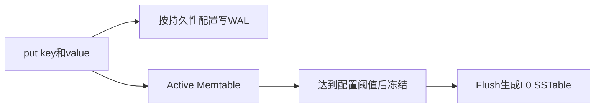
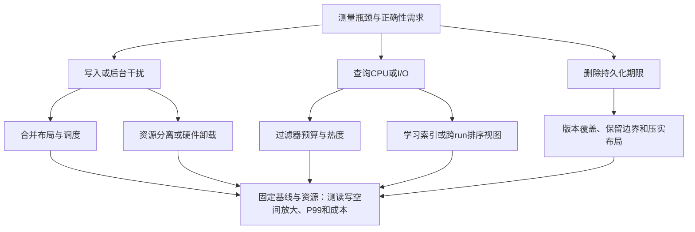

# Rethinking LSM-tree based Key-Value Stores: A Survey

> Yina Lv (厦大), Qiao Li* (MBZUAI), Quanqing Xu* (OceanBase/蚂蚁), Congming Gao (厦大),
> Chuanhui Yang (OceanBase/蚂蚁), Xiaoli Wang (厦大), Chun Jason Xue (MBZUAI)
> ArXiv 2507.09642, 2025-07-13. 37 页, ~140 篇参考文献.
> 经费来源: CCF-Ant Research Fund (CCF-AFSG RF20240102)

---

## 1. 论文定位与价值

这是一篇面向 **2020-2025** 年 LSM-tree KV Store 优化研究的系统性综述。与 Luo & Carey (VLDBJ 2020) 综述的关键区别在于：它不是在分类旧工作，而是把**存算分离、多租户 Serverless、DPU/GPU 硬件 Offload、ZNS SSD、持久内存、LLM 训练数据定制**等现代架构挑战纳入 LSM-tree 研究的核心版图。

论文提出的核心洞察：**Compaction 是 LSM-tree 许多性能权衡的共同来源，但也是其核心优势的来源。** 不消除 Compaction，而是让它智能化、柔性化、硬件协同化——这是过去五年研究的主旋律。

---

## 2. LSM-tree 基础架构回顾（论文 Figure 1 详解）

论文将 LSM-KVS 架构拆解为四个核心组件，形成完整的写入-合并-查询链路：

**写入路径 (Write Path)**:

**Compaction 层次结构 (以 RocksDB 为基准)**:
- L0: **Tiering 布局** — 多个 SSTable 可重叠（因为直接 flush 自不同 MemTable）。OceanBase 在 L0 内还额外执行 intra-level compaction
- L1~Ln: **Leveling 布局** — 每层只有一个全局有序 run。每层容量约为上一层的 10 倍（size ratio ≈ 10）
- L0→L1 Compaction (④): 按具体引擎策略选择 L0 待合并文件，与 L1 中重叠 SSTable 合并后写入 L1
- Higher Level Compaction (⑤): L1→L2→...→Ln，跨层合并，是释放更新/删除导致的过期数据的最终手段

**Compaction 机制细节**:
- 触发条件: L0 SSTable 数量超阈值(`level0_file_num_compaction_trigger`，默认4)、pending compaction bytes 超软/硬阈值、手动触发
- 执行过程: 选 victim SSTable → 读入待合并文件及目标层重叠文件 → 在内存中归并排序 → 去重(保留最新版本) → 在确认不会使旧值复活且满足快照/保留要求后清理 tombstone → 写回新 SSTable → 替换旧文件
- 关键成本: Compaction 涉及大量额外读写(写放大)，与前台 put/get/scan 共享 CPU/IO/内存，导致资源竞争

**删除语义的特殊性**:
- 删除不是物理删除，是写入一个特殊标记(tombstone，value 通常为 1 字节)
- 逻辑删除立即生效(后续查询不再返回该 key)
- **物理删除发生在 tombstone 被 compaction 传播到 LSM-tree 最底层(Ln)之时**——在此之前，被删除的原始数据在物理介质上仍然存在
- 这对隐私合规(GDPR)构成严重挑战: 旧版本未清理期间可能仍可恢复；介质残留和备份保留还需独立处理

---

## 3. 五大核心研究问题与答案（论文 Section 3 研究地图）

论文围绕 5 个 Research Question 展开，每个都对应了一组状态的解决方案。

### 3.1 Compaction 优化：从传统视角到新架构视角

论文从两个维度分析 Compaction 优化：

#### A. 传统视角（单机 LSM-tree）

**3.1.1 资源分配 (Resource Allocation)**

Write-Stall 的本质是前台写入速度超过后台 flush/compaction 处理速度。RocksDB 内置两档限流：
- **Slowdown writes threshold**: L0 SSTable 数达软阈值时，每次 `put()` 后 sleep 1ms
- **Stop writes threshold**: 达硬阈值时，完全阻塞所有写操作

论文综述的核心工作：

| 方案 | 论文 | 技术要点 |
|------|------|----------|
| SILK | ATC'19 / TOCS'20 | 动态分配前台/后台带宽，根据 compaction 紧迫度实时调整。设计为 write-intensive 场景优化，read/scan-intensive 场景改进有限 |
| Vigil-KV | ATC'22 | 利用 NVMe 协议的 I/O Determinism 特性：将时间窗口分为确定性窗口（只服务读请求）和非确定性窗口（允许写+compaction），实现可预测的读延迟 |
| ADOC | FAST'23 | 两个动态调参维度：compaction 线程数 + batch size。基于数据流(dataflow) 自适应调整，避免写停顿。相比手动优化的 RocksDB，写停顿时间大幅减少 |
| SpanDB | FAST'21 | 混合存储策略：将 WAL + L0 部署在高速 NVMe SSD，深层数据用廉价 SATA SSD/HDD |

**核心冲突**: 限流(write throttling, rate limiter)虽然避免了写停顿，但又导致积压→后续 flush/compaction 密集爆发→长尾延迟。这是一个"按下葫芦浮起瓢"的经典反馈控制系统问题。

**3.1.2 I/O 调度 (I/O Scheduling)**

关键技术路线:

| 方案 | 论文 | 技术要点 |
|------|------|----------|
| Pipeline Compaction | IPDPS'14 | 将 Compaction 拆分为多个阶段流水线执行（Read→Sort→Merge→Write），提高 IO 吞吐 |
| SILK 优先级抢占 | ATC'19 | 给内部关键操作（flush、紧急 compaction）最高 I/O 优先级，低优先级任务可被抢占 |
| STEM | ICDE'24 | FPGA 加速的流式 Compaction：multi-unit pipeline + 动态调度，针对大规模数据 compaction |
| Vigil-KV 时间窗口 | ATC'22 | 利用 NVMe 确定性窗口特性，在非确定性窗口内调度内部操作 |

**3.1.3 自动调参 (Auto-Tuning)**

RocksDB 有 **超过 100 个配置参数**，手动调优几乎不可能。论文综述了三代方案：

| 代 | 方案 | 方法论 | 局限 |
|---|------|--------|------|
| 1 代 | Endure (VLDB'22) | 基于 workload 不确定性，最大化最坏情况下的吞吐量 | 不利用实时workload反馈 |
| 2 代 | Dremel (SIGMETRICS'22) | Multi-Armed Bandit 在线学习 + 多保真度评估 + UCB 采样 | 在线过程有探索成本 |
| 3 代 | ELMo-Tune (HotStorage'24 / arXiv'25) | **LLM 辅助参数预测** — 用 DeepSeek V3 生成参数推荐 | 论文自己做的实验显示：**DeepSeek V3 的调优时间约 100 秒**，不适用于实时系统 |

这个 100 秒的实验数据来自论文作者自己的验证——这非常关键，说明 LLM-based tuning 目前还是一个**离线优化工具**，不能嵌入在线路径。

**3.1.4 Compaction 策略四维度**

论文将 Compaction 策略精化为四个可以独立优化的维度：

| 维度 | 含义 | 代表性工作 |
|------|------|-----------|
| **When to Trigger （何时触发）** | 决定 compaction 启动时机 | dCompaction(JCS'17): 延迟并批量合并；Dostoevsky(SIGMOD'18): 自适应跳过低效 merge；TRIAD(ATC'17): 等 overlap 足够大再触发 |
| **Which Data（选择哪些数据）** | 选择 victim SSTable 和重叠文件 | Spooky(VLDB'22): 全局 compaction 解决空间放大+文件生命周期匹配；BlockDB(ICDE'22): block 级 compaction 替代 table 级 |
| **Compaction Granularity （合并粒度）** | 每次合并的数据量大小 | DOPA-DB(HotStorage'24): **动态调整 compaction 大小**，基于 workload pattern 实时推荐最优粒度 |
| **Data Layout （数据布局）** | Leveling vs Tiering 切换 | PebblesDB(SOSP'17): 碎片化 level 减少重写；SA-LSM(VLDB'22): 用**生存分析**（survival analysis,一种生物统计学方法）优化冷数据布局；vLSM(arXiv'24): 调整 compaction chain 的宽度和长度控制尾延迟 |

#### B. 新架构视角

**分布式 LSM-KVS 关键系统**:

| 系统 | 论文 | 架构核心 |
|------|------|----------|
| Hailstorm | ASPLOS'20 | 分布式文件系统分离存储与计算，compaction 任务 offload 到远端节点，无需 resharding 即可平衡负载 |
| Nova-LSM | SIGMOD'21 | **基于 RDMA 的存算分离 LSM-KVS**，动态 compaction + 负载均衡，在倾斜(skewed)访问模式下远优于单体 RocksDB/LevelDB |
| DEPART | FAST'22 | Replica 解耦：双层日志（上层服务写入，下层管理存储），大幅优化 IO 成本 |
| Caas-LSM | SIGMOD'24 | **Compaction-as-a-Service**：将 compaction 解耦为无状态服务，带自适应控制面(control plane) |
| LightPool | HPCA'24 | 为 OceanBase 设计的 NVMe-oF 存储池：集中管理，Kubernetes 集成，解决存算分离架构下的存储利用率低的问题 |
| RocksMash | TACO'22 | 混合本地-云端存储分层（本地 SSD 热数据 + 云对象存储冷数据） |
| IS-HBase | ToS'22 | In-Storage Computing：将 HBase 部分 I/O 操作 offload 到存储节点内部执行 |

**硬件 Offload Compaction 全景**:

| 硬件 | 代表工作 | 加速机制 | 适用场景 |
|------|----------|----------|----------|
| **FPGA** | Zhang et al. FAST'20, Sun et al. ICDE'20 | 定制 compaction 流水线，key-value 分离+index-data block 分离以最大化带宽 | 短 key-value pair 的 compaction |
| **DPU** | D2Comp TACO'24 | 细粒度动态 compaction offload，同时减少 CPU 竞争和网络流量 | 存算分离环境下的 RocksDB |
| **GPU** | gLSM ToS'24 | 全面利用 GPU 大规模并行处理能力加速归并排序 | 大 batch compaction |
| **FaaS** | Wang et al. CLUSTER'21 | 利用弹性 FaaS 集群执行 compaction | 云环境弹性伸缩 |
| **Edge** | Edgepilot CLOUD'24 | 边缘联邦(federation)环境下的 compaction offload，显著减少写停顿 | 边缘计算 |

**SSD 适配与新型存储**:

_ZNS (Zoned Namespace) SSD_:
这是近年的存储硬件趋势，上层需遵循zone顺序写入与reset约束，并参与数据生命周期管理；不能据此断言设备完全不存在内部地址映射。
- LSM_ZGC (HotStorage'20): Segment-based GC + group reading + 数据按热度分 zone
- SplitZNS (TACO'23): 引入小 zone 提高 GC 效率
- WALTZ (VLDB'23): **利用 zone append 命令实现紧凑尾延迟**；WAL zone replacement 解决并行 append 时的快速 failover；lazy metadata management 实现 lock-free put 查询
- Jung et al. (HotStorage'22): **Lifetime-leveling Compaction** — 均衡同一 zone 内 SSTable 的生命周期，实现无 GC 的空间放大控制

_持久内存 (Persistent Memory)_:
- NoveLSM (ATC'18): byte-addressable skip list + 直接变更持久化状态 + 投机性读并行
- MatrixKV (ATC'20): 利用 NVM 做更小更快的 L0-L1 compaction + column compaction 细粒度 key range 减少数据量
- Pacman (ATC'22): 优化引用查找（tagged pointer + DRAM compaction info；综述未展开完整放置协议） + 冷热分离
- ZigZagDB (ICDE'24): SSD-NVM 交替访问模式(SSD→NVM→SSD→..., like a zigzag)改善写效率和空间利用
- Kreon (ToS'21): **部分数据重整 + memory-mapped I/O**，大幅减少 compaction 需求和缓存开销
- ChameleonDB (EuroSys'21): **LSM-tree(低写放大写入) + 内存 HashTable(快速读取)** — 混合利用 Optane DC PM 的独特特性

_异构存储分层_:
- SplitKV (HotStorage'20): 按 key-value size 分 I/O 路径——小 kv 经 PM 再迁移至 SSD，大 kv 直写 SSD
- PrismDB (ASPLOS'23) / Prism (ASPLOS'23): 3D XPoint + QLC NAND 多层 NVMe 存储的数据迁移 + 崩溃一致性
- MirrorKV (SIGMOD'23): **双重策略** — 垂直分离：冷热数据分不同存储层+定制 compaction；水平分离：mirrored LSM-tree 优化缓存和本地性

### 3.2 KV 操作优化

**Point Lookup 优化**:

Bloom Filter 是 LSM-tree 点查的核心。每张 SSTable 附带一个 Bloom Filter，快速排除不存在的 key。问题在于：**多个 SSTable 需要多次 Bloom Filter 探测 → CPU 开销 + 误判累积**。

关键演进:
1. bLSM (SIGMOD'12): 使用 BF 优化点查；“最早”不成立，Bigtable 2006 §6 已描述其使用
2. Monkey (SIGMOD'17): **在 Bloom Filter 间分配内存以最小化最坏情况 I/O 成本**，提供了一个可导航的调优空间
3. ElasticBF (ATC'19): 利用数据访问热度，**动态分配细粒度的异构 Bloom Filter**，减少误判
4. Bourbon (OSDI'20): **机器学习方法实现快速查找**
5. Zhu et al. DAMON'21: 在低延迟存储设备上，Bloom Filter 的 CPU 开销成为新瓶颈——**跨层级重用 hash 计算**大幅降低 CPU 开销
6. Moose (SIGMOD'24): 允许**独立配置每层**（L0/L1/L2 可用不同 compaction 策略和 filter），在巨大配置空间中找最优结构

**Range Query 优化**:

| 方案 | 论文 | 核心技术 |
|------|------|----------|
| SuRF | SIGMOD'18 | Fast Succinct Trie，对点查和范围查询均可调误判率 |
| Rosetta | SIGMOD'20 | 层级 Bloom filter 索引 key 的所有二进制前缀，范围查询拆为多个非重叠二进制前缀探测，动态调整 filter 数量 |
| REMIX | FAST'21 | **全局有序视角**：提供跨文件的全局排序视图（索引完整驻留位置需原文核验），支持二分查找和快速范围扫描 |
| Disco | SIGMOD'25 | 跨所有 LSM-tree run 索引所有 key + 紧凑 key 表示，达到 B+-tree 级别的查询效率 |
| GRF | SIGMOD'24 | Global Range Filter：用 shape encoding 将多点查和范围查询的 filter 探测从多次缩减为**1 次** |

**缓存优化**:

- LSbM-tree (ICDCS'17): 在磁盘加一个 compaction buffer，**避免 compaction 导致 block cache 大面积失效**
- AC-Key (ATC'20): 根据 workload 动态调整缓存大小
- Leaper (VLDB'20): **用机器学习预测并预取热门记录**，对抗 compaction/flush 导致的缓存失效——通过预测 post-compaction 的热点 block 维持缓存热度
- Calcspar (ATC'23): Contract-aware 缓存，**按 I/O 压力调节请求速率并吸收溢出请求**，降低云存储尾延迟
- 关键洞察：MemTable 和 Block Cache 需要**协同优化**——写缓冲决策直接影响读性能

**删除与隐私 (Lethe, SIGMOD'20)**:

Lethe 是本文讨论的删除感知LSM引擎代表：
- 问题：逻辑删除(tombstone)到物理删除的延迟窗口内，敏感数据仍可恢复
- 解决：通过**具有删除持久化阈值的 compaction 策略及存储布局**（本文未完整给出原论文算法，不能把阈值简化为tombstone比例）+ 减少写放大
- 权衡：频繁 compaction 保证及时删除但增加写放大 vs 懒惰 compaction 提高吞吐但延长数据暴露窗口

### 3.3 多租户场景

**资源隔离**（用不同 LSM-tree 实例隔开不同租户，如 OceanBase）:
- 优点：逻辑结构隔离；CPU、内存和I/O仍可能共享竞争
- 问题：**资源利用率低**——不同租户的峰谷时段不同，静态隔离浪费大量空闲资源

**共享存储**（多租户共享一个 LSM-tree 实例）:
- 优点：资源利用率高，可利用不同租户的峰谷互补
- 问题：IO 干扰严重——**吵闹邻居(noisy neighbor)**效应

关键工作：
- Iso-KVSSD (HotStorage'21 / TECS'23): 在 KVSSD 上为每个 namespace 构建独立 LSM-tree，**硬件级命名空间隔离**
- Jaliminche et al. (SoCC'23): 用 ML 预测 SSD 在多租户干扰下的性能，**优化 workload placement** 以减少干扰

---

## 4. LSM-KVS 架构分类（论文 Section 5）

论文对 LSM-KVS 相关的三类架构做了系统性的优缺点对比：

| 架构 | 代表系统 | 优点 | 局限 |
|------|----------|------|------|
| **单机 (Single-Node)** | LevelDB, RocksDB, X-Engine | 高写吞吐、部署简单、灵活 | Compaction 资源竞争、不可水平扩展、单点故障 |
| **无共享 (Shared-Nothing)** | Cassandra, HBase, Bigtable, DynamoDB, TiKV, OceanBase, CockroachDB, Doris | 写扩展性好、高可用、故障隔离、并行处理 | 计算与存储紧耦合→扩展成本高、数据一致性复杂、网络延迟敏感 |
| **共享存储 (Shared-Storage)** | Aurora, PolarDB, Hyperscale, Snowflake, S3 | 高资源利用率、全局数据管理、一致性简化 | 网络开销大、IO 竞争、资源隔离 |

**范围性观察：作者按其分类与检索范围未遇到 Shared-Storage LSM-KVS** 这是一项有边界的文献观察，不是不存在此类系统的证明。共享存储带来竞争和网络开销，但不是原理上不能结合。但论文暗示混合架构可能是未来方向——LSM-tree 加 Shared-Storage 的能力（如 Caas-LSM 的 Compaction-as-a-Service）。

---

## 5. 未来研究方向（论文 Section 6）

1. **读写性能权衡**: 如何在 LSM-tree 设计层面同时优化写吞吐和查询延迟，不再是非此即彼
2. **Workload 自适应**: 动态变化、倾斜、多样化的 workload 下 compaction 策略的实时调整 + ML 预测
3. **写放大与空间放大降低**: 只重写必要数据 + 压缩 + 跨存储介质智能组织 + AI 训练数据的 scale 挑战
4. **多租户 LSM-KVS**: 灵活隔离机制（虚拟化/namespace）+ 自适应优化 + 负载均衡
5. **云环境弹性伸缩**: 实时响应不可预测的 workload 变化，从手动调参到全自动化

---

## 6. 与知识库的关联

| 已有卡片 | 本论文覆盖程度 | 新增价值 |
|----------|-------------|---------|
| [[LSM-Tree]] | 基础结构详细回顾 | Section 2 提供了一份很好的教学级 LSM-tree 架构图 |
| [[LSM-Tree-RUM猜想]] | 写放大×读放大×空间放大的权衡 | 提供了 100+ 论文在权衡空间中的具体坐标 |
| [[LSM-Tree-合并优化]] | Compaction 四维度完全覆盖 | 补充了分布式、硬件加速、ZNS SSD 等新视角 |
| [[Silo-Compaction-迁移协议|HATS副本选择与配额]] | 2026年补充，非2025综述所引 | HATS调读流量与本地压实预算；CaaS-LSM则卸载任务，二者不同 |
| [[LSM-Tree-写放大]] | Write Stall 根因分析 | 补充了从写停顿到反馈控制的完整链路 |
| [[LSM-Tree-自动调参]] | Auto-Tuning 三阶段 | 给出了 LLM-based tuning 的量化评估(100秒) |
| LevelDB-RocksDB | 单机 LSM-KVS 基准 | 补充了 RocksDB 的内部参数和机制细节 |

---

## 7. 论文局限性

1. **缺乏量化基准**: 综述未提供统一的 benchmark 数据——不同论文的实验环境和 workload 差异巨大，不能直接用原作的相对倍数跨系统排名
2. **LLM 相关覆盖较浅**: ELMo-Tune 是唯一讨论的 LLM 相关 work，但对 AI-driven tuning 方向的分析深度有限
3. **Shared-Storage LSM-KVS 方向缺失**: 论文§5.3按其检索范围表示未遇到此类系统，但未深入探讨"为什么不能"和"如何可能"
4. **选材范围**: 作者包含产业团队成员；是否存在系统性选材偏差需要量化文献选择标准，不能仅凭机构归属判定

## 本次精读核验与证据边界

本地PDF为2025年7月作者稿，共37页。§3（约7–21页）是机制分类，§4（22–24页）讨论多租户，§5/图4/表2（24–27页）讨论架构，§6（28页）提出方向。正文主要转述他人工作，并没有统一实现/重跑全部论文。不能把每项工程分析称为原论文已验证结论。

| 主题 | 具体原文定位 | 能确认什么 |
|---|---|---|
| LLM调参 | §3.1，页13 | 作者用DeepSeek V3、db_bench的一次端到端选项预测约100s；不代表所有模型和配置均需100s |
| 分离式LSM | 页15–16 | Hailstorm远端压实/无需resharding；Nova-LSM RDMA组件分离；CaaS-LSM无状态压实服务与控制面 |
| GPU | 页16及参考文献[101]，页34 | gLSM使用GPU并行压实；无可直接转录的统一加速倍数或GPU阈值算法 |
| 持久内存 | 页17–18及[114] | Pacman 的引用搜索、tagged pointer、DRAM compaction info、流水线与冷热对象分离；未支持旧卡所有百分比 |
| 读索引 | 页19–20 | Bourbon学习索引、REMIX跨文件全局有序视图；没有提供原作所有结构/实验配置 |
| 删除 | 页21及[94] | Lethe通过compaction和布局平衡删除持久化阈值、写放大；不是合规充分条件 |
| 共享存储分类 | §5.3，页26 | 作者声明“检索中未遇到”，同时前文讨论多种存算分离系统；定义有张力，不能当成绝对排除 |

### 用一个工作负载串起分类（教学推演）

假设同一引擎白天以负查和小范围扫描为主、晚上集中写入、还有可验证删除时限。先记录问题是前台排队、run过多还是过滤器误判：负查主要花在无效I/O时可看Monkey/ElasticBF；CPU索引查找占优时再考虑Bourbon；多run范围归并成本高时考察REMIX；写入峰值应区分compaction布局与调度；删除时限需要评估旧版本回收和备份保留，不能只调吞吐。选择不同研究路线，必须以测得的瓶颈为前提。

**局限与下一步**：综述只是导航层。其被引论文的数字、故障协议、参数阈值和持久化顺序，需要取得对应独立原文后才能提升为精读结论。本次不会以补长文章为由编造这些缺失证据。
