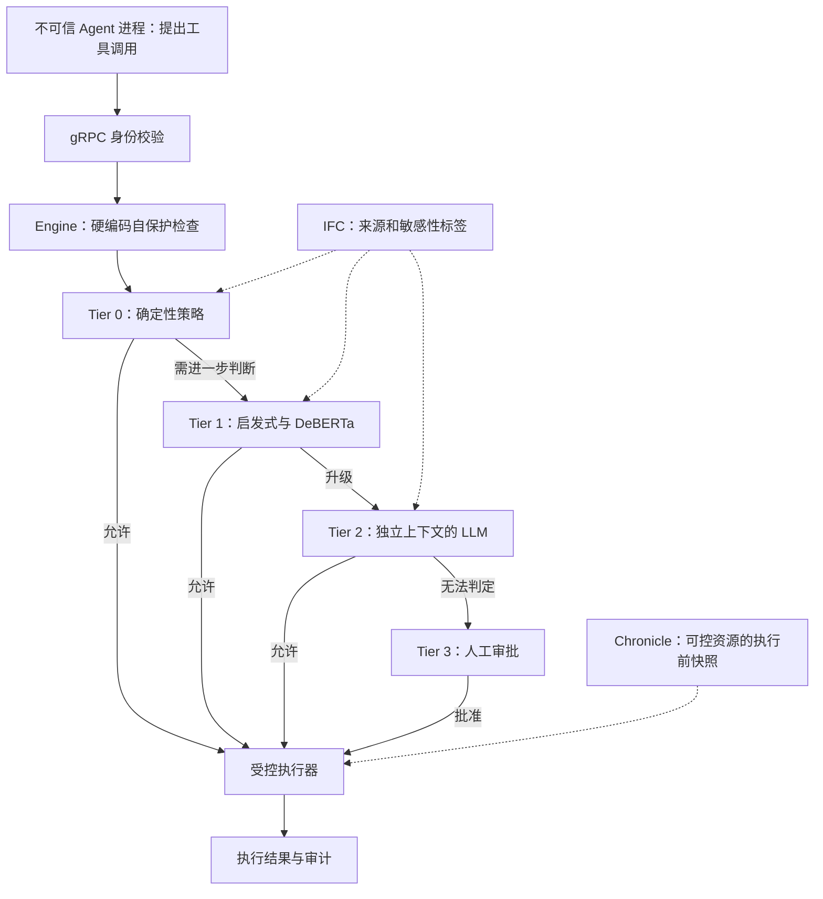

# Parallax：认知与执行隔离的安全边界 — 精读分析

## 论文与阅读范围

- Joel Fokou（单作者），*Parallax: Why AI Agents That Think Must Never Act*，arXiv:2604.12986v1，2026-04-14；本地 PDF 共 **20 页**。副标题为 *A Paradigm for Architecturally Safe Autonomous Execution*。
- [原文版本](https://arxiv.org/abs/2604.12986v1)；[[知识库/sources/papers/Parallax/arxiv-2604.12986.pdf|本地 PDF]]。参考实现为 OpenParallax，Go 编写。
- 本次核对论文正文、表 2–5 与局限部分；**没有运行参考实现或独立复现实验**。下文数字均为作者报告，不能当作普遍攻击阻断保证。

## 问题、威胁模型与假设（§3，PDF pp.4–6）

带工具权限的 Agent 可能把不可信网页或文件中的内容转成真实操作。论文采用强对手假设：推理进程已被完全控制，可以提出任意工具调用；需要验证的不是模型是否拒绝提示，而是它能否绕过独立的执行边界。

可信计算基包含操作系统/沙箱、engine 进程及 Shield 验证层；对手不能任意控制这些组件。**进程分离本身不是充分安全条件**：若 agent 仍能直接读宿主文件或访问任意网络，边界就被绕过。§5.2 的启动 canary 探针测试本应失败的文件访问、网络访问和进程访问；探针失败只检验已覆盖的隔离属性，并非完整形式化证明。

## 机制：从提出动作到产生副作用（§4–5）

图是对论文 Fig.1、§5 的简化重绘，省略 deny/error 分支：任一层拒绝或验证故障应阻止执行。各层并非每次都顺序执行到底，Tier 0 可直接允许或拒绝，Tier 1 内有并行检测，具体升级规则取决于配置。

1. **认知与执行分离**：agent 只持有提交工具调用的接口；engine 承载执行器。agent 无权修改 Shield 的策略、审计、分类器或核心配置（§4.5、§5.1–5.3）。进程内同一权限的 middleware hook 不足以等价实现这个边界。
2. **渐进验证**：旧稿把系统简化成三层。实际为 Tier 0 策略、Tier 1 启发式+DeBERTa、Tier 2 LLM、Tier 3 人工四层。规则匹配的确定性不等于规则完备性；ML 判定也不是安全证明。
3. **信息流控制**：凭证读取的结果携带标签，后续外发动作需检查从高信任源到低信任目的地的流动。不是只判断 `read_file` 或 `http_request` 这个动作名称（§4.3、§5.5）。标签传播和变换覆盖不完整仍会漏报。
4. **可逆执行**：Chronicle 在受控破坏性操作前保存资源状态，事后可由用户显式触发恢复（§4.4、§5.6）。**第三方 API、已发邮件和已发布消息可能无法撤销**。验证前拒绝与执行后恢复是两个不同阶段；不是“验证失败就回滚每一步”。

### 具体例子：凭证外发链

假设模型被诱导先读凭证，再把内容拼进 URL，最后发送 HTTP 请求。单独看三个工具名称都可能正常；IFC 需要保留“来自凭证”的标签并在外发边界拒绝。若凭证已经发到第三方，即使恢复本地文件也无法让远端忘记数据，因此必须优先做执行前控制。此例解释 §4.3 的机制，不是本次复现实验。

## 评估设计：测的是哪条边界（§6，PDF pp.12–14）

作者直接向 Shield 注入结构化工具调用，跳过推理模型，称为 Assume-Compromise Evaluation。测试含 280 个恶意用例（9 类）、50 个普通合法用例，以及额外 7 个 Tier 3 合法用例，共 337 个；Tier 3 的人工回复由测试脚本模拟。

- **Config A**：无 Shield，注入动作无验证执行，形成 100% ASR 的基线。
- **Config C**：Shield、IFC、Chronicle 启用；比较默认与最高安全配置。
- **Config B（仅 prompt 护栏）**：在 inject 模式下不适用，因为不存在接收提示的推理阶段。不能据此声称做了一个公平的自然语言攻击对照，证明所有 prompt 防御现实中均为 0%。论文另有 LLM 模式初测，三个模型在所测请求上均拒绝危险动作，无法区分这些配置。

| 配置 | 恶意动作阻断 | ASR | 合法动作误拦截 | 依据 |
|---|---:|---:|---:|---|
| 无 Shield | 0/280 | 100% | 不适用 | §6.1、表 3 |
| 默认：部分动作跳过 DeBERTa，交由 Tier 2 | 277/280（98.9%） | 1.1% | 0/50（0%） | §6.3、§6.6 |
| 最高安全：所有动作启用分类器 | 280/280（100%） | 0% | **18/50（36%）** | §6.3、§6.6 |

默认配置漏过的 3 例分别涉及临时文件删除、看似合法的 POST 端点和被判断为只读的 `env` 命令。作者在同一套测试暴露问题后添加 deny 规则与 17 条启发式模式，才得到上表结果；没有独立留出攻击集或分布外自适应攻击的统一结果。默认 0/50 也不意味着总体误报率严格为零。

### 延迟与代价（表 5，PDF p.14）

| 决策层 | 样本数 | P50 / P95 / P99，毫秒 |
|---|---:|---|
| Tier 0 | 43 | <1 / <1 / <1 |
| Tier 1 | 163 | 1947 / 2335 / 2638 |
| Tier 2 | 73 | 2089 / 3379 / 4781 |

Tier 2 使用 Claude Haiku 4.5。Tier 1 的高延迟主要来自文中 purego/ONNX 初始化路径；10–50ms 是作者讨论的常见推理水平/优化预期，**不是当前实现测得延迟**。这些按决策层分组的延迟也不是多步骤任务总延迟，缺少统一硬件与重复次数细节时不宜据此做容量规划。

表 4 的层级分布合计 280，与默认配置仅阻断 277 不同；该表没有在表头清楚说明对应配置。这里保留该歧义，避免将其当作默认配置的精确分层收益。

## 局限与复现清单（§7.4，PDF pp.15–16）

- DeBERTa 训练任务是文本注入检测，实际输入为工具参数，域不匹配造成高误报；LLM evaluator 自身也有随机性与判断错误。
- 策略覆盖、engine/OS 完整性、IFC 对变换的跟踪能力都是可信前提；“推理被攻破”并不覆盖可信基础也被攻破。
- 这是单机参考实现上的作者自建测试。没有证明任意多 Agent、插件或生产基础设施均安全，也没有独立复现或大规模用户工作负载验证。
- 可逆性只限可控资源；网络副作用和信息泄漏不能靠本地快照消除。
- 复现应固定提交、策略、分类器、evaluator 模型和随机性设置，分别测恶意/合法样本，增加未参与规则调优的留出攻击、正常任务成功率与 P95 延迟，并测试验证层故障时的 fail-closed 行为。

## 关联阅读

- [[Parallax-Agent安全架构]]：保留可用于设计评审的简版边界图。
- [[Agent-Sandbox-安全沙箱选型]]：沙箱负责资源隔离；动作策略负责边界内的权限判断。
- [[Custom-Agent-Harness-Middleware架构]]：可组织检查逻辑，但需要独立权限边界。
- [[Agent-Harness-Governance治理]]：将权限、日志、人工介入与信息流检查纳入统一治理。
