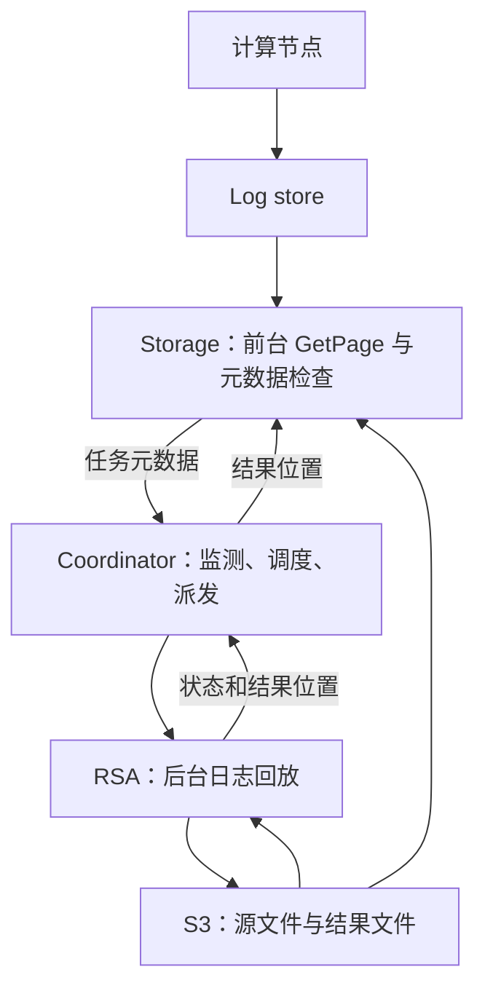

> **论文**：Reducing Tail Latency in Storage-Disaggregated Database Systems  
> **作者**：Xi Pang, Jianguo Wang (Purdue University)  
> **会议**：SIGMOD 2026 · Proc. ACM Manag. Data, Vol. 4, No. 1, Article 74  
> **代码**：https://github.com/purduedb/OpenAurora/tree/RaaS  
> **资助**：NSF 2337806

---

**论文 PDF：** [Reducing Tail Latency in Storage-Disaggregated Database Systems（26 pages）](https://cs.purdue.edu/homes/csjgwang/pubs/SIGMOD26_RaaS.pdf)

补充阅读：[[论文精读/RaaS-Reducing-Tail-Latency-Storage-Disaggregated-DB-全文翻译|论文全文翻译]]

## 一、问题背景

### 1.1 存储计算分离已成云数据库标配

Amazon Aurora、Microsoft Socrates、Google AlloyDB、华为 Taurus、Neon 都采用这种架构。核心优势：

- **独立弹性扩缩**计算和存储
- **资源池化**减少碎片、降本
- Aurora 是 AWS 历史上增长最快的服务，数万客户

### 1.2 核心矛盾：Performance is Unstable

在 Aurora PostgreSQL v16.6 (db.r6g.large, 2vCPU/16GB) 上跑 SysBench 10GB 数据集：

| 指标 | 延迟 | vs Median |
|------|------|-----------|
| Avg | 33.2 ms | 1.24× |
| Median | 26.7 ms | 1× |
| **P95** | **69.3 ms** | **2.6×** |
| **P99** | **153.1 ms** | **5.7×** |

**Tail latency 严重**——这对在线游戏、金融交易、实时通信、AI Agent 工作负载来说是致命问题。

---

## 二、根因分析

### 2.1 问题根源：log-as-the-database

本文研究的log-as-the-database架构采用：**计算节点只发 redo log 给存储节点，不发送实际数据页**。数据页由存储节点异步回放日志（replay）来物化。

这导致一个后果：**不同页的回放链长度差异巨大**——有些页积压大量未回放日志，读请求时需 on-the-fly replay，造成高延迟。

### 2.2 两大实验验证（OpenAurora 平台，24GB SysBench）

**实验 1：延迟与回放日志数强正相关**

| 查询延迟 | 平均回放日志数 |
|----------|---------------|
| <50 ms | <25 |
| 86.5 ms | 272 |
| **145 ms (tail)** | **380** |

**实验 2：后台回放与前台查询争抢 CPU**

用 perf + flame graph 分析 Storage Node CPU 占用：

| 场景 | GetPage@LSN | 后台 Replay | 其他 |
|------|-------------|-------------|------|
| 无后台回放 | 90.6% | 3.7% | 5.7% |
| 后台回放运行 | **49.4%** | **43.0%** | 7.6% |

→ 后台回放吃掉 43% CPU，前台查询只剩 49.4%（下降 45.5%），直接导致 throughput 骤降。

**结论：Tail latency 两个根因**：
1. 日志链长度差异 → 个别请求需回放大批日志
2. 后台回放和前台查询**争抢存储节点有限的 CPU**

---

## 三、RaaS（Replay-as-a-Service）核心方案

### 3.1 核心思路

**把后台日志回放从存储引擎里解耦为独立服务，利用集群空闲实例或专用实例执行**。

一举两得：
1. 减少原节点回放与前台查询的资源竞争 → 降低该场景tail latency
2. 回放可以更频繁、更激进地执行 → 缩短日志链 → 进一步降低延迟

### 3.2 架构

两个新组件：
- **RSA (Replay Service Agent)**：部署在空闲实例上，执行回放任务，无状态服务
- **Control Coordinator**：接收回放任务 → 调度分发 → 选择合适的 RSA

### 3.3 四大技术挑战与解法

| # | 挑战 | 解法 |
|---|------|------|
| C1 | 回放逻辑与前台 GetPage@LSN 代码强耦合 | 识别最小元数据边界（KeySpace + LsnRange + page→log mapping + location index），只解耦 compute-intensive 的 page materialization step |
| C2 | 回放数据量巨大，存储节点 CPU 有限 | 利用 S3 中转：只发 metadata（18KB），RSA 自己去 S3 拉数据/写结果 → **该实验storage node传输量降低93.9%**（49GB → 3GB） |
| C3 | 原来单线程回放浪费 RSA 的多核资源 | 并行 MergeSort 按 page 分组日志 + 多线程并行 apply → single-thread vs parallel：Avg 延迟 -17.3%，P95 -23.7% |
| C4 | 任务调度策略 | 优先级同时考虑任务量与等待时间（论文未给乘法公式）；选 RSA 策略：(1) 过滤 CPU>75% 的实例 (2) 过滤资源不足的 (3) 优先上次服务过的 RSA（缓存亲和） (4) 选资源最多的 |

### 3.4 任务卸载流程

1. Storage Node 检测到 CPU 不足 → 提取元数据（KeySpace, LsnRange, mapping index, location index）
2. 发 metadata → Control Coordinator（不传数据文件）
3. Coordinator 选 RSA → 派发任务
4. RSA 从 S3 拉文件 → 执行 `remote_compact_tiered()` → 结果写回 S3
5. RSA 通知 Coordinator → Coordinator 通知 Storage Node 结果位置
6. Storage Node 更新本地索引

**如果 Storage Node 有空闲资源，任务在本地执行，不触发卸载。**

---

## 四、在 OpenAurora 上的实现

基于 PostgreSQL 的开源存储计算分离数据库 OpenAurora：

- **存储节点**：复用 PG 的 log replication + Neon 的 LSM-based layered storage
- **关键函数迁移**：`compact_tiered()` → `remote_compact_tiered()`（无状态服务）
- **集成改动量**：替换 `compaction_execution()` 中的本地调用为 RaaS 远程调用；不改变读写路径

---

## 五、实验评估

### 5.1 实验配置

| 组件 | 配置 |
|------|------|
| 数据库实例 | 8 × OpenAurora (disaggregated mode) |
| 计算节点 | 8 vCPU, 32GB |
| Log Store / Storage | 4 vCPU, 16GB, 1.5TB NVMe SSD |
| Coordinator | 2 vCPU, 8GB |
| RSA | Co-located on storage nodes |
| 网络 | 10 Gbps TCP/IP |
| 数据集 | SysBench 86GB, mixed read/write, 32 threads |

### 5.2 核心结果

| 指标 | Without RaaS | With RaaS | 改善 |
|------|-------------|-----------|------|
| **Avg Throughput** | 1351 TPS | **2376 TPS** | **+75.9%** |
| **P95 Latency** | 68.28 ms | **40.9 ms** | **-40.1%** |
| **P99 Latency** | 106.75 ms | **62.19 ms** | **-41.7%** |
| 请求 >100ms 占比 | 1.33% | 0.06% | -95.5% |
| <10ms 完成占比 | 32.5% | 53.3% | +20.8 个百分点 |

### 5.3 CPU 利用率变化

Without RaaS：storage node 在后台回放期间 CPU 打到 400%（满核），前台查询饿死  
With RaaS：workload 期间 CPU 200-320%（正常），后台回放在 idle interval 由其他节点的 RSA 执行

→ Storage node 空闲率从 48% → 18%，**资源利用率大幅提升**

### 5.4 TPC-C 验证

| 指标 | Without RaaS | With RaaS | 改善 |
|------|-------------|-----------|------|
| P95 | 225.49 ms | 129.08 ms | **-42.76%** |
| P99 | 300.43 ms | 189.84 ms | **-36.81%** |

### 5.5 容错能力

| 故障场景 | 表现 |
|----------|------|
| S3 上传失败 | RSA 自动重试，对 storage node 透明 |
| 单个 RSA 崩溃 | §7.6注入实验：Coordinator检测后剔除并重调度到其他RSA（该注入实验中任务完成晚约 200 s，未观察到明显前台性能下降；不是一般无影响保证） |
| 全部 RSA 不可用 | Coordinator 拒绝任务 → storage node 跳过本次回放 → 下次重新触发 |
| Coordinator 崩溃 | Storage node 回退到本地回放模式 → 无数据丢失/无宕机风险 |

### 5.6 边界情况

| 场景 | 结果 |
|------|------|
| Read-only workload | RaaS 无影响（无日志积压，任务在触发前取消） |
| Non-bursty（全集群持续高负载） | co-located RSA 无改善（预期内）；non-co-located 部署仍可提升至 **2151 TPS**（+71.6%） |
| 本地并行回放（不卸载） | **反而恶化**：P99 +38.3%（资源争抢加剧） |
| 提高本地回放频率 | 效果有限：P99 仅改善 3%（频繁 cancel + 资源争抢） |

---

## 六、与 Kafka/流存储系统的关联分析

### 6.1 存储计算分离的共通性

Kafka 在云上部署（如 AutoMQ、Confluent Cloud、WarpStream）可从后台任务干扰角度作类比（以下为工程推论，不是该论文对 Kafka 的实验）：

| 概念 | 存储分离数据库 | 分离式 Kafka |
|------|---------------|-------------|
| 日志语义 | redo/WAL log | Kafka log segment |
| 物化 | 回放 log → data page | 日志段读取/压缩；不等同于数据库页回放 |
| 后台任务 | log replay/compaction | log compaction, segment merge |
| 问题 | tail latency | consumer lag spike / tail latency |

### 6.2 RaaS 思路对分离式 Kafka 的启发

1. **Log Compaction 卸载**：Kafka compaction 是 CPU 密集型操作，可以像 RaaS 一样卸载到空闲 broker
2. **Tiered Storage 回放**：从 S3 拉取 cold segment 回放时，可借鉴 S3 中转模式减少 broker 网络开销
3. **调度策略**：Coordinator 的 Monitor/Scheduler/Dispatcher 模式可作为调度设计参考，但需另行验证 Kafka 的日志段、事务标记及删除语义

### 6.3 Key Takeaways

- **log-as-the-database 是双刃剑**：减少数据传输量，但引入了不确定的回放延迟
- **解耦是解法**：把 CPU 密集的后台任务从资源受限的存储层剥离
- **S3 作为数据总线**：metadata 通过控制面传递，data 通过 S3 对象存储交换——该实验storage node传输量减少93.9%
- **错峰资源复用的价值**：RaaS 的核心效果来自"让空闲资源干活"而非"加机器"

---

## 七、论文评价

### 亮点
- **问题定义精准**：通过OpenAurora插桩分析存储分离OLTP的两条尾延迟路径
- **思路简洁有效**：解耦后台回放——本质是"让存储层回归存储"
- **实现务实**：基于 OpenAurora 真实系统，不改读写路径
- **评估扎实**：SysBench + TPC-C，覆盖容错、边界场景、non-bursty 等
- **开源**：https://github.com/purduedb/OpenAurora/tree/RaaS

### 局限
- COTS 数据库（Aurora/Socrates）的验证依赖封闭系统，主要实验在 OpenAurora
- Non-bursty 场景下 co-located 部署无增益——需要 dedicated RSA 节点
- 未涉及多租户环境的 tail latency 分析（论文列为 future work）
- 对 memory-disaggregated 数据库（RDMA/CXL 场景）有待探索

---

*精读完成于 2026-06-10 · CHANG_AI_TEAM CTO*

## 原文定位与复现边界（2026-10-05 核验）

本地 [[知识库/sources/papers/RaaS/RaaS-SIGMOD2026.pdf|26 页 PDF]]：§3/图3–5（页6–9）验证日志链和 CPU 竞争；§5.1–5.2（页11–12）定义元数据/对象存储卸载边界；§5.4–5.5（页13–14）描述调度和失败处理；§7.1–7.3/图8–9（页15–17）给吞吐与延迟；§7.6（页19–20）给故障注入；§7.7（页20）给网络流量。

主实验每实例 86 GB SysBench、32线程，8个 OpenAurora 实例。10分钟预热后，3轮5分钟混合负载，中间各有10分钟空闲；db5–8比db1–4晚8分钟开始。这种错峰创造可借用资源，是 +75.9% 吞吐与 P95 -40.1% 的重要前提。Aurora 10GB观测、OpenAurora 24GB根因实验和86GB主评估是三组不同设置，不得合成同一实验。本文未直接给 AWS Aurora 安装 RaaS 后的性能。

**走通示例（教学）**：页 P 现有物化版本位于 LSN 100，请求读取 LSN 150。Storage 根据原始 page→log mapping 选择100之后至150所需日志；后台任务把一个完整 keyspace/LSN 范围交给 RSA 时，原始日志和索引仍是正确性依据。RSA 先把输出文件持久化，返回位置，再由 Storage 取回并同步索引。它不是“远端回放完成就立即覆盖所有快照”，也不改变事务提交的 WAL 持久性路径。

**失败边界**：§5.5 对 RSA 故障描述为 coordinator 通知 storage 重试卸载；网络错误由 RSA 重试，损坏数据通知 storage，coordinator 全失效则回退本地回放。副本/日志持久性故障仍依赖原数据库。页20的49 GB→3 GB、93.9%衡量减少经过受限 storage node 的传输；不是整个集群含 S3 流量归零或普遍网络节省比例。

**工程推论**：部署前应测长日志链占比、可借用CPU窗口和 S3传输开销；若全集群持续繁忙，共置 RSA 不会创造新算力，应比较专用 worker 的成本与收益。

> **失败路径的原文差异**：§5.5（PDF14页）描述RSA故障后通知storage重新卸载，§7.6（PDF19页）实验描述coordinator自行重调度、storage不重新发任务。本笔记分别保留两处的语境，不把其合成为已经完全说明的统一重试协议；准确实现需进一步对照对应版本源码。
