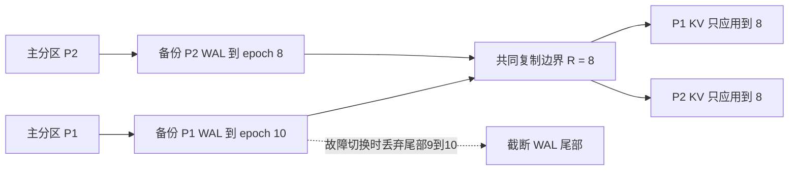

# Rosé：分区数据库异步复制精读

> Zarkadas 等，*Rosé: Flexible Replication With Strong Semantics For Partitioned Databases*，CIDR 2026，7 页。核对本库原始 PDF；下文页码为 PDF 页序。本文明确区分作者陈述、原文疑点与分析推导。

## 问题与前提

异步主备复制可使写请求先在主区域完成，跨区域复制随后发生，因此无法承诺远端已经持久化全部已确认写。分区数据库又有额外困难：不同分区复制进度不同，故障切换时不能任取每个分区最新状态拼成一个全局状态。

Rosé 的三个设计相互配合：复用已有全局一致快照机制暴露单调前缀；用有界队列和回压控制待复制积压；将 WAL 复制与底层 KV 应用分开，只向 KV 应用全局安全边界以内的记录。它不把异步复制变成零数据损失，也不凭空赋予所有 MVCC 数据库全球快照能力。

§2.2（p.2）中的集成宿主 Chablis 有 RangeServer、WAL Service、Key-Value Service、Warden 和 epoch 服务。论文使用其跨分区 epoch：较早 epoch 的事务发生在较晚 epoch 之前，完整全局顺序边界由 epoch 定义。单有HLC时间戳或MVCC多版本不足以建立这个前提，还需要正确的事务完成与安全时间推进协议。

## 1. 单调前缀：可见的是全局安全快照

§2.1 定义两条性质：备份状态对应主库事务历史的连续前缀；连续暴露给只读事务的前缀长度不倒退。§4.1（p.3）推广到分区，主分区按 epoch 顺序发送已提交 write-set，备份管理者跟踪每个分区**完整应用**的 epoch e_i，可读边界为 `e_snapshot=min_i(e_i)`。

自构跨分区转账例：epoch 10 同时使 P1 扣10、P2加10。若备份P1到了10而P2只到8，不能读出扣款已发生、入款却缺失的拼接状态；两者只能提供已完成的全局epoch 8。P1的9–10可能后来可用，但切换到epoch8时必须排除。

## 2. 有界队列控制积压，不是无条件时间上界

§4.2（pp.3–4）使用push复制及每分区有界队列L；该分区待复制队列满时，对涉及该分区的写施加回压，并可等待超时θ让复制腾出空间。其他独立分区不被直接限流，但共享快照的推进仍受最慢分区约束，跨分区事务也可能受影响。“掉队分区只影响自己”不能推广为所有读和事务都不受影响。

### 原文公式疑点：保留出处，给出推导

§4.2.1 p.3 原文写 `effective_replication_lag=min_i(lag_i)`；这与同页 `snapshot=min_i(e_backup,i)` 和“单分区停滞卡住快照”的解释不一致。本文将其标为**疑似公式错误**，不将它直接作为实现规则。

在各主分区以共同已关闭epoch E为比较基准时，备份安全快照落后为：

`lag_global = E - min_i(e_backup,i) = max_i(E - e_backup,i)`。

例如E=10、两个备份分别到9与2，局部lag是1与8，全局可读快照为2，落后8而非min值1。若各primary的进度也不同，须先定义共同安全比较边界，不能任意对局部差值取min或max。

§4.2.2明确承认：某分区在接受写后完全停机任意长时间，会使快照epoch无法推进，时间上的replication lag可无限增长。有界L控制在途积压及写入接纳，不自动保证故障期间的墙钟新鲜度/RPO上限。

### 可用性论证的范围

作者按顺序到达的事务比较Rosé与同步主备：网络可用时同步能接受的事务，可在队列等待θ后腾出槽位；网络不可用时异步可先消耗缓冲。因此在其模型下论证不劣于同步复制。该段不是任意负载、任意相关故障、任意调度下的完整可用性定理。

论文以三个副本、单节点99.9%可用性估算同时全宕概率；`p^R` 隐含独立故障假设，机房/网络共因故障不满足它。长期备份区域失联时允许外部系统或管理员解除回压，这是以放弃原积压约束换可用性，不能同时宣传原耐久边界仍成立。

## 3. Coordinated Apply：把需丢弃的尾部留在 WAL

§4.3.2（p.5）、Figure2：管理者先跟踪所有分区完整复制到WAL的最小epoch R，只允许各分区把WAL应用至R。复制进度、应用许可和最终可读进度是不同水位；不能因为发出apply通知就认为所有KV瞬间应用完成。

如果故障切换点取8，P1的超前记录仍在WAL，不会污染KV；只需截断不应保留的WAL尾部，而无需遍历KV删除所有超前版本。原文说快速trim，**没有证明所有存储实现都O(1)**，也不表示完整故障检测、提升和状态应用总耗时为零。

§4.3.1、Figure3 的Yugabyte基线把keep_ts写入SST元数据，快速开始服务，再在读时过滤超界数据、后台compaction清理。区别在恢复后读路径的额外工作，不应归结为“LSM本身必然有22%退化”。

## 等待与短 epoch 的条件

§4.3.2、Figure4（pp.5–6）推导简化模型下 `dead_time_i=max(RT)-RT_i`，其中RT由写带宽、epoch长度和网络带宽决定。短epoch可减少快分区等待慢分区的时间；Figure4在快分区应用可于慢分区完成前结束的示例下说明最终快照推进不变。这不是任意apply代价/负载不均时都无额外延迟的证明，更不能说“开始apply前就已经完成apply”。

## 实验设置、结果与局限

| 问题 | 设置和基线 | 证据与结果 |
|---|---|---|
| 回压能否限制积压 | 单机Cloudlab c6525-25g模拟多节点和网络故障；Chablis中集成Rosé；同分区开/关回压 | §5.2 Figure5 p.6：开启回压限制图中的epoch lag，代价是过载分区性能降低；该图不是普遍墙钟RPO证明 |
| 切换后性能 | 两区域各两节点主备；主区均匀读写；断开一台备份连接；基线Yugabyte2.25.2.0-b359按其手动说明切换 | §5.3 Figure6 pp.6–7：两者切换均小于2秒；Yugabyte读吞吐下降22%、P99增加15%，Rosé该实验对应0%/0% |

作者明确不比较绝对吞吐，因为一个是完整SQL生产系统、另一个是KV原型。0%表示该实验未观测到恢复后相对退化，不能推出所有存储、故障和工作负载“永远满性能”。单机模拟、较小拓扑、有限负载、短文没有完整复现参数，限制了对真实跨区及大规模恢复的外推。

知识链：[[Rosé-异步复制协议设计]]、[[Rosé-Coordinated-Apply-协调应用]]、[[事务模型深度调研]]、[[LSM-Tree]]。
