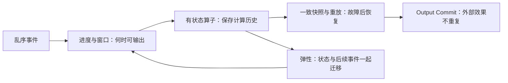

# A Survey on the Evolution of Stream Processing Systems — 精读分析

## 版本、问题与证据类型

Marios Fragkoulis、Paris Carbone、Vasiliki Kalavri、Asterios Katsifodimos，arXiv:2008.00842v2，2023-01-14，30页、10图、6表。[版本页](https://arxiv.org/abs/2008.00842v2)；[[知识库/sources/papers/SP-Survey/SP-Survey-arXiv2020.pdf|本地 PDF]]。文件名中的2020是首版年份，当前入库PDF为2023年的v2。

论文研究早期（约2000–2010）与现代（约2011–2022）流处理系统的设计演化：哪些机制被保留、重组或重新命名，以及这些选择依赖什么假设。Fig.1 把第三代标成问号，表示事件驱动、Actors、事务、硬件加速等**新趋势**，不是已定义成熟统一架构，更不是对2026年当前产品能力的横评。

这是文献与系统设计综述，**没有作者统一运行的性能 benchmark、统一硬件与任务基线或速度冠军结论**。Table 1–6 是语义、设计和功能分类，不能由勾选项推导延迟或吞吐排序。

## 阅读主线：从时间到状态，再到故障与迁移

图是概念依赖，不代表所有系统固定使用同一条执行流水线。

## §2：代际变化的适用边界（PDF pp.3–5，Table 1）

早期 DSMS 往往基于关系查询、共享计划与 scale-up；现代系统更强调分布式数据流、独立作业、用户定义状态与 scale-out。它们是研究趋势，不是“第一代都不容错/不能分布式，第二代都没有SQL”的绝对分类。不同代际保留了大量共同机制，例如窗口、punctuation 和进度边界。

## §3：乱序、进度与修正（PDF pp.5–11，Fig.2–3、Table 2）

乱序来自网络、多源与算子自身。In-order 路线先缓冲排序；out-of-order 路线允许到达即处理，但维护进度并保存必要状态；revision processing 在旧结果之后补做修正。三者可组合，不是互斥产品标签。

- **Slack** 是等待界限；**heartbeat** 是源端进度信号；**low-watermark** 描述未完成工作的下界；**punctuation** 是在数据流中传达约束/进度的载体。
- **Pointstamp** 在时间戳外加位置；frontier 是偏序下尚未完成工作的边界，不一定只有一个最小时间。Naiad 以此处理迭代数据流（§3.5.2、Fig.3）。
- **Trigger** 决定何时发布，**refinement** 决定下一次输出与上次输出的关系。确定性进度与启发式 watermark 必须区分；不能说所有 watermark 都只是猜测。

**小例子（本笔记）**：按事件时间统计10分钟内金额，先看到4和6，提前输出10，后来收到同窗口迟到的3。Accumulating输出13；discarding在该次pane只输出新增的3，需要下游合并；accumulating-and-retracting撤回10再发13。具体丢弃边界还取决于allowed lateness、状态保留及源端保证。只看到watermark越窗，不足以声称最终永不变化。

## §4：状态管理与持久化（PDF pp.11–16，Fig.4–6、Table 3）

状态从系统内部 synopsis，演进到应用自管，再到用户定义、系统负责恢复和扩展。要分开四个问题：谁定义逻辑状态、状态驻留哪里、何时持久化、按什么key分片。

| 维度 | 选项 | 关键代价 |
|---|---|---|
| 驻留 | 内存、嵌入式外存、外部存储 | 容量、I/O、远程调用与运维 |
| 持久化粒度 | batch、epoch、record | 提交/快照频率与恢复重放量 |
| 一致快照 | 保存通道在途数据，或在barrier处对齐 | 运行时等待、通道记录大小、恢复与迁移复杂度 |
| 分片 | keyed/partitioned与非分区状态 | 热点、路由与重配置的语义约束 |

**源文需要纠正的一点**：§4.3 将 FASTER 与 LSM变体并列，不能据此把FASTER等同于RocksDB。微软[FASTER官方说明](https://microsoft.github.io/FASTER/docs/fasterkv-basics/)描述的是hash index与hybrid log，支持内存部分的原地更新和向外存溢出。Out-of-core是一种容量/驻留架构，不限定底层必须为LSM。

### 一个恢复例子（本笔记）

key A的累计值在已提交epoch中为10，之后处理输入3得到13但尚未形成下一次完整checkpoint。故障恢复到10并从对应输入offset重放3，可使状态恢复为13；若13曾发往不支持事务/幂等的外部接收方，重放可能再次发送。这引出下一节的output commit问题。

## §5：状态 exactly-once 与输出提交（PDF pp.16–22，Table 4–5）

Exactly-once state通常指恢复后的可见状态等价于每个逻辑输入生效一次，物理执行仍可能重试。它不自动意味着外部效果一次。Output commit还需协调输入进度、状态提交与输出确认，或在接收端借助稳定ID、幂等/事务协议。

论文把恢复策略分为主动复制、被动复制及输入重放，并比较需要的状态、输出缓冲和存储。主动复制也有故障检测与切换开销，不能写成“恢复延迟零”；本地RocksDB持久化也不能替代抵御整机丢失的远端checkpoint。

Table 5 强调不同output commit方案依赖不同假设：输入顺序、确定性、可重放性或接收方能力。非确定性计算可能需要记录决定因子并在恢复时重放，不能只重放输入。高可用讨论关注故障后处理进度与正常目标的偏离，而非给出“所有系统通用的固定可用率”。

## §6：负载、流控、弹性与重配置（PDF pp.22–26，Fig.7–10、Table 6）

正确章节为：§6.1 load shedding，§6.2 scheduling/flow control，§6.3 elasticity（policy与mechanism），§6.4代际比较，§6.5开放问题。

1. **过载处置**：舍弃部分数据会影响结果；背压将需求反馈给上游，仍需足够可重放日志与缓冲，不能消除计算资源不足。
2. **policy**：判断是否扩缩容、扩哪个算子，分启发式与预测模型；不能把所有系统说成只有告警加人工决策。
3. **mechanism**：决定迁移过程如何保持key语义。一个key的历史状态与未来事件必须由同一有效owner处理。
4. **重配置**：stop-and-restart暂停全作业；partial-pause只暂停受影响子图；预复制可缩短迁移阶段。渐进迁移将状态分块，与计算交错以平滑延迟尖峰，代价可能是总迁移时间更长（Megaphone对应讨论）。

**Fig.9迁移例子**：暂停旧owner的上游→排空其输入→传状态到新owner→加载成功后通知上游恢复，并更新路由。若路由先切换、状态还未装载，后续事件可能基于空状态计算；若旧owner未停又接受同key事件，迁移快照会遗漏更新。论文给的是机制分类，不保证任意实现零停顿。

## 如何评价与复用

本文适合用作设计审查坐标系：先写清有序/乱序、确定/非确定、可重放输入、外部sink契约，再比较checkpoint、进度追踪和迁移机制。需要实测时，固定算子图、状态规模、key倾斜、迟到分布、输入率、故障注入点和存储配置；同时报告吞吐、尾延迟、恢复时间、重复/遗漏结果、迁移时长与迁移期间停顿。本笔记未运行这些实验。

局限是版本截止2022左右，第三代仅为展望；没有统一性能重跑，也不能涵盖此后框架API与生产配置变化。综述对底层结构的概括需回原系统资料核验，FASTER便是实例。

## 关联阅读

- [[Dataflow-Model]]、[[流处理乱序数据管理]]：时间、触发、修正。
- [[流处理状态管理]]、[[流处理容错模型]]：驻留、checkpoint与output commit。
- [[流处理弹性与重配置]]：迁移保持key语义。
- [[Stream-Processing-System-Generations]]：用代际趋势定位系统，不用代际标签替代具体能力核验。
