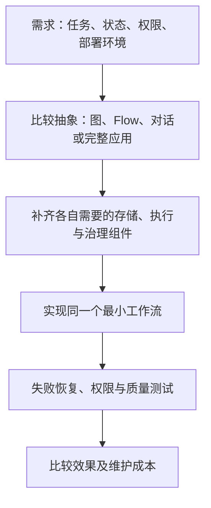

# Agent 框架 2026 — 官方能力对照（非横评）

本页原归档于 2026-07-03；2026-10-05 重新核验各项目官方文档/仓库。旧稿只列出若干博客名称，缺少可回溯链接、统一负载与评价方法，因此本次改为**官方能力对照与选型实验设计**，不再称为多家机构已达共识的横评。

## 来源与可确认事实

| 项目 | 本次实际读取的官方来源 | 可以据此确认的定位 |
|---|---|---|
| LangGraph | [Overview](https://docs.langchain.com/oss/python/langgraph/overview) | 面向有状态 Agent/工作流的底层图执行与编排；有持久化、人类介入等机制 |
| CrewAI | [Introduction](https://docs.crewai.com/en/introduction)（核验时跳转 v1.15.23） | 同时提供 Crews 和 Flows；不能只概括为角色扮演 |
| AutoGen | [架构文档](https://microsoft.github.io/autogen/stable/) 与 [仓库 README](https://github.com/microsoft/autogen) | Core 为事件驱动，AgentChat 为上层交互；当前维护状态须另看下段 |
| Semantic Kernel | [Microsoft Learn 概览](https://learn.microsoft.com/en-us/semantic-kernel/overview/) | C# / Python / Java 集成、插件/函数与连接器；企业宣传不等于业务治理自动完备 |
| Hermes Agent | [官方仓库](https://github.com/NousResearch/hermes-agent) | 更接近可直接运行的 Agent 应用，含技能/记忆、消息接入、调度和执行后端 |

**时效修正**：AutoGen 官方 README 在本次核验时明确标为 maintenance mode，不再新增功能/增强，后续社区维护；新项目推荐 [Microsoft Agent Framework](https://github.com/microsoft/agent-framework)，已有项目提供迁移指南。这里记录官方维护声明，未测试迁移兼容性。不能继续把 AutoGen 无条件列为活跃新项目的默认首选。

## 先对齐比较对象

LangGraph 是编排运行时；CrewAI 将角色协作与显式 Flow 组合；AutoGen 有分层 runtime/AgentChat；Semantic Kernel 偏代码与模型能力集成；Hermes 是含默认策略与工具的 Agent 应用。比较它们的“开箱即用程度”时，必须把额外组合的沙箱、数据库、评估和平台服务计入。

LangGraph 可表达循环，不能称为只能 DAG；LangSmith 等平台能力也不能全部算成开源 LangGraph 自带。类似地，Hermes 的技能更新或跨会话检索是功能设计，不是“学习必然变好”或“其他产品没有”的证据。

## 共同实验应怎么做（本笔记建议）

选择“收集资料→生成草稿→人工审批→发布”的工作流。各候选固定模型、工具和任务集，记录安装/实现投入及外部依赖。让它们在同一位置暂停恢复、遇到限流、重复事件和发布响应丢失；再改一条规则，观察变更范围与回归。

| 维度 | 可比较指标 | 避免的伪指标 |
|---|---|---|
| 结果 | 固定任务成功率、人工修改率 | README 自称生产级 |
| 恢复 | 恢复时间、重复副作用、未决状态 | 有 checkpoint 按钮就等于 exactly-once |
| 治理 | 越权测试、审计完整性、批准拒绝后的行为 | 有 hooks 就等于合规 |
| 成本 | 每成功任务费用、峰值资源、运维投入 | 只比较模型单价 |
| 可维护性 | 升级成本、可导出状态、维护状态与 API 稳定性 | Stars、榜单名次、演示热度 |

这组实验尚未在本次执行，因此不能给出“最灵活、最完善、所有评估都弱、治理领先”的排名。旧稿 Stars/OpenRouter 名次及“原生 SDK 零额外依赖”的判断也未保留。

## 关联阅读与证据限制

[[Agent-框架-2026-全景对比]] 是摘要；[[Agent-Harness-Engineering-Survey综述]] 的 ETCLOVG 可用于列检查项，但其 2026-05-08 快照不能代替当前项目核验。[[Hermes-Agent-自进化Agent框架]] 可补充应用层设计；[[Custom-Agent-Harness-Middleware架构]] 可补充干预位置。

本页只核对公开说明，没有运行候选框架、测维护响应时间或核验所有可选插件。官方功能声明是选型起点，不是安全/性能证书。Microsoft Learn 页面同时显示访问提示与可读正文，本次只采用实际返回的概览内容，未推测不可见部分。
