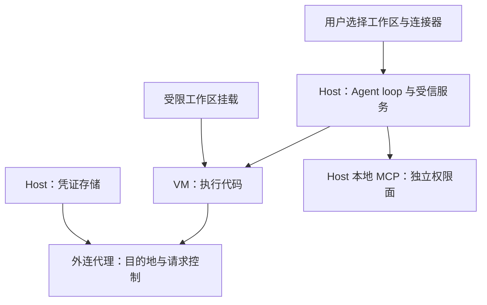

# How We Contain Claude — 产品隔离与失效案例精读

Anthropic Engineering，2026-05-25。[官方原文](https://www.anthropic.com/engineering/how-we-contain-claude)。2026-10-05 核验页面正文。文章是多个产品的工程回顾及安全事件总结，不是可跨产品直接排名的统一实验；以下数字为厂商报告，本次未复现。

## 风险与防御职责

作者区分用户误用、模型主动误行为和外部攻击，并从环境、模型、外部内容三个方向限制风险。这三个方向是互补控制面，不是“上层可以被绕过、最下层绝不可能被绕过”的线性层级。访问边界仍依赖 OS、虚拟化、代理和配置正确。

## 三种产品模式与架构演进

| 文章中的产品 | 主要模式 | 关键边界 |
|---|---|---|
| claude.ai 代码执行 | 服务端临时 gVisor 容器 | 保护服务端/租户，工作区为会话级；不是访问用户本机的一般工具 |
| Claude Code | OS 权限沙箱配合人类监督 | Seatbelt / bubblewrap 限制命令可访问的文件与网络 |
| Claude Cowork | 本地 VM 执行环境 | 只挂载选定工作区，guest 与宿主边界分离 |

参考 devcontainer 是另外讨论的无人值守配置例子，不能替换表中第三种 Cowork 模式。

Cowork 最早把整个 Agent loop 放在 guest 内；后来把 loop 移到 host，保留代码在 VM 执行，以便 VM 失败时仍能响应并诊断。部分本地 MCP server 也移到 host，因此其权限与信任必须单独管理。旧版“没有外部进程持有例外开关”的论述适用于全文明确限定的 full-VM 模式，不能无条件套到演进后的全部产品。

图重绘文章后期 host-mode 职责，省略平台具体机制；MCP 不因为与 Agent 同用一个产品就自动继承 VM 的隔离。

## 数字必须保留分母和条件

- **93%** 指遥测中的权限提示被批准比例，不是“93% 用户自动批准”，更不能仅由该比例证明用户都未阅读。
- **84%** 是作者报告引入 Claude Code OS 沙箱后权限提示数量的下降，不是风险下降 84%。
- 钓鱼演练中，一个研究者诱导一位员工提交恶意 prompt；对**该 prompt 重试 25 次**，24 次发生外泄。不是 24/25 位用户，也不是总体攻击成功率。
- 文章还引用模型红队指标，但攻击集、重试预算和环境与 [[Parallax-Agent安全架构]] 不同，不能拿百分比直接判定谁更安全。

## 三个失效案例的机制

1. **信任提示之前加载本地配置**：项目内 hook 在用户确认前已被处理。修复应把不可信配置的解析/执行纳入信任边界，不能只保护用户点确认之后的命令。
2. **用户成为注入入口**：用户转贴恶意任务时，模型可能把攻击内容视为用户意图；环境权限能限制后果，但仍需选择足够窄的挂载与外连范围。
3. **通过允许域名外泄**：恶意文件引导把工作区内容上传到攻击者控制的 Anthropic 账号。代理允许 `api.anthropic.com` 并不能判断账号归属和数据用途；沙箱没有被逃逸，数据仍越过了业务授权边界。

因此，“凭证不进沙箱就绝无泄漏”混淆了凭证保密和数据外泄。外置 key 保护的是 key 暴露面；还需要检查代理接受哪些凭证、能操作哪些资源、能发送哪些数据。

## 从案例到验证（本笔记建议）

对新接入的工具/连接器，分别测试启动前配置、符号链接解析、挂载权限、允许域名下的未授权账号，以及本地 MCP 的宿主访问。为每项记录攻击前提和合法任务影响，避免把减少审批次数直接当安全收益。组合强制边界与有针对性的审核时，也应保留紧急停止和审计能力。

摘要：[[Anthropic-Agent安全容器化实践]]；关联：[[Agent-Sandbox-安全沙箱选型]]、[[Custom-Agent-Harness-Middleware架构]]、[[Agent-Harness-Governance治理]]。
