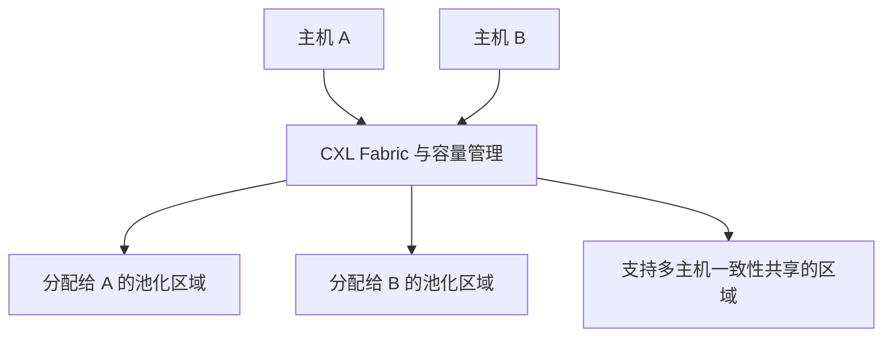

# CXL 3.0：内存池化与共享的区别

本文依据 CXL 联盟白皮书解释架构能力，不据此预测某个年份的全部商用产品就绪程度。

## 三个容易混淆的概念

| 概念 | 含义 | 不能直接推出什么 |
|---|---|---|
| Pooling | 将内存容量按需分配给不同主机 | 同一字节必然同时被多主机共享 |
| Sharing | 多主机同时访问受一致性机制管理的内存区域 | 数据库事务自动串行化 |
| Fabric | 通过交换与路由组织多节点互连 | 任意规模、拓扑都具有本地 DRAM 延迟 |

图展示两种分配语义，不代表每个设备或交换机都支持所有组合。CXL 3.0 增强了对 host-managed device memory 的一致性和 back-invalidation；不能简单把设备内存的跨主机共享全部归为 CXL.cache。CXL.cache、CXL.mem 的访问方向和职责需要分开理解。

## 数据库推论与待验证问题

扩大 buffer/cache 可减少部分 I/O，远端内存池也可能改善容量利用。但收益取决于访问热度、NUMA 放置、交换跳数、带宽竞争、故障域及软件分配策略。旧稿“完全容量利用”“固定 2–3 倍本地延迟”“免重启扩到某容量”缺少对应硬件与实验，不再作为事实。

硬件 cache coherence 解决的是缓存行可见性，并不会替数据库设计事务隔离、持久化日志、进程故障恢复或多租户权限。将共享内存用作 LSM 缓存是研究方向，不代表 [[Aurora-Limitless-分布式架构]] 或 TiDB 已采用。

验证设计时可比较本地 DRAM、CXL 直连和经过交换的配置，固定数据集与线程数，分别测 P50/P99、吞吐、带宽、CPU 占用和故障恢复；这些是建议实验，并非已有测量结果。

关联：[[LSM-Tree-硬件适配]]、[[存储计算分离数据库的-Tail-Latency]]。

## 核验来源

- [CXL 3.0 官方白皮书，pp.2–4](https://computeexpresslink.org/wp-content/uploads/2023/12/CXL_3.0_white-paper_FINAL-1.pdf)
