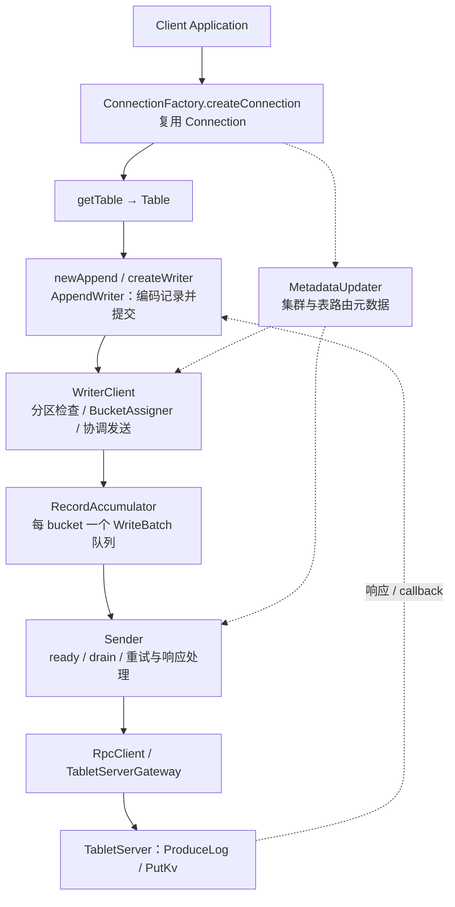

# Fluss 客户端写入流程源码分析 — 精读分析

> **版本与证据边界**：这是 2026 年 6—7 月的内部源码阅读归档摘要。原长文仅记录 Fluss `trunk`，没有固定上游 commit；`a3a59fd ~ 53b4f65` 的仓库归属也未记录。2026-10-05 仅依据本地 [[项目文档/Fluss源码分析/05b-客户端写入流程深度分析|客户端写入长文]] 整理图示和摘要内部一致性，未证明当前 Fluss 的实现、配置默认值或错误码与之相同。

## 基本信息

| 维度 | 内容 |
|------|------|
| 来源 | 内部源码分析归档，原记录 `a3a59fd ~ 53b4f65`（所属仓库未注明），2026-06-30 ~ 07-01 |
| 类型 | 源码架构分析 |
| 覆盖模块 | Fluss 源码分析 8 个模块全完成（01-07 + 05b 客户端写入） |
| 分析日期 | 2026-07-03 |
| 归档日期 | 2026-07-03 |

## 归档内容

- 客户端写入长文：API 示例、组件分工、创建/启动/关闭流程、批缓冲、RPC 和错误处理。
- 原 SVG 架构图和 ASCII 流程图已在 2026-10-05 转为 Mermaid；旧 SVG 文件保留作历史资产，正文使用 Mermaid。

## 核心架构：三层约定

下述分工按内部长文整理，属于使用方式与对象职责的说明；“共享连接”不意味着 JVM 强制全局唯一，线程安全性仍应以固定版本 API 契约为准：

### Layer 1: Connection（共享连接入口）

`ConnectionFactory` → `Connection`：
- 原稿建议在应用中复用连接，管理到 Fluss 集群的 RPC 资源
- 持有 RPC 客户端、配置信息、schema registry 等
- 生命周期由应用管理，关闭时释放内部客户端和连接资源

### Layer 2: Table（轻量级 per-thread）

`Connection` → `Table`：
- 每个线程独立持有 Table 实例
- 表级别配置、schema 绑定
- 创建过程依赖表元数据；不应据“轻量”推导为完全无状态

### Layer 3: AppendWriter（异步 append，显式 flush 等待）

`Table` → `AppendWriter`：
- 将记录转换为 `WriteRecord` 后交给共享写入引擎；后台 Sender 批量发送
- `append()` 返回 Future；显式 `flush()` 等待待发送批次完成。批缓冲、重试和内存压力由下层组件协作处理

## 全链路流程

图中的每 bucket 队列属于 `RecordAccumulator`；`AppendWriter` 是表级 API 入口，不能反过来画成每个 bucket 独有的底层缓冲器。

## 关键组件详解

### MetadataUpdater

为写入引擎提供集群快照、物理表/bucket 路由和服务端 gateway。长文记录了未知 leader 或 metadata 失效后触发更新的路径；这不能直接推导出任意 schema 变更都透明、无等待地完成。

### WriterClient

协调动态分区检查、bucket 分配和 `RecordAccumulator.append()`。长文区分有 key 的 Hash 路由，以及无 key 的 Sticky / RoundRobin 策略；不是所有路由都按 partition key 完成。按 bucket 的批队列由 `RecordAccumulator` 维护，并非为每个 bucket 创建一个 `AppendWriter`。

### AppendWriter 与 RecordAccumulator

`AppendWriter` 承接表级 API，将行转换为写入记录。`RecordAccumulator` 负责内存和按 bucket 聚合的批次；Sender 根据批大小、等待时间等条件取出批次并发送。成功或异常回调完成调用方 Future。显式 `flush()` 是等待接口，不能与后台异步发送混为一谈。

### RpcClient

提供 RPC gateway 与连接资源。准确的传输线程、超时和错误处理约束需要在补齐上游 commit 后逐项核验。
## 与 Flink/Spark 集成

Flink 的 Fluss sink connector 通过 `fluss-flink-common/sink/writer` 封装了相同的三层约定，将 Flink 的 checkpoint 机制与 Fluss 的 flush 流程对齐。

## 从历史材料可提炼的设计分工

1. **三层分离**：重量级连接 / 轻量表 / 异步写入器，职责清晰
2. **元数据参与路由恢复**：失效的 leader/bucket 路由需要重新获取，更新和重试可能进入写入等待路径
3. **按 bucket 聚批、按节点发送**：API 对象、缓冲队列与 RPC 目的节点是不同层次
4. **异步 append 与等待式 flush**：批缓冲和重试发生在后台，调用方通过 Future / flush 感知完成或失败

## 历史归档的 8 模块清单

下表保留原归档的完成记录；“完成”表示当时已有文稿，不表示本轮逐模块重新验证源码：

| 编号 | 模块 | 状态 |
|------|------|------|
| 01 | 整体架构对比 | ✅ |
| 02 | 存储引擎 | ✅ |
| 03 | 分布式协调 | ✅ |
| 04 | RPC 与网络 | ✅ |
| 05 | 客户端与计算集成 | ✅ |
| 05b | 客户端写入流程（本次） | ✅ |
| 06 | Lake 层与湖仓融合 | ✅ |
| 07 | Kafka 兼容层 | ✅ |
