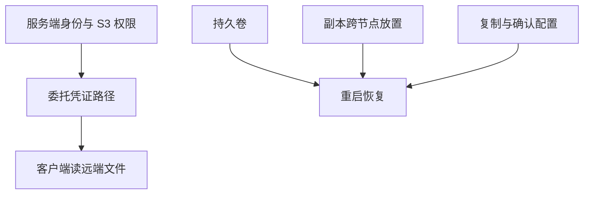

# Fresha 的 Fluss / EKS 部署案例

这是 Nicoleta Lazar 于 2026-04-30 发表的团队一手实践，覆盖 Fluss 0.9 附近的早期简单生产用例。它不是全部版本的部署规范，也没有对所有功能进行统一基准评估。

文章记录了身份链与 delegation token、依赖冲突、本地持久卷、副本放置和 direct memory 等问题。部分修复在当时仍计划随 0.9.1 或后续版本交付，不能把文章的将来时改成已经验证的发布承诺。

可迁移的经验是逐层测试身份、存储、故障域和内存，而不是照抄 JAR 版本、固定 1GiB 内存或静态凭证绕过配置。状态外置改变状态所在位置，不会让一致性、缓存和恢复工作消失；“Searchable Kafka”也是作者类比，并非 Kafka 线协议兼容声明。

关联：[[Fluss-整体架构]]、[[Fluss-KV存储-RocksDB]]、[[流处理弹性与重配置]]。

来源：[Fresha 原文](https://medium.com/fresha-data-engineering/bottling-the-river-apache-fluss-on-eks-6aa63c00d9e9)。本次核对文章，未重现其 EKS 环境，亦未逐个 PR 验证最终进入哪个发布包。
