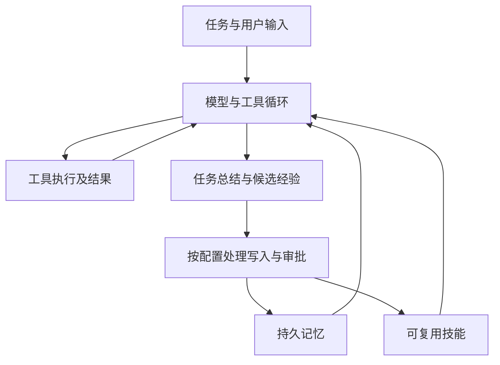

# Hermes Agent：持久记忆、技能与执行循环

Hermes 的“自进化”主要指从交互中维护记忆、复用或更新技能文件，不能理解为每次会话自动训练基础模型权重。本文按官方文档区分功能与工程推论。

## 机制与边界

官方文档把有限容量的 MEMORY/USER 文件与技能、历史会话检索区分开。持久化能跨会话保存信息，也会引入过期事实、错误总结和不可信内容污染；读取与更新策略应接受评估。

代码执行可把多个工具调用放进一次程序逻辑，减少模型往返，但工具结果、程序和反馈仍占上下文与运行资源。“零上下文成本”不成立。子代理拥有独立上下文也不等于天然可信，应按权限与共享状态设计边界。

记忆/技能写入审批是可配置能力，不能当作所有安装的默认安全保证。本文不再保留 GitHub 排名、固定模型尺寸即可稳定胜任所有任务等缺乏可重复证据的判断。

## 建议验证

用重复任务检查技能复用是否真的减少失败；故意加入过期偏好检查记忆纠正；测试工具异常、中断恢复和并发实例写同一目录。记录质量提升与新增风险，避免只统计执行次数。

关联：[[Agent-Memory-Survey-2026综述]]、[[Custom-Agent-Harness-Middleware架构]]、[[Agent-Fault-Tolerance-容错设计]]。

## 核验来源

- [Hermes 功能概览](https://hermes-agent.nousresearch.com/docs/user-guide/features/overview)
- [持久记忆](https://hermes-agent.nousresearch.com/docs/user-guide/features/memory/)
- [配置与审批](https://hermes-agent.nousresearch.com/docs/user-guide/configuration/)
