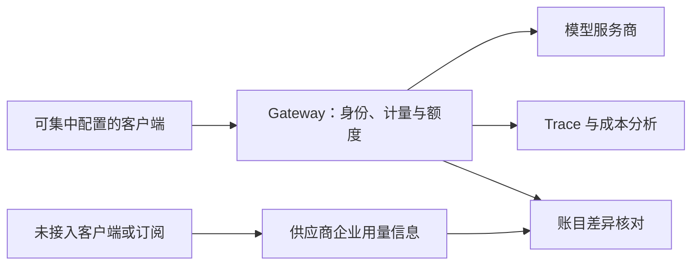

# Coding Agent 成本可预测性 — 官方案例精读

Martha Janicki，LangChain Blog，2026-06-15。[官方原文](https://www.langchain.com/blog/how-we-made-coding-agent-spend-predictable)。本次核验为文章阅读，未实际部署 Gateway 或复核公司账单；文中产品发布状态保留为文章当时描述。

## 问题与机制

Agent 的一次用户任务可能包含多次模型调用，个人和团队费用难以只靠月末总账归因。文章用内部部署案例说明集中计量与额度控制：组织、工作空间、用户和 API key 可配置不同窗口的预算；能集中配置的客户端由 MDM 接入 Gateway，再把调用成本与 Trace 关联。

图按原文能力重绘；右侧差异核对不表示流量受 Gateway 限制，也不表示实现了某个特定 billing API。

## 三个容易误读的状态

| 内容 | 原文支持的说法 | 旧稿错误扩展 |
|---|---|---|
| 计价更新 | 价格、缓存和 token 分档复杂；正在审计计算与完善更新流程 | 静态 CSV 不到一周失效、每周调价、已实时轮询价格 API |
| 路由覆盖 | 接入所有符合集中配置条件的调用；部分客户端有限制 | 全公司所有调用均已进入 Gateway |
| 超额流程 | 正在增加提前分层预警，并探索可审计提额请求 | 80% Slack 告警、100% 自动审批、≤5 分钟完成均已上线 |

文章自述内部费用保持在预算内，但没有给出前后费用、任务质量、并发、统计误差或对照实验；发文时称 Gateway 为 private beta。它是可借鉴的工程案例，不是全公司零漏记、零超支或最优性证明。

## 一个预算对账例子（本笔记设计）

假设月预算 1,000 元，Gateway 记录 600 元，某独立订阅 200 元。先确认两者是否互斥，再计算已核对总额；若订阅内使用量已被按 API 价格估算，直接相加会重复计费。未路由部分仍可能继续增长，因此不能从“Gateway 尚余 400 元”推断公司尚余 400 元。汇率、税费、缓存计价与账单延迟也要统一口径。

额度耗尽如何处理应由任务后果决定：可停止新调用、保存进度、通知负责人；不能只在计数器归零时把正在提交外部副作用的任务粗暴截断。预警阈值和提额时限由业务定义，不冒充文章给出的参数。

## 验证方法与关联

建议分别测计量误差、路由覆盖、账单差异、额度生效延迟、被误阻断任务和单位成功任务费用；并模拟并发调用、价格切换、重试及供应商计费延迟。集中 Gateway 还要考虑自身失败与绕行流量，文章没有完整讨论这些机制。

[[Agent-Cost-Control-Gateway成本控制]] 提供概念摘要；[[Loop-Engineering-多层Agent循环架构]] 解释循环费用；[[Model-Neutrality-模型中立与反锁定]] 讨论模型替换的选择权。单供应商仍可做缓存、限额和失败优化，多模型路由只是额外手段。
