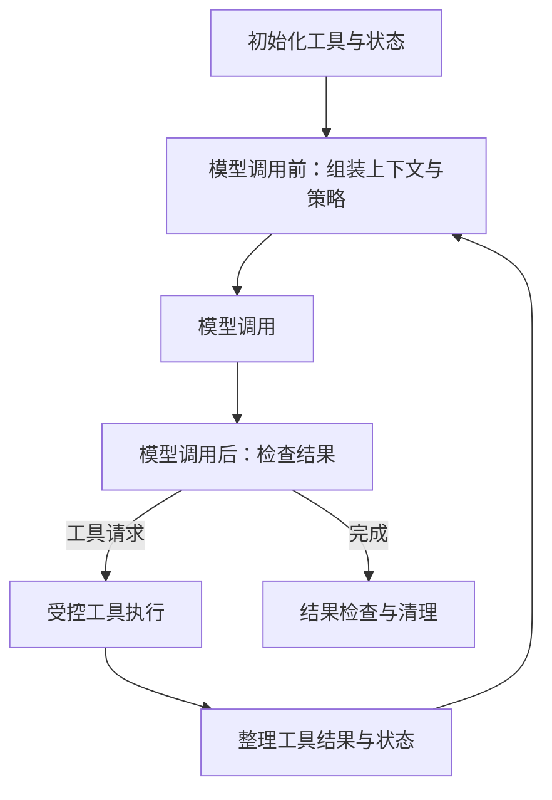

# 自定义 Agent Harness — Middleware 精读

Sydney Runkle，LangChain Blog，2026-06-03。[官方原文](https://www.langchain.com/blog/how-to-build-a-custom-agent-harness)。2026-10-05 核验正文。这是 Harness 扩展机制的设计介绍，未给出统一 benchmark 证明该实现“最容易”或所有组合都可靠。

## 问题与核心抽象

Agent 除了模型，还需要上下文、工具、状态和运行环境。文章把 `create_agent` 作为基本模型/工具循环，把任务特定的干预组织成 middleware。公式 `agent = model + harness` 是概念说明，不能解释为模型质量不重要。

图表示概念位置，不声明 `before_tool`、`after_tool` 等字面名称都是当前 API。实际 hook/wrapper 的签名、异步支持和顺序要查所用 LangChain/Deep Agents 版本。

## 四种扩展杠杆

| 杠杆 | 作用 | 需要明确的契约 |
|---|---|---|
| 确定性逻辑 | 在循环特定位置处理业务规则、上下文或模型选择 | 输入、失败语义和执行顺序 |
| 工具生命周期 | 注册、初始化与清理带依赖的能力 | 可用范围和清理失败处理 |
| 自定义状态 | 在不同调用点间保存计数、标志或任务状态 | 字段归属、持久化和并发合并 |
| 输出流处理 | 给 UI、日志或监控分发事件 | 敏感信息、重复事件和背压 |

文章还列出摘要、记忆、执行、委托、重试、审批和调用限额等 middleware 名称。这是能力示例，**不是一项能力只能对应一个模块的 1:1 规则**；相关类来自不同包/版本，也不应把类名清单当可直接运行的 import 示例。

## 组合为什么仍有耦合（本笔记分析）

假设摘要模块先压缩历史、审计模块后读取历史，审计可能再也看不到原始工具返回；若审计先复制原文，则必须处理敏感信息保留。再如内层 SDK 重试 3 次、middleware 重试 3 次、工作流重试 3 次，最坏情况下调用次数可能相乘。顺序执行也存在这些数据和控制依赖，不能宣称“组合不增加耦合”。

建议为每个模块约定读取/写入状态、何时持久化、如何失败、是否可重入，以及调用预算如何共享。先用最小可解释组合测量，再按失败轨迹补机制，而不是把所有预制模块一并安装。

## 与安全边界、模型替换的关系

策略 hook 可以组织授权检查，但若同一进程持有不受限制的执行权限，恶意代码仍可能绕开 hook。强制资源边界要由沙箱、服务端权限和独立执行器落实。模型切换也不只是换字符串：工具 schema、消息语义、上下文预算、结构化输出和评估阈值可能需要适配。

## 可检验的例子与局限

为“读取资料后生成报告”的 Agent 加摘要、工具重试、发布审批三个模块。设计对照：固定任务/模型，一次只改变摘要或重试；测成功率、遗漏约束、重复外部写入、Token 和延迟。再测试摘要后权限约束仍保留、重试次数不跨层放大、审批拒绝后不会从另一工具发布。这里是评估方案，本次没有实现或跑分。

摘要：[[Custom-Agent-Harness-Middleware架构]]；相关：[[Loop-Engineering-多层Agent循环架构]]、[[Agent-Fault-Tolerance-容错设计]]、[[Agent-Harness-Governance治理]]、[[Model-Neutrality-模型中立与反锁定]]。
