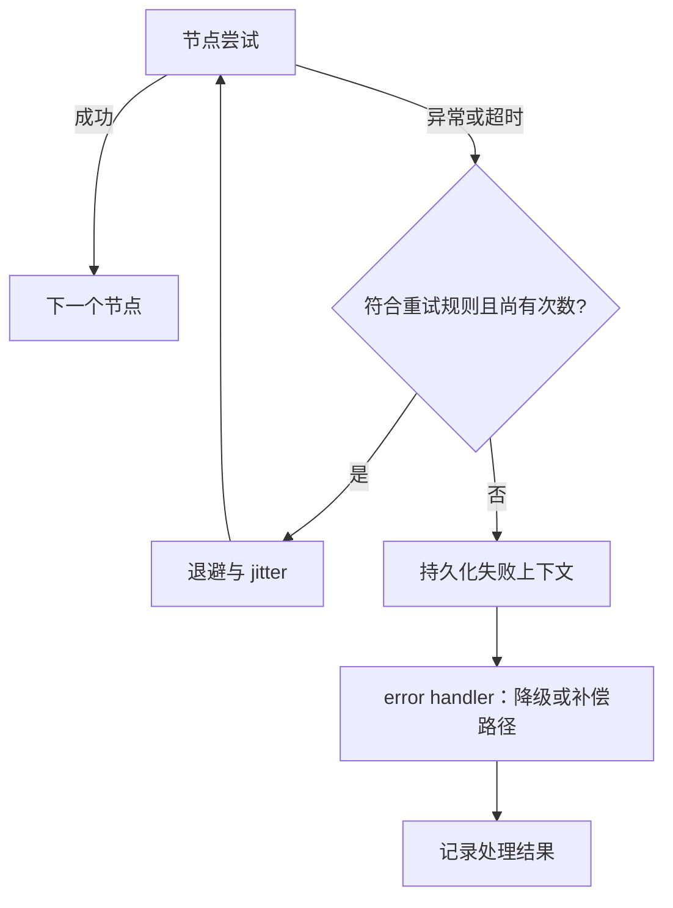
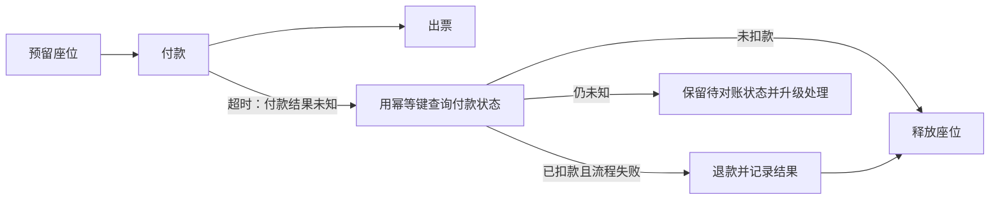

# LangGraph 重试、超时与错误处理 — 精读分析

Quanzheng Long、Sydney Runkle，LangChain Blog，2026-06-04。[博客原文](https://www.langchain.com/blog/fault-tolerance-in-langgraph)；2026-10-05 另核对 [官方容错文档](https://docs.langchain.com/oss/python/langgraph/fault-tolerance) 与 [RetryPolicy API](https://reference.langchain.com/python/langgraph/types/RetryPolicy)。下文是机制分析，未运行示例或故障注入实验。

## 问题与三种原语

工作流一部分已产生外部效果时，重跑整个任务可能重复付款或重复通知。LangGraph 把节点重试、单次尝试的超时和停止重试后的处理放在执行器层组合；应用仍负责副作用正确性。

| 原语 | 语义 | 边界 |
|---|---|---|
| `RetryPolicy` | 按错误类别与退避规则重跑一次节点尝试 | `max_attempts=3` 包含第一次，最多额外重试两次 |
| `TimeoutPolicy` | `run_timeout` 限单次尝试总时长；`idle_timeout` 看可观测进展 | 两者都设时先触发者生效；新尝试重新计时，不是总任务预算 |
| `error_handler` | 在不再重试时接收失败上下文，可改变后续路径 | 没配置重试或错误不可重试也会进入处理；不等于外部补偿已完成 |

默认重试类别应以所用版本的文档/源码为准；博客用瞬态错误作简化说明。当前文档对特定编程异常及 `OSError` 等有排除规则，不能假设所有 `ConnectionError` 子类均被默认重试。重要调用应显式选择可重试条件。

## 进展、取消与恢复

默认 `refresh_on="auto"` 允许流输出、写入和回调等活动刷新 idle 计时；`heartbeat` 模式只采用显式心跳。不断产生日志或 token 不一定代表任务有实质进展，因此 idle 超时不能替代总预算或业务停机条件。

当前 Python 文档要求节点超时/错误处理使用 `langgraph>=1.2`；超时针对 async 节点，同步节点配置超时会在编译时被拒绝。取消协程不等于杀死其启动的线程、子进程或撤回远程请求；必须配置底层客户端超时和资源清理。超时尝试的图状态写入被清理，也不表示外部数据库写入被回滚。

博客解释失败信息随 checkpoint 持久化，恢复可继续调度 handler。这个保证依赖实际配置的持久化和恢复路径；handler 仍可能重复执行。官方文档还区分：handler 可有重试/超时，但不会再套一个 error handler 捕获自己，避免无限递归。

## 航班预订 SAGA：结果未知是关键

图是对博客例子的工程补全。付款超时可能是“服务已扣款，但响应丢了”。原文文字明确要求把失败节点也纳入补偿考量；其简化代码虽然记录 `FAILED:节点`，补偿示例主要检查 `completed`，没有完整展示结果未知的对账。旧稿只补偿 completed 列表会遗漏这条路径，不能复制为生产级协议。

补偿通常按已知依赖逆序执行，但每个补偿本身可能失败或重复。应给正向请求和补偿请求稳定标识，保存已执行/结果未知/已补偿状态；邮件或已经发生的业务行为可能无精确逆操作。**SAGA 是业务补偿，不是全局 ACID 回滚，也不等于流处理 exactly-once。**

## 验证设计（本笔记建议）

注入四个断点：请求发出前失败、服务端提交后响应丢失、handler 写入前崩溃、补偿完成后 checkpoint 丢失。检查是否重复扣款、是否遗留座位、是否重复退款及未知状态是否可追踪；同时记录恢复时间和重试费用。重试、模型 SDK 内部重试与外层循环要共用预算，避免次数相乘。

详见 [[Agent-Fault-Tolerance-容错设计]]；相关：[[流处理容错模型]]、[[Custom-Agent-Harness-Middleware架构]]、[[Agent-Cost-Control-Gateway成本控制]]。
