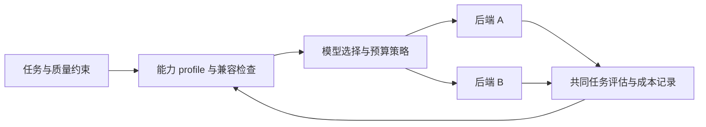

# Model Neutrality — 模型切换选择权精读

Neil Dahlke，LangChain Blog，2026-06-04，原文标题 *Why Model Neutrality Matters More Than Cloud Neutrality*。[官方原文](https://www.langchain.com/blog/model-neutrality)。2026-10-05 核验正文。这是带有 LangChain 产品立场的观点文章，不是模型/框架性能比较实验。

## 作者主张及其证据性质

作者类比云时代的工具层绑定，认为 Agent 的业务流程若深度依赖某家模型的 Harness，切换成本会超过更换模型 API。本篇提出开源、多模型与识别模型能力差异三个方向。这些是架构主张；文中关于供应商动机和哪家模型领先的判断，不能直接升级为普遍事实或当前榜单。

“中立”可理解为保留切换和组合能力，**不要求模型行为完全相同，也不要求每次请求都动态切换**。开源便于审查，但不自动排除漏洞、遥测或不利默认配置。

图为从主张提炼的设计方案；原文没有实现并评估这套完整路由算法。

## 真正需要迁移的内容（本笔记分析）

| 层面 | 看似只换 API 时容易遗漏的差异 |
|---|---|
| 输入 | 消息角色、上下文长度、图像/音频格式、缓存控制 |
| 工具 | schema 支持、并行调用、工具结果编码与错误语义 |
| 输出 | 结构化结果约束、拒绝格式、流式事件 |
| 状态 | 历史压缩、模型特定提示、会话/任务恢复 |
| 运营 | 速率限制、数据驻留、价格/缓存口径、可观测字段 |

例如主模型已经产生付款工具调用，在切换备用模型前要确认工具是否执行，不能仅将对话历史交给另一个模型重新规划。提供兼容 API 并不自动提供相同副作用语义。

## 如何验证选择权的价值

在相同任务和预算下跑现有模型及备选模型，报告成功率、拒绝/格式错误、工具调用成功、费用与 P95 时延；再模拟限流及中途故障。对业务有利的 routing 可以是部署时选型、按任务类型选择或运行中故障切换，粒度由收益与复杂度决定。

旧稿的“某厂商始终最强”“同任务必有 5–10× 价差”“廉价模型适合所有 grader”“不跨供应商就只能做账单报表”没有本篇实证支持，已移除。单供应商也能通过缓存、限额与控制重试降本；多模型能力增加选择空间，也增加兼容和评估成本。

## 局限与关联

文章未量化迁移工时、行为回归或统一成本收益，也未证明中立 Harness 总优于厂商 SDK。适用场景取决于替换需求、模型特有能力和团队维护预算。

摘要：[[Model-Neutrality-模型中立与反锁定]]；相关：[[Custom-Agent-Harness-Middleware架构]]、[[Agent-Cost-Control-Gateway成本控制]]、[[Agent-Harness-Verification-Evaluation评估]]。
