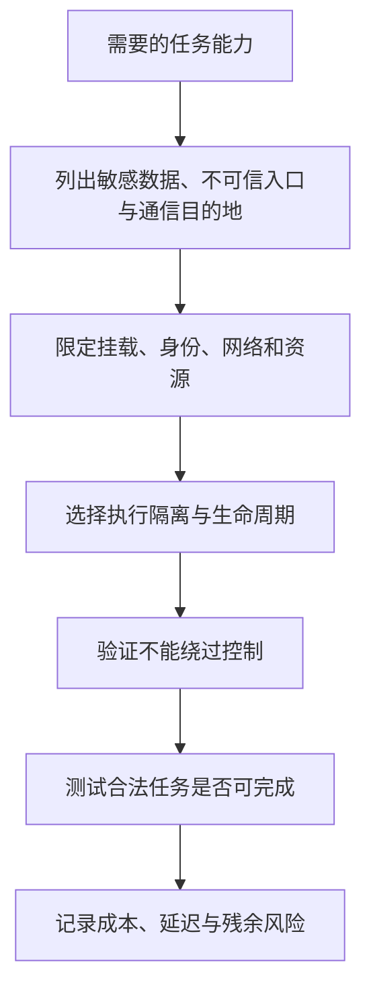

# Agent 沙箱选型 — 机制与边界精读

Rahul Verma，LangChain Blog，2026-06-12。[官方原文](https://www.langchain.com/blog/how-to-choose-the-right-sandbox-for-your-agent)。这是厂商的选型指南和产品说明，不是不同沙箱的共同性能/安全 benchmark；本次未部署或渗透测试任何产品。

## 威胁与选型维度

文章引用 lethal trifecta：敏感数据、不可信内容、外部通信同时存在时，提示注入可能形成外泄链。它是风险分析启发式，不是“三个条件齐全必然泄漏”或“去掉一项便完全安全”的定理。Rule of Two 是设计原则，也不能用一个审批弹窗代替执行边界。

文章要求检查文件、网络、资源、生命周期复用及宿主隔离。LangSmith 的实现说明是独立 microVM 和受控认证代理，**允许由使用者选择复用与销毁**，并非每次用完必毁。

图为本笔记根据文章提炼的流程，不是原文提供的自动决策算法。是否写代码不是唯一判断点：不执行任意代码的 Agent 也可能经工具 API 泄漏数据或修改记录。

## 隔离机制不能混用名称

VM/microVM 以独立 guest kernel 等边界隔离；普通容器通常共享宿主内核；gVisor 是用户态内核隔离方案，不能直接列为 Firecracker 一类的 microVM。产品名称也不等于固定威胁模型：挂载、网络、特权配置和代理权限都影响实际边界。旧稿宣称 microVM 比容器贵约 10×，没有来源或统一负载依据，已删除。

沙箱限制 guest 对 host 的访问；宿主是可信基础的一部分，不能反写成“宿主也看不到沙箱”。复用可能保留有用状态，也可能保留攻击者写入内容，需要隔离不同身份、清理策略和可信基线。

## 外置凭证仍需限制代理能力

认证代理可让真实 key 不直接暴露给沙箱代码，但沙箱仍能发起被允许的请求。若代理允许上传任意文件到任意租户，数据仍可从授权通道流出；因此目的域名白名单不等于目的账号、资源和请求内容均获授权。这一点可与 [[Anthropic-Agent安全容器化实践]] 中“允许域名仍发生泄漏”的案例交叉阅读。

**设计例子**：Agent 只需读取仓库 issue，则令牌应限该仓库与读取动作；运行测试的目录不挂载用户主目录。若确需上传构建产物，要对目标项目和对象路径设置范围。这里的路径/方法/账号限制是工程建议，文章未声称每种产品均实现相同粒度。

## 如何验证与局限

测试越界读写、未授权外连、跨会话残留和资源超额，同时测正常任务成功率、启动时延与资源成本。安全测试通过只说明覆盖的用例；高危代码执行还要考虑内核、hypervisor、控制面和供应链。沙箱与 [[Parallax-Agent安全架构]] 的动作策略互补，不能只凭两篇文章的描述排出安全高低。

摘要：[[Agent-Sandbox-安全沙箱选型]]；架构分类：[[Agent-Harness-Execution-Environment执行环境]]。
