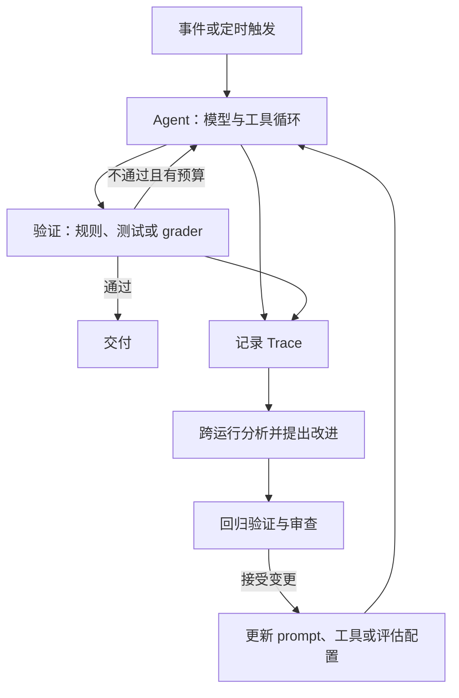

# Loop Engineering — 四种循环与验证边界精读

Sydney Runkle，LangChain Blog，2026-06-16。[官方原文](https://www.langchain.com/blog/the-art-of-loop-engineering)。2026-10-05 核验正文。文章以文档 Agent 说明四种循环及 LangChain 产品的组合，不是四层架构的统一实验或自动改进保证。

## 四种循环解决不同问题

| 循环 | 输入与输出 | 停止或升级条件（本笔记建议） |
|---|---|---|
| Agent loop | 任务、上下文与工具结果 → 动作或答案 | 任务已完成、无法继续、权限或预算边界 |
| Verification loop | 候选工件 → 通过/反馈与重试 | 验收通过或达到尝试上限 |
| Event-driven loop | 消息、定时或 webhook → 一次任务运行 | 重复事件去重、频率与队列上限 |
| Hill-climbing loop | 多次运行 Trace → Harness 改进候选 | 离线回归/审查通过后部署，失败则保留旧版 |

图整合原文并显式加入预算/审查，不表示每个任务都需要四层，也不表示所有循环是严格嵌套同步调用。

## 文档 Agent 例子与原文边界

原文中 Agent 编辑文档、验证链接和 CI；外部消息触发新任务；多条 Trace 显示重复问题后，分析层提出修订请求。博客提及 `RubricMiddleware`、`after_agent`、定时/事件能力以及 Engine 等产品。**提出 issue 或配置候选与无需人审直接部署是两回事**；原文专门保留人的判断。

确定性链接检查能发现断链，却不能保证语气适合读者或论点准确。LLM grader 也可能与生成模型共享盲点。优化 prompt 以提高 grader 分数时，还可能过拟合固定样本，因此不能把“L2 保证正确、L4 每轮必然进化”当作已证结论。

## 成本和恢复（本笔记分析）

总费用取决于每次调用的输入/输出、重试、验证次数和事件频率。若某外循环重复运行全部内层，费用可能乘性增长；但不是只要层数增加就必然指数增长。给每次运行分配预算，并把离线优化费用与服务线上任务的费用分开计量。

外层 deadline 可以有意中断内层任务，不必永远大于所有内层超时之和；关键是传播剩余预算、取消操作，并处理已发生的外部效果。事件重投也要有稳定任务键，否则“重试触发”会创建重复任务。

## 如何评估改进

固定一批未参与调参的任务，比较旧/新 Harness 的成功率、人工复核修改率、费用和时延。故意放入链接正确但事实错误的文档，检查 grader 是否过于片面；再注入重复 webhook、服务失败和预算耗尽，检查是否重复提交或丢失任务。文章没有提供这套对照实验，本笔记把它列为落地要求。

摘要：[[Loop-Engineering-多层Agent循环架构]]；相关：[[Custom-Agent-Harness-Middleware架构]]、[[Agent-Harness-Verification-Evaluation评估]]、[[Agent-Fault-Tolerance-容错设计]]、[[Agent-Cost-Control-Gateway成本控制]]。
