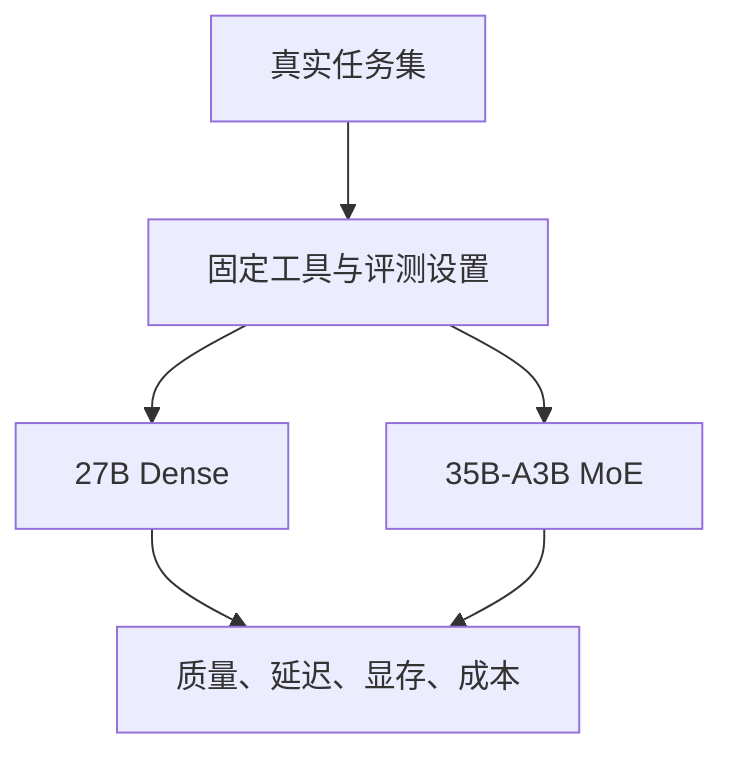

# Qwen 3.6：27B Dense 与 35B-A3B MoE

本页按模型发布方的模型卡记录架构与评估边界。结果是发布方报告，未在本知识库独立复现。

| 模型 | 参数口径 | 架构区别 |
|---|---|---|
| Qwen3.6-27B | 27B | Dense；混合线性注意力与标准注意力 |
| Qwen3.6-35B-A3B | 总参数 35B，激活约 3B | MoE；不能称为 35B Dense |

激活参数影响每 token 计算，但部署仍需要存放专家权重，并承担 KV cache、运行时缓冲和并发的成本。不能由 A3B 推断只需装载 3B 权重，或承诺固定 20GB 显存即可满足所有长度和吞吐需求。

## 如何阅读成绩

27B 模型卡在 SWE-bench Verified 给出 77.2，与同表 Qwen3.5-397B-A17B 的 76.2 接近；这个比较只适用于该基准和发布方设置，不等于 27B 在所有任务达到近 400B 模型水平。模型卡还说明工具 harness、采样、上下文和部分基准的专门评测方式。

本地选择模型应固定代码仓库、工具权限、上下文预算、量化方式和重试次数；同时观察任务成功率、延迟、显存及失败类型。原生上下文上限也不是推荐每个请求都填满的长度。

关联：[[Agent-Harness-Engineering-Survey综述]]、[[Model-Neutrality-模型中立与反锁定]]。

## 核验来源

- [Qwen3.6-27B 模型卡](https://huggingface.co/Qwen/Qwen3.6-27B)
- [Qwen3.6-35B-A3B 模型卡](https://huggingface.co/Qwen/Qwen3.6-35B-A3B)
