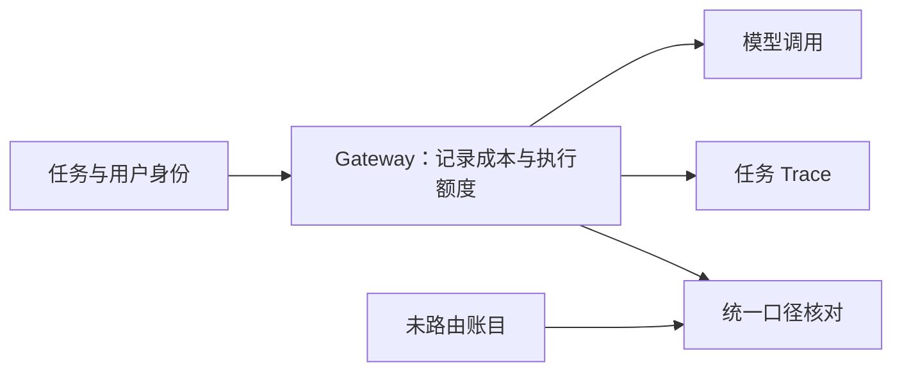

# Agent Cost Control — Gateway 成本控制

集中 Gateway 能把可路由的模型请求按组织、项目、用户与 key 计量，结合 Trace 定位重试、重复探索和异常成本。它的控制范围受客户端接入方式影响；未经过 Gateway 的订阅或请求需要单独核对。

[LangChain 2026-06-15 内部案例](https://www.langchain.com/blog/how-we-made-coding-agent-spend-predictable) 报告费用留在预算内，但没有量化对照实验。文章描述正在完善计价、增加提前告警、探索提额流程；没有说已实现 80% Slack 告警或 5 分钟审批。其发文时的 private beta 状态不能当作当前服务可用性结论。

## 设计与验证要点

- 区分模型估算价、真实账单与订阅费用，避免漏记或重复计费。
- 分别记录路由覆盖率与费用覆盖率；知道费用不等于能强制限制该流量。
- 将重试、验证、离线优化的费用归到任务；循环更深可能增费，但不必然指数增长。
- 额度触顶时保存可恢复状态，并按副作用边界停止新动作；具体预警和提额参数由业务制定。
- 比较单位成功任务费用、超支额、限额延迟和误阻断率，不能只看 Token 减少。

例如 Gateway 记录 600 元、独立订阅 200 元时，须先验证口径互斥，再相加；Gateway 的剩余额度不是组织的真实剩余额度。

详读：[[知识库/sources/web/langchain/coding-agent-spend-精读]]；相关：[[Agent-Harness-Observability可观测性]]、[[Agent-Fault-Tolerance-容错设计]]、[[Model-Neutrality-模型中立与反锁定]]。
