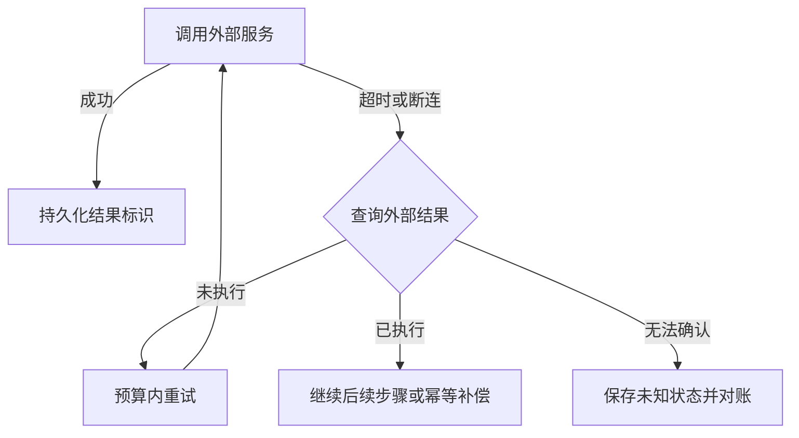

# Agent Fault Tolerance — 容错设计

可靠恢复需要回答：失败前做到了哪一步、外部效果是否已发生、重复执行是否安全。LangGraph 的重试、超时和 `error_handler` 帮助组织控制流；它们不能替业务实现外部事务语义。

| 原语 | 正确使用边界 |
|---|---|
| `RetryPolicy` | `max_attempts` 是含首次的总尝试数；显式选择可重试错误，并核对 SDK 和外层重试预算 |
| `TimeoutPolicy` | run 限单次尝试总时间，idle 限无可观测进展时间；协程取消不撤销远端操作 |
| `error_handler` | 不再重试时运行；失败上下文可随 checkpoint 恢复，补偿仍须幂等 |

Python 节点超时/handler 的版本与 async 约束见 [官方文档](https://docs.langchain.com/oss/python/langgraph/fault-tolerance)。不能把旧博客例子当作跨版本不变的 API 规范。

**付款例子**：座位已预留、付款响应超时。只回滚 `completed` 列表可能漏掉实际已成功的付款；必须用订单/幂等键查账，再决定出票、退款或人工处理。补偿不是数据库回滚，已发邮件也不能因本地状态恢复而消失。

SAGA 与 [[流处理容错模型]] 都处理部分失败，但保证不同：SAGA 允许中间效果并以业务补偿修复；exactly-once 需要限定受保证状态与输出边界。不能把两者等同。

验证应覆盖“提交后响应丢失”和“补偿后崩溃”，统计重复效果、未决状态、恢复时延和费用。详读：[[知识库/sources/web/langchain/fault-tolerance-in-langgraph-精读]]；相关：[[Loop-Engineering-多层Agent循环架构]]、[[Agent-Cost-Control-Gateway成本控制]]。
