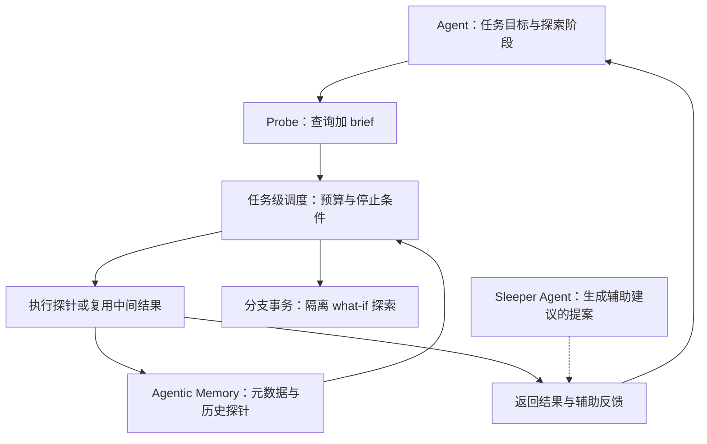

# Agent-First Data Systems — Agent 优先的数据系统架构

## 问题与适用假设

CIDR 2026 愿景论文提出：当 LLM Agent 在同一数据上并行尝试、反复探索元数据并接受系统反馈时，数据库可以利用查询之间的共同目标和冗余来优化整个任务。传统数据库早已支持高并发与近似查询；论文批评的是接口缺少 Agent 的意图和探索阶段，不是断言现有系统只支持低并发人类用户。

四个工作负载特征是规模、异质性、冗余和可引导性。它们提供研究动机，不代表任意 Agent 工作负载都具备相同冗余率。

## 机制提案（§3–6）

1. **Probe + brief**：查询附带自然语言目的、阶段、精度需求和优先级；系统才能知道是宽泛探索还是最终验证。语义搜索并非逻辑上不能用 SQL 表达，而是纯查询文本未必充分暴露任务意图。
2. **Satisficing**：以足以推进下一步决策的结果为目标，在允许的阶段近似、剪枝或提前停止；最终正确性要求不能因此默默降低。
3. **共享执行**：跨探针复用结果、子计划或物化中间状态。计划相似仅是潜在机会；真正收益要扣除识别、协调和缓存维护成本。
4. **引导与持久状态**：辅助建议减少盲目探索，记忆复用已知语义，分支事务隔离并行假设。Sleeper Agent 是提案，实验使用的是人工专家给出的 hints。

**例子（解释性设计）**：Agent 想比较按订单时间或发货时间统计的销售趋势。brief 标注“探索口径”，系统可先给样本和列语义；口径确定后再精确执行。把探索阶段的近似值直接当最终财务数字，则超出该近似策略的适用范围。

## 证据与结果边界（§2，表 1、图 1–2）

- BIRD 的并行尝试实验使用 DuckDB，并比较 GPT-4o-mini 与 Qwen2.5-Coder-7B。作者报告成功率的提升范围为 14–70%；须按模型、尝试数和图中相对量理解，不能归结为“50 次一定提升 70 个百分点”。
- 50 次尝试的查询计划中，distinct sub-plans 占约 10–20%，反映结构冗余；没有实现完整共享执行引擎来证明对应的时延或费用节省。
- 表 1 在 22 个任务、每任务两次运行上比较有/无人工 hints；o3 的平均 SQL 次数从 12.67 降至 10.38（约 18.1%），其中部分查询尝试从 4.28 降至 2.71（约 36.6%）。这不是 Sleeper Agent 的端到端收益。
- 论文引用 Neon 的 Agent 分支/回滚观察，但未给足采样分母和测量设计，不能当作通用容量参数。

## 局限与下一步验证

这是有动机实验的愿景论文，尚无完整 Agent-First 数据系统实现或统一 benchmark 证明其整体架构优于现有引擎。需要固定任务成功标准，比较端到端成功率、总时延、SQL/LLM 费用、缓存维护开销、分支冲突和权限隔离；近似导致的错误或额外迭代也应计入。

详读：[[知识库/sources/papers/Agent-First-Data/精读分析]]；相关：[[Agentic-Memory-语义缓存]]、[[Agent-First-Branch-Transactions-分支事务]]、[[Agent-Memory-Survey-2026综述]]。
