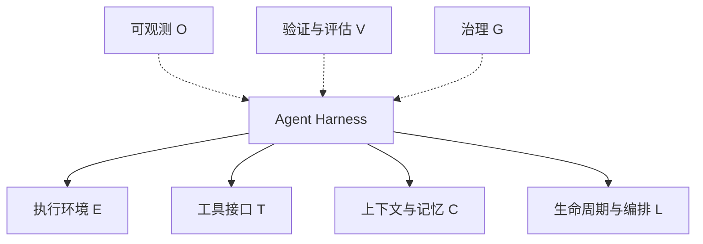

# Agent Harness Engineering 综述

> 来源边界：本页对照综述 2026-05-08 截止的项目快照及所列章节。该文采用文献/公开项目编码，没有统一 benchmark 重跑各系统；引用工作数字为综述的二手转述，未在本次独立复现。产品能力描述不等于当前版本保证。

图按职责组织，不表示七层严格顺序调用。

> 本页为 Li et al. (2026) "Agent Harness Engineering: A Survey" 的 Wiki 概念卡片，覆盖核心论点和生态全景。
> 七层 ETCLOVG 的详细分析见各自独立卡片。

---

## 1. 论文定位

**Agent Harness Engineering** 是 2026 年由 CMU/Yale/JHU/NEU/Tulane/UAB/OSU/Virginia Tech/Amazon 联合团队提交到 TMLR 的综述论文。本地 PDF 为 71 页，页眉标注 Under review as submission to TMLR；其贡献是把 170+ 项目映射到七层分类体系，而非证明覆盖所有项目。

论文核心主张：**模型与 Harness 共同决定可实现的可靠性；基础设施可能成为约束。** 这是综述的架构主张，不是通过统一因果实验证明模型永远不构成瓶颈。

---

## 2. 三条核心主张

### Claim 1: Binding-Constraint Thesis（绑定约束论）

Agent 从工具进化为同事的关键一步，不在于更好的模型，而在于构建**可操作、可审计、可恢复**的 Agent 基础设施。模型能力在快速进步，但生产环境 Agent 的可靠性被 Harness 层限制——这就是"绑定约束"的含义。

综述引用的证据：Anthropic 报告基础设施配置偏移 Agent 编码评估分数 6 个百分点（p < 0.01）；LangChain 2026 调查显示 89% 团队使用可观测但仅 52.4% 运行评估。

### Claim 2: ETCLOVG 七层分类法

将现有框架的"Lifecycle Hooks"概念拆分为七个职责层，其中 **Observability（O）** 被单独处理，**Governance（G）** 成为一级职责；各层相互耦合：

| 层 | 内容 | 原文章节 |
|---|---|---|
| E | 执行环境与沙箱 | §3 |
| T | 工具接口与协议 | §4 |
| C | 上下文与记忆 | §5 |
| L | 生命周期与编排 | §6 |
| O | 可观测与运维 | §7 |
| V | 验证与评估 | §8 |
| G | 治理 | §9 |

### Claim 3: 170+ OSS 生态系统映射

将 170+ 开源项目映射到 ETCLOVG 分类体系，形成截至 2026-05-08 的生态快照。项目来自 GitHub、论文、注册目录与公司文档等渠道，由一名主要编码者分类、其他作者复查；未报告独立双人编码一致性。缺少公开证据不能自动解释为功能不存在。

---

## 3. 三阶段演化模型

| 阶段 | 时间段 | 核心关注 | 典型技术栈 |
|------|--------|----------|------------|
| **Prompt Engineering** | 2022-2023 | 通过提示词驱动模型完成单次任务 | Few-shot, CoT, ReAct |
| **Context Engineering** | 2023-2024 | 管理上下文窗口，注入检索信息 | RAG, Memory Stores, Compaction |
| **Harness Engineering** | 2024-now | 构建 Agent 运行的完整基础设施层 | 沙箱、工具协议、编排、可观测、评估、治理 |

关键洞察：**Harness 不是 Agent 应用的附属品，而是一个独立的工程层面**——类比操作系统之于应用程序。

---

## 4. ETCLOVG 七层速览

| 层 | 核心问题 | 代表系统 | 关键风险 |
|----|----------|----------|----------|
| **E** | Agent 在哪里执行？如何隔离和重置？ | E2B, Daytona, SWE-bench Docker, Progent | 沙箱逃逸、规模化成本、可复制性 |
| **T** | Agent 如何调用外部工具？ | MCP (Anthropic), A2A (Google), Composio | Prompt Injection、工具选择错误、Schema 描述粒度 |
| **C** | 如何在长期任务中维持状态一致性？ | Mem0, Letta, Zep, Memobase | Context Drift（上下文漂移）、幻觉沉淀 |
| **L** | 如何跨多轮推理编排 Agent？ | Claude Code, AutoGen, LangGraph, Symphony | 错误传播、过早完成、环境破碎 |
| **O** | 如何监控、调试和优化 Agent 行为？ | Langfuse, Opik, AgentOps, TensorZero | 可观测-评估鸿沟、成本爆炸 |
| **V** | 如何评估 Agent 并将其作为反馈回路？ | SWE-bench, HAL, DeepEval, RAGAS | 评估噪声伪装成模型失败 |
| **G** | 安全、权限、审计、合规如何保障？ | AutoHarness, Progent, SAGA | 身份管理缺失、护栏组合冲突、审计标准缺乏 |

---

## 4b. ETCLOVG 七层子页面索引

每层均有独立 Wiki 概念卡片，详细展开：

- **E** — [[Agent-Harness-Execution-Environment执行环境]]：7 类沙箱架构、沙箱逃逸、规模化挑战
- **T** — [[Agent-Harness-Tool-Interface工具接口]]：MCP 与 A2A 的互补接口、工具设计四原则、Prompt Injection
- **C** — [[Agent-Harness-Context-Memory上下文管理]]：三层记忆架构、Context Drift 四大来源、幻觉沉淀
- **L** — [[Agent-Harness-Lifecycle-Orchestration编排]]：三层编排、5 种编排模式、四大故障模式
- **O** — [[Agent-Harness-Observability可观测性]]：四级可观测堆栈、成本优化、Anthropic Managed Agents
- **V** — [[Agent-Harness-Verification-Evaluation评估]]：5 阶段评估生命周期、评估噪声归因
- **G** — [[Agent-Harness-Governance治理]]：5 组机制与安全版图、治理覆盖缺口分析

---

## 5. 跨层规律

### 5.1 Cost-Quality-Speed Trilemma

更强的沙箱 → 更高成本和延迟；更丰富的上下文 → Token 消耗和检索开销；更深的评估 → 更慢迭代。生产系统不能将质量视为标量目标——必须决定哪些风险值得昂贵控制。

### 5.2 Capability-Control Tradeoff

更大的工具菜单 → 更广任务覆盖 → 更多选择错误和攻击面。这不是安全附加组件，而是连接工具设计、上下文策略、运行时权限、身份和审计的**设计轴**。

### 5.3 Harness Coupling Problem

Harness 层相互耦合：执行环境影响评估结果；工具描述消耗上下文预算；可观测 Trace 仅在状态捕获粒度一致时才能成为治理证据。**这意味着 Harness 变更必须作为系统变更进行测试**——孤立优化的组件可能在整体中表现更差。

### 5.4 From Frameworks to Platforms

- **框架**：本地抽象（Agent, Tool, Memory Store, Loop）
- **平台**：持久工作空间、托管沙箱、身份、计费、可观测、评估、治理、人工交接

核心转变："如何构建 Agent？" → "如何运营一个可检查、可逆转的 Agent 集群？"

---

## 6. 五大开放问题

| # | 问题 | 核心挑战 |
|---|------|----------|
| 1 | Hardening & Scaling Execution Environments | 统一安全评估、成本模型驱动的隔离选择、跨部署环境的可移植性 |
| 2 | Maintaining Reliable State in Long-Running Agents | 上下文管理应重新定义为状态估计问题：量化每次压缩/检索的信息损失 |
| 3 | Diagnosing Failures from Agent Traces | 关闭可观测→评估循环：将生产异常 Trace 转化为回归 Case，实现 Trace-Native Evaluation |
| 4 | Standard Handoffs Across Agents, Tools & Humans | 定义跨层交接契约：转移的不仅是文本摘要，还有意图、约束、权限、溯源、预算状态 |
| 5 | Keeping Harnesses Useful as Models Improve | Meta-Engineering：随着模型变强，Harness 应自适应简化，而非单向增加脚手架 |

---

## 7. 对 CHANG_AI_TEAM 的指导意义

### 直接可用的设计原则
1. **联合评估 Harness 与 Model**——不是可直接计算的乘法公式
2. **沙箱选择遵循威胁模型驱动**——评估/训练/部署场景需要不同隔离策略
3. **Tool 最小权限原则**——不暴露 Agent 不需要的工具
4. **Context Drift 是长期 Agent 的顶级威胁**——需要不确定性感知状态管理
5. **可观测和评估必须闭环**——否则"知道做了什么，但不知道对不对"

### 可跟进的方向
- **A2A / MCP 标准演进**：工具和 Agent 间协议持续演化
- **Governance 缺口**：按威胁模型核验身份、信息流与形式化约束的覆盖，不能将抽样审计外推为所有系统的状态
- **Harness Simplification**：模型变强后有意识地移除不需要的脚手架

### 与现有知识库关联
- [[Custom-Agent-Harness-Middleware架构]] — 自定义 Harness 中间件实践，与本综述的 Harness Coupling 概念直接对应
- [[Agent-Sandbox-安全沙箱选型]] — 沙箱维度与本综述 §3 Execution Environment 对照
- [[Loop-Engineering-多层Agent循环架构]] — 编排层与本综述 §6 Orchestration 对照
- [[Model-Neutrality-模型中立与反锁定]] — Harness 应保持模型中立，与本综述 §12.5 的 Harness-as-Assumption 原理一致
- [[Agent-Memory-Survey-2026综述]] — 互补的记忆系统综述，本综述 §5 的 Context Drift 概念可作为补充

---

## 8. 关键数字

| 指标 | 数值 |
|------|------|
| 覆盖开源项目 | 170+ |
| 分类层级 | 7 层 (ETCLOVG) |
| 沙箱类别 | 7 类 |
| 编排模式 | 5 种 |
| 评估阶段 | 5 阶段 (Task-to-Feedback Lifecycle) |
| 治理章节 | 5 组机制 + 安全版图讨论 |
| 开放问题 | 5 个 |
| 作者机构 | 9 所 (CMU, Yale, JHU, NEU, Tulane, UAB, OSU, Virginia Tech, Amazon) |
