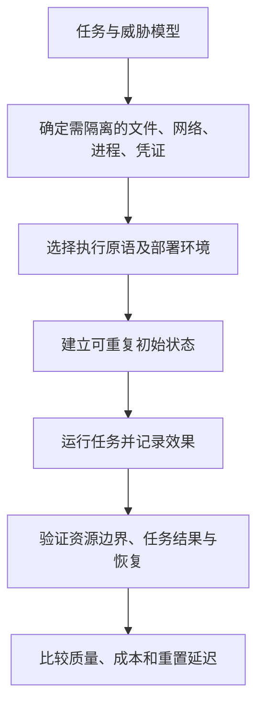

# Agent Harness: Execution Environment & Sandbox (E)

> 来源边界：本页对照综述 2026-05-08 截止的项目快照及所列章节。该文采用文献/公开项目编码，没有统一 benchmark 重跑各系统；引用工作数字为综述的二手转述，未在本次独立复现。产品能力描述不等于当前版本保证。

> ETCLOVG 第一层：Agent 的执行基板——提供安全边界、重置机制和限定的行动区域。

---

## 1. 层级定位

Execution Environment 是 Agent Harness 的**物理基板**。它提供三个核心功能：

1. **安全边界**：Agent 可行动的最大范围
2. **重置机制**：可复制评估和训练的干净状态恢复
3. **限定行动区域**：长期 Agent 无需人工批准即可行动的范围

设计空间不再由单一隔离原语主导，而是由**工作负载保真度、威胁模型和运营模式**三者共同决定。

---

## 2. 七类执行环境（§3.2）

分类混合了工作负载、封装方式与隔离机制，不能按编号当作安全等级。下面的代表系统按原文位置列举。

| 类别 | 原文代表 | 主要取舍 |
|---|---|---|
| 通用托管沙箱 | E2B、Daytona、Modal | 管理容量和生命周期，实际隔离原语依产品/配置 |
| 桌面 / Computer-use | 完整桌面或 VM 环境 | UI 保真度与启动、镜像、并发成本 |
| 代码专用沙箱 | Judge0、Code Interpreter、langchain-sandbox | 快速执行与语言/库支持；并不全是 Docker |
| 框架集成运行时 | OpenHands、agent infra sandbox、smolagents executor | 开箱即用与框架耦合 |
| 浏览器评估环境 | WebArena、VisualWebArena、BrowserGym | 可重置任务和可执行判定；浏览器外仍需资源边界 |
| OS 权限沙箱 | sandbox-runtime、Claude Code、IsolateGPT | 文件/网络/syscall 控制与共享内核的边界 |
| 沙箱抽象层 | SWE-ReX、smolagents executor、Kubernetes Agent Sandbox | 后端可替换性；抽象层本身不提供隔离 |

旧稿将 Progent 直接列为 seccomp 沙箱、把 SAFEFLOW 等同内核隔离，并把工具集成平台当作沙箱后端，均混淆了权限策略、信息流控制和执行隔离。治理可参考 [[Agent-Harness-Governance治理]]，但必须单独确认实际执行边界。

图为从综述提炼的选型流程，非作者实现的自动选型器。

---

## 3. 核心挑战

### 3.1 沙箱逃逸（Sandbox Escape）

**SandboxEscapeBench**（Marchand et al., 2026）表明前沿模型可在现实配置下利用沙箱弱点：
- 多层嵌套的符号链接
- 内核版本特定的漏洞
- 共享卷和 sidecar 容器的配置错误
- 防御工作分散在不同威胁模型和评估协议之间，尚未统一

### 3.2 可复制性 vs. 真实性

真实环境提高任务保真度，但可能引入第三方服务变化、权限差异和不可重置状态；简化环境便于重置，却可能漏掉真实依赖。综述没有统一实验证明“真实环境任务成功率一定更高”或“真实分钟级、简化秒级”。两类环境都应实测启动、稳态延迟和行为差异。

### 3.3 规模化挑战

大规模训练（如 Agent RL）需要数万并行轨迹：
- 逐任务创建完整环境可能增加成本，需要与复用和轻量环境实测比较
- **SWE-World**（Sun et al., 2026）探索 Docker-free 的替代环境——但学习过渡到真实执行的保真度仍然未解决

### 3.4 Docker 的平台绑定

Docker 继承 Linux 内核假设：
- macOS/Windows/浏览器/桌面/混合云环境暴露不同的隔离和再现性约束
- 跨平台的可移植性尚未成为标配

---

## 4. 设计原则

1. **威胁模型驱动选择**：沙箱类型的选取应基于具体部署的威胁模型，而非默认使用某一类
2. **评估环境即评估**：执行环境的设计直接影响 Agent 行为和评估结果——环境噪声可能伪装成模型失败
3. **比较 Bundle 与 Compose**：集成运行时和独立沙箱各有权衡，原文未证明前者必然被替代
4. **防御纵深**：OS 级权限控制应作为最后防线，补充但不是替代容器级隔离
5. **可移植性**：MCP 等标准可降低组合成本，但需在工具、治理和可观测层暴露足够状态以保持审计性

---

## 5. 具体评估例子（本卡片建议）

对一个“读取仓库、安装依赖、运行测试”的 Agent，固定仓库提交、镜像和网络策略；分别测冷启动和复用会话，记录任务成功率、P95 时延、CPU/内存及费用。同时验证它不能读取宿主凭证、不能写出允许目录、不能连接未批准目的地；再模拟工作进程退出，检查是否能从持久工件恢复。通过若干探针不等于隔离完备证明。

综述 §3.4 明确指出不同部署模式下的系统性实证比较仍然缺失；本卡片不提供“最安全”或“最快”的通用排名。

返回：[[Agent-Harness-Engineering-Survey综述]]；实践来源：[[Agent-Sandbox-安全沙箱选型]]、[[Anthropic-Agent安全容器化实践]]。
