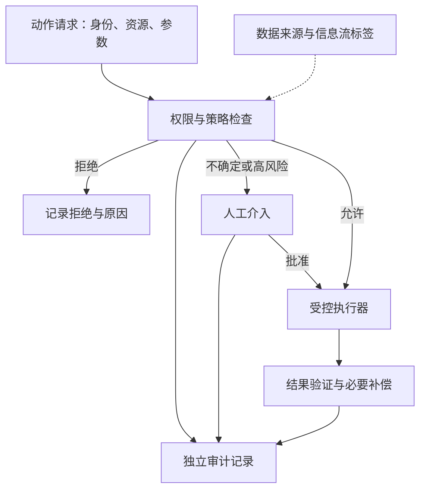

# Agent Harness: Governance（G）

> 来源边界：本页对照综述 2026-05-08 截止的项目快照及所列章节。该文采用文献/公开项目编码，没有统一 benchmark 重跑各系统；引用工作数字为综述的二手转述，未在本次独立复现。产品能力描述不等于当前版本保证。

## 问题与机制分类（§9）

治理约束 Agent 以谁的身份、在什么条件下执行哪些操作，并为后续核查保留证据。§9.1–9.5 分别讨论权限、生命周期检查、组件加固、章程与审计；§9.6 把这些机制放入更广的安全研究版图，不能当成第六种具体机制。

| 机制 | 需要回答的问题 | 常见误区 |
|---|---|---|
| 权限与身份 | 哪个 Agent 代表哪个用户，对哪个资源做什么？ | 模型答应遵守不等于服务端授权 |
| 生命周期检查 / hooks | 在执行前、结果后、交接时检查什么？ | 有 hook 不等于它无法绕过 |
| 组件加固 | 执行器、依赖、隔离和供应链如何限制攻击？ | 策略 DSL 不等于内核沙箱 |
| 章程 / 声明式策略 | 规则怎样版本化、组合和解释？ | YAML 可读不等于规则完备或无冲突 |
| 审计与监测 | 如何记录决策、发现多步异常并追责？ | 有日志不等于完整、可重放或不可篡改 |

输入/输出 guardrail、信息流跟踪、人工审批及形式化约束可跨多个机制组合。它们有误报、漏报、开销和相互干扰，综述没有证明任意组合都更安全。

## 从调用到可审计副作用（解释性设计）

这是把综述机制组合的例子，不是论文验证过的统一协议。若 Agent 已能直接调用外部 API 绕过 P，图中的检查就不构成强制边界。独立执行权限与资源隔离可对照 [[Parallax-Agent安全架构]]。

## 表 4：按原符号重读覆盖情况

下表保留原表的 **完整 / 部分 / 未标出** 三档；“未标出”仅表示作者在该快照中未编码为覆盖，不证明所有版本都不存在该功能。旧稿把空心/实心符号大量反读，导致 Codex 无权限、只有 OpenHands 有多 Agent 治理等错误结论。

| 系统 | Permissions | Hooks | Hardening | Constitution | Audit | Multi-Agent |
|---|---|---|---|---|---|---|
| Codex | 完整 | 部分 | 未标出 | 未标出 | 部分 | 未标出 |
| Gemini CLI | 完整 | 部分 | 未标出 | 未标出 | 部分 | 未标出 |
| OpenHands | 部分 | 完整 | 未标出 | 未标出 | 部分 | 部分 |
| AutoHarness | 完整 | 完整 | 部分 | 完整 | 完整 | 部分 |
| Progent | 完整 | 完整 | 未标出 | 部分 | 未标出 | 未标出 |
| CaMeL | 部分 | 完整 | 未标出 | 未标出 | 未标出 | 未标出 |
| SAGA | 完整 | 部分 | 未标出 | 未标出 | 完整 | 完整 |
| IsolateGPT | 完整 | 部分 | 未标出 | 未标出 | 未标出 | 完整 |
| AgentSpec | 部分 | 完整 | 未标出 | 完整 | 未标出 | 未标出 |
| SAFEFLOW | 部分 | 完整 | 部分 | 未标出 | 完整 | 完整 |

原表的覆盖标签不是成熟度、攻击成功率或合规认证。项目来源异构且由单一主要编码者标注、作者复查，不能把“完整”解释为已在共同威胁模型下验证无漏洞。

## 具体例子：代表用户创建并发送报告

身份信息应同时包含 Agent、用户和授权范围。读取销售数据、写报告、向外部邮箱发送是三个不同权限；报告来源的数据标签需要延续到发送检查。只有用户允许收件人且当前策略允许外发，才执行发送。审计至少记录授权主体、资源、策略版本、决定、工具结果与关联 ID；Token/费用和输入输出摘要可帮助归因，但敏感原文应按策略脱敏。

这里的字段清单是工程建议，不是综述规定的“完整可重放最小标准”。记录哈希也不能单独阻止有权限者删改日志；需要可信存储/收集边界及验证流程。

## 证据限制与关联阅读

综述转述的小样本安全审计不能外推为“所有系统都缺身份和信息流控制”。章程可配置不等于不需要代码审核；形式化验证也仅在指定模型与假设下成立。评估应同时报告越权/泄漏率、合法任务误拦截、策略延迟、恢复与人工负担，并固定攻击集和策略版本。

[[Agent-Harness-Engineering-Survey综述]] 提供分类方法；[[Agent-Harness-Tool-Interface工具接口]] 定义能力契约；[[Agent-Harness-Execution-Environment执行环境]] 提供执行边界；[[Anthropic-Agent安全容器化实践]] 提供具体工程案例。
