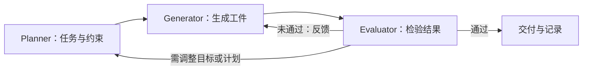

# Agent Harness: Lifecycle & Orchestration (L)

> 来源边界：本页对照综述 2026-05-08 截止的项目快照及所列章节。该文采用文献/公开项目编码，没有统一 benchmark 重跑各系统；引用工作数字为综述的二手转述，未在本次独立复现。产品能力描述不等于当前版本保证。

> ETCLOVG 第四层：Agent 如何跨多轮推理、工具调用、失败恢复和交付物交接来完成任务——从单一循环到完整工程流水线。

---

## 1. 层级定位

Lifecycle & Orchestration 结合了两个在早期框架中经常分离的关注点：
1. **Agent 的执行流**——如何从一个状态转移到下一个
2. **操作状态**——执行流读取和写入的持久状态

长期任务中，可靠性不取决于模型能否生成"好的下一步"，而取决于 Harness 能否**记住已发生的事、决定下一步、从错误中恢复、协调子任务、在完成时停止**。

---

## 2. 三层编排架构

### 2.1 Level 1: Single-Agent Inner Loop（单 Agent 内循环）

| 维度 | 详情 |
|------|------|
| 核心模式 | 观察 → 决策 → 行动 → 反馈，遵循 ReAct 范式（Yao et al., 2023） |
| 执行模型两种 | **Stateless Replay** vs. **Hybrid（Stateful+Replay）** |

**Replay 与持久状态**：原文用 replay-based 与 hybrid 描述控制方式，但模型调用的无状态接口不等于整个产品没有会话、文件、检查点或任务状态。比较时应明确恢复的是模型上下文、编排进度还是外部工件，不能把 Codex 简化成“纯无状态”。

例如进程退出后，可以重放事件构建下一次模型输入，同时从任务表读取已完成节点；外部工具是否重做仍需幂等性或结果对账。这是可恢复性设计，不是特定产品的完整实现描述。

### 2.2 Level 2: Multi-Agent Orchestration（多 Agent 编排）

**五种编排模式**：

| 模式 | 核心机制 | 代表系统（论文快照） | 何时使用 |
|------|----------|---------------------|----------|
| **Hierarchical** | 高级控制器分配任务，Agent 作为执行者 | AutoGen, OpenAI Agents SDK, DeerFlow, DeepAgents | 任务可清晰分解为子任务 |
| **Team** | 具名角色的专业化 Agent 协作 | oh-my-claudecode | 需要明确的角色分工（规划者/编码者/审查者） |
| **Workflow** | Agent/工具组成显式阶段 | Semantic Kernel | 业务流程/流水线式的任务 |
| **Fan-out** | 多 Agent 并行探索 | Emdash | 需要多样性（代码生成、创意任务） |
| **Graph Composition** | Agent/工具/状态为节点的交互图 | LangGraph, Hive | 复杂的、条件分支多的任务 |

**Anthropic 的 Planner-Generator-Evaluator 三 Agent 架构**（GAN 启发）：

关键发现：升级到 Opus 4.6 后，**移除** sprint 构造和 context resets，成本 $200 → $125，质量不变——这是综述引用的单个工程案例，说明应重新检验旧脚手架的价值；不能推出复杂度与能力必然负相关。该费用比较未由本次复现。

### 2.3 Level 3: Full Lifecycle Pipeline（完整生命周期）

| 维度 | 详情 |
|------|------|
| 核心抽象 | **Task Runner** — 管理调度、状态持久化、重试、验证、迭代 |
| 代表系统 | Symphony (OpenAI, 24k), Vibe Kanban (26k), GitHub Agentic Workflows (5k) |
| 典型工作流 | Issue/Task → 规划 → 代码/工件生成 → 测试验证 → Review → PR 接受 |
| 人类角色 | **Steering（指导）而非 Executing（执行）** |

**Symphony（OpenAI 2026）的设计原则**：
- Issue Tracker 作为控制平面
- Repository 作为任务状态的持久化锚点
- Agent 围绕 Git 工作流组织，而非替代它

---

## 3. 生命周期状态管理

论文**严格区分**三类状态：

| 状态类型 | 层次 | 示例 | 维护者 |
|----------|------|------|--------|
| **Context/Memory** (§5) | 推理级 | 对话历史、检索文档、记忆 | 上下文层 |
| **Lifecycle State** (§6) | 操作级 | 待处理子任务、检查点、重试计数、共享工件、执行状态 | 编排层 |
| **Observability** (§7) | 监控级 | Trace、Span、Token 计数、延迟、成本 | 可观测层 |

**Lifecycle State 是 Harness 自身用来继续执行的操作状态**——它独立于"Agent 推理时看到什么"和"外部观察到什么"。

---

## 4. Anthropic 长期 Agent 的四大故障模式

从 Anthropic (2025d, 2026c) 的生产经验中提炼：

| 故障模式 | 表现 | Harness 级解决方案 |
|----------|------|-------------------|
| **One-Shot 尝试** | Agent 试图一次性完成整个任务 | Initializer Agent 拆解任务为特性列表 |
| **过早宣布完成** | Agent 声称完成但实际未完成 | Separated Evaluator（独立的评估 Agent） |
| **Session 间环境破碎** | 新 Session 开始时环境不可用 | Clean Handoff State（干净的交接状态）+ git repo checks |
| **标记完成但无测试** | 声称实现但未运行测试 | 自动化测试作为 Agent 流程的硬性门禁 |

---

## 5. 多 Agent 系统中的故障传播

**AgentErrorTaxonomy**（Zhu et al., 2025）的核心发现：
- **错误传播（Error Propagation）是核心可靠性瓶颈**
- 失败按模块分解：记忆错误 → 反思错误 → 规划错误 → 行动错误 → 系统错误 → 级联
- AgentDebug 框架：隔离根因而非治疗表面症状，其引用实验报告相对任务成功率提升 26%，不是本综述对所有编排框架的提升率

**MAST**（Cemri et al., 2025）：14 种多 Agent 故障模式（κ=0.88），聚类为三类：
1. 系统设计问题
2. Agent 间不对齐
3. 任务验证问题

---

## 6. 设计原则

1. **编排可靠性 = 状态管理 + 恢复机制**——不仅仅靠"好的提示词"
2. **Human-in-the-loop 位置应在关键决策点，而非每一步**
3. **Harness 复杂度应随模型能力自适应**——模型变强时主动移除不必要的脚手架
4. **Durable Progress Artifacts**：确保 Agent 的进展以可恢复的工件形式持久化（Git repo、进度文件、初始化脚本）
5. **Clean Handoff**：Agent 在 Session 间交接时应留下"干净的状态"，让下一 Session 的 Agent 可以无摩擦继续

---

> 返回父页：[[Agent-Harness-Engineering-Survey综述]] · 上一级：ETCLOVG 七层体系 · L 层（Lifecycle & Orchestration）

## 恢复检查例子（工程建议）

“生成报告→上传→通知”在上传后崩溃，不能仅重放模型历史就认为未上传。持久化上传结果、对象标识和幂等键；恢复先查询外部状态，再决定续传或跳过。若通知不可撤销，应在发出前设独立提交边界。详见 [[Agent-Fault-Tolerance-容错设计]]。
