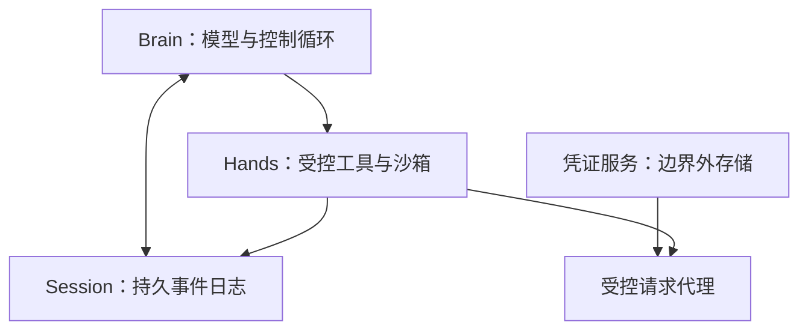
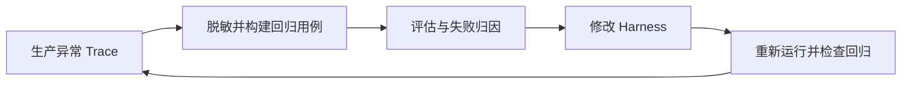

# Agent Harness: Observability & Operations (O)

> 来源边界：本页对照综述 2026-05-08 截止的项目快照及所列章节。该文采用文献/公开项目编码，没有统一 benchmark 重跑各系统；引用工作数字为综述的二手转述，未在本次独立复现。产品能力描述不等于当前版本保证。

> ETCLOVG 第五层：如何监控、调试、优化 Agent 行为——论文从 Lifecycle Hooks 独立出来的第一层。

---

## 1. 层级定位

Observability 从 Lifecycle Hooks 独立为第一级层的理由：
- 催生了一个**独立的平台和规范生态**（Langfuse、Opik、OTel、AgentOps、TensorZero...）
- 拥有独立的工程实践和专业社区
- 是 Agent 可靠性的反馈回路的**感知器**

核心洞察（LangChain 2026 调查）：**受访样本中 89% 使用可观测性、52.4% 运行离线评估**——存在结构性"可观测-评估鸿沟"。

---

## 2. 可观测堆栈

### 2.1 Tracing & Monitoring Platforms（链路追踪）

| 平台 | 核心能力 | 定位 |
|------|----------|------|
| **Langfuse** | 交互式 Trace 树、延迟火焰图、Token 细目、成本归因、Prompt 版本管理 | 开源追踪与评估平台 |
| **Opik** (Comet ML) | 类似能力 + Comet ML 生态集成 | 实验追踪 |
| **Arize Phoenix** | Trace 可视化 + LLM 评估 | 评估集成 |
| **MLflow** | 传统 ML + 新增 LLM Trace | 全栈 ML 平台 |

这些平台的共同模式：平台各自的 SDK / 自动插桩（装饰器名称并不通用）→ 自动 Instrumentation → Trace 树 → 分析仪表盘。

### 2.2 底层规范：OpenTelemetry (OTel)

| 组件 | 说明 |
|------|------|
| **OTel GenAI 语义约定** | 标准化 Span 属性：model name, temperature, token counts, latency |
| **OpenLLMetry** (Traceloop) | 自动 Instrumentation for OpenAI/Anthropic/Cohere + 向量数据库（Pinecone/Chroma/Weaviate） |
| **OpenInference** (Arize AI) | 互补规范，设计为 Phoenix 的伴侣 |

**核心价值**：通过适当导出器，把 Trace 和指标分别送入兼容后端；Prometheus 主要承载指标，不能把它直接等同通用 Trace 存储。

### 2.3 Agent-Specific Platforms（Agent 专用）

| 平台 | 独特能力 |
|------|----------|
| **AgentOps SDK** | 层级 Span 模型：Session > Agent > Task > Workflow > Tool Call > LLM Call |
| **RagaAI Catalyst** | RAG + Multi-Agent 的质量和安全仪表盘 |
| **Laminar** | OSS 优先：Trace + Evaluation + Prompt Management 统一 |

### 2.4 Cognitive Observability（认知可观测）

| 系统 | 方法 | 价值 |
|------|------|------|
| **Watson** (Rombaut et al., 2025) | "代理 Agent" 复现主 Agent 输出，通过 Prompt Attribution 生成逐步推理 Trace | 帮助解释输出；代理重建的理由不等于模型真实内部因果过程 |
| **AgentLens** (Lu et al., 2024) | 三窗格可视化：Outline View → Agent View (因果弧线) → Monitor View (环境重播) | 14 人用户研究：复杂分析任务显著优于纯重播 |
| **claude-code-reverse** | 逆向工程特定编码 Agent 的交互链 | 理解 Harness 级行为的分析工具 |

### 2.5 System-Level Monitoring（系统级监控）

| 系统 | 方法 | 独特优势 |
|------|------|----------|
| **AgentSight** (Zheng et al., 2025) | eBPF 在适当探针处观测应用/TLS 相关数据与内核事件 | 综述引用实验报告 <3% CPU 开销；覆盖与抗绕过性依探针、权限和内核可信假设，不能宣称不可绕过 |
| **AgentTrace** (AlSayyad et al., 2026) | Schema-based 日志：Cognitive Surface（推理）+ Operational Surface（工具调用）+ Contextual Surface（环境状态） | 三面统一日志 + OTel 导出 |

---

## 3. 成本追踪与优化

### 3.1 成本追踪

| 工具 | 方法 | 定位 |
|------|------|------|
| **TensorZero** | 统一 LLMOps 栈：Gateway + Observability + Experimentation + Optimization | 全栈 |
| **Helicone** | Drop-in Proxy——零代码修改增加成本和延迟监控 | 轻量入门 |
| **AutoHarness** | Per-call Token 消耗 + Session 级预算强制 | 治理集成 |

### 3.2 成本优化策略

| 策略 | 代表工作 | 核心贡献 | 效果 |
|------|----------|----------|------|
| **自适应级联路由** | FrugalGPT (Chen et al., 2023) | 简单查询 → 廉价模型，复杂查询 → 强模型 | 原研究特定任务下最多降本 98%；非通用 Agent 工作负载保证 |
| **语义缓存** | GPTCache (Bang, 2023) | Embedding 相似度匹配 → 缓存响应 | 减少重复/释义查询的 LLM 调用 |
| **质量感知路由** | QC-Opt (Shekhar et al., 2024) | BertScore 预测输出质量 + 联合优化模型/Token/延迟 | 预算约束下的最优选择 |
| **Token 弹性** | TALE (Han et al., 2025) | Token 预算过低 → 模型溢出预算 → **反而增加消耗** | 揭示 Token 预算的非单调效应 |
| **双池 Token 路由** | Dual-Pool (Liu et al., 2026b) | vLLM 集群分短/长上下文池 | 综述转述 Azure / LMSYS 轨迹上 GPU-hours 降 31–42%；$2.86M 是规模化年化估算，非实测账单节省 |

**对 Harness 工程师的启示**：成本可观测必须跨越多层——API Token 追踪 + 应用级路由决策 + 基础设施资源利用。

---

## 4. 可靠性工程

### 4.1 Anthropic 的 Managed Agents 架构（2026b）

图为综述转述的组件职责示意。凭证外置缩小暴露面，但代理必须限制可调用资源与参数；不等于所有请求都安全或外部副作用自动可恢复。

核心原则：**将组件从"宠物"（不可替代、手工维护）变为"牲畜"（可互换、自动重新供给）**。

### 4.2 故障分类体系

| 分类 | 来源 | 故障数 | 核心发现 |
|------|------|--------|----------|
| **MAST** | Cemri et al. (2025) | 14 种 | 聚类为系统设计 / Agent 不对齐 / 任务验证三类（κ=0.88） |
| **AgentErrorTaxonomy** | Zhu et al. (2025) | 按模块分解 | 错误传播是核心瓶颈——AgentDebug 相对改进 26% |
| **隐藏故障模式** | Vinay (2025) | 15 种 | 版本漂移、成本驱动性能崩溃、多步推理退化 |
| **QSAF 退化** | Atta et al. (2025) | 6 阶段 | 幻觉沉淀跨 Session 自强化 |

### 4.3 运行态异常检测

| 系统 | 方法 | 粒度 |
|------|------|------|
| **SentinelAgent** (He et al., 2025) | 多 Agent 交互图建模，LLM-as-Judge + 人反馈策略优化 | 全局/单点/多点三级 |
| **AgentFixer** (Mulian et al., 2026) | 15 种验证工具（IBM CUGA 生产系统） | 64-88% 检测率，38% 失败追溯至解析错误 |

**分层检测策略**：
1. **轻量规则检查**（结构失败：格式错误的工具调用、Schema 违规）
2. **统计监控**（性能漂移：延迟、Token 使用、成本趋势）
3. **LLM 语义分析**（推理失败：幻觉、计划-行动不对齐、过早停止）

---

## 5. 关键原则

### 5.1 Harness-as-Assumption Principle（Harness 即假设）

> 每个 Harness 组件编码了一个关于"模型不能独自做什么"的假设。随模型能力变化，这些假设可能过时。

Anthropic 实证：Opus 4.5 → 4.6 时移除 context resets，成本 $200 → $125，质量不变。

**理想的可观测系统应包含元监控层**——追踪哪些干预（context resets, evaluator feedback loops, tool restrictions）仍是荷载，哪些已是不必要的开销。

### 5.2 关闭可观测-评估循环

当前鸿沟：89% 有可观测 → 52.4% 有评估。应实现：

### 5.3 基础设施噪声

Anthropic (2026a) 发现基础设施配置可偏移 Agent 编码评估分数 **6 个百分点** (p < 0.01)。含义：
- 成本优化和评估保真度紧密耦合
- 为节省成本削减资源 → 可能无声地降低 Agent 性能
- 需要细粒度的可观测才能发现

---

## 6. 对我们（CHANG_AI_TEAM）的启示

1. **Langfuse / Phoenix** 是一线可观测平台——选型建议 Langfuse（开源追踪与评估平台，生态最大）
2. **OTel 兼容**应成为 Agent 可观测的基本要求——不绑定供应商
3. **成本追踪不能只靠 LLM Provider 的 Dashboard**——需要应用级 Per-Task 成本归因
4. **AgentSight 的系统级监控**值得关注——对于安全关键部署，应用级工具可绕过
5. **关闭可观测-评估鸿沟**——技术调研周报的评估应与可观测数据打通

---

> 返回父页：[[Agent-Harness-Engineering-Survey综述]] · 上一级：ETCLOVG 七层体系 · O 层（Observability & Operations）

## 数据完整性与隐私边界

Trace 可能包含敏感参数、工具返回值和用户内容，应按数据策略脱敏、限制访问并设置保留期。成功采集日志不等于日志不可篡改；独立收集权限、不可变存储或签名要按威胁模型验证。观测到相关事件，也不自动建立故障的因果关系。
